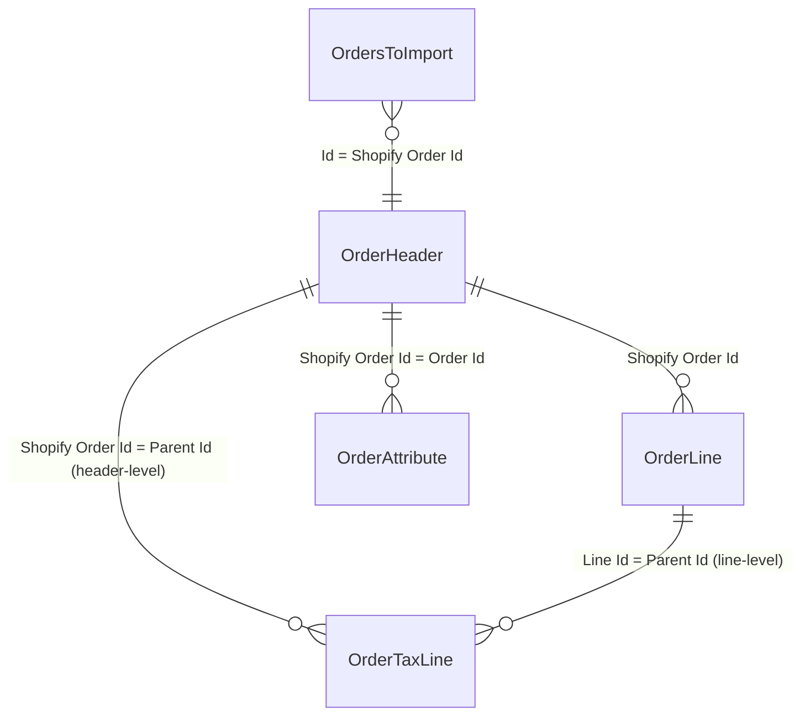

# Data model

## Core entity relationships

## Order Header and Order Line

`Shpfy Order Header` (table 30118) is keyed on `Shopify Order Id` (BigInteger). It carries the full snapshot of a Shopify order: three complete address blocks (sell-to, ship-to, bill-to), financial totals, status enums, and the BC-side output fields (`Sales Order No.`, `Sales Invoice No.`, `Sell-to Customer No.`, `Bill-to Customer No.`).

`Shpfy Order Line` (table 30119) is keyed on `(Shopify Order Id, Line Id)`. Each line holds the Shopify product/variant reference plus the mapped BC item (`Item No.`, `Variant Code`, `Unit of Measure Code`). Boolean flags `Gift Card` and `Tip` classify non-inventory lines. The secondary key on `(Shopify Order Id, Gift Card, Tip)` maintains a SIFT index on `Quantity`, which drives the header's `Total Quantity of Items` FlowField (excluding tips and gift cards).

Deleting a header cascades. The `OnDelete` trigger on Order Header explicitly deletes order lines, return headers, refund headers, data capture records, fulfillment order headers, and order fulfillments.

## Dual-currency design

Every amount field on both header and line exists in two versions: shop currency and presentment currency. The header stores `Currency Code` (the shop's settlement currency) and `Presentment Currency Code` (the currency the buyer saw). Lines reference the header for formatting via local helper procedures `OrderCurrencyCode()` and `OrderPresentmentCurrencyCode()`. During processing, the shop's `Currency Handling` setting determines which currency column is used to populate the BC sales document.

## Order Tax Line (polymorphic parent)

`Shpfy Order Tax Line` (table 30122) uses a `Parent Id` field that can point to either an Order Header (`Shopify Order Id`) or an Order Line (`Line Id`). The `OrderCurrencyCode()` helper attempts to resolve the parent as an Order Line first, then walks up to the header. This polymorphic key is not enforced by a table relation; the code simply tries both lookups. The `Channel Liable` flag indicates marketplace-collected taxes, and the header has a FlowField `Channel Liable Taxes` that checks for their existence.

## Orders to Import (queue table)

`Shpfy Orders to Import` (table 30121) is a transient queue populated by `ShpfyOrdersAPI.GetOrdersToImport` and consumed by `ShpfyImportOrder`. It carries summary fields (amount, quantity, financial status, fulfillment status, tags) so users can review and filter before importing. The `Import Action` enum distinguishes `New` from `Update`. Error tracking uses blob fields for the message and call stack since error text can be long.

## Supporting tables

- `Shpfy Order Attribute` (table 30116) stores key-value pairs per order, keyed on `(Order Id, Key)`. The value field was widened from 250 to 2048 characters.
- `Shpfy Order Line Attribute` (table 30149) stores key-value pairs per order line, keyed on `(Order Id, Order Line Id, Key)` where `Order Line Id` is a Guid (the line's SystemId).
- `Shpfy Order Disc.Appl.` (table 30117) captures Shopify discount applications with allocation method, target selection, target type, and value type.
- `Shpfy Order Payment Gateway` (table 30120) records which payment gateways were used, keyed on `(Order Id, Name)`.

## Table extensions on BC tables

`Shpfy Sales Header` (tableextension 30101) adds `Shpfy Order Id`, `Shpfy Order No.`, and `Shpfy Refund Id` to the Sales Header. `Shpfy Sales Line` (tableextension 30104) adds `Shpfy Order Line Id`, `Shpfy Order No.`, `Shpfy Refund Id`, `Shpfy Refund Line Id`, and `Shpfy Refund Shipping Line Id` to the Sales Line. These fields link the BC sales documents back to their Shopify source records.

## Contact fields

The Order Header carries contact name and contact number fields for all three address contexts:

- `Sell-to Contact Name` (1014), `Sell-to Contact No.` (1017)
- `Bill-to Contact Name` (1015), `Bill-to Contact No.` (1018)
- `Ship-to Contact Name` (1016), `Ship-to Contact No.` (1019)

Contact names are populated during import from the Shopify order's address data. Contact numbers are resolved during mapping by `ShpfyOrderMapping.FindContactNo`, which matches the contact name against person-type contacts under the customer's company contact. The contact number fields have `OnValidate` triggers that call `CheckContactRelatedToCustomer` to enforce that the contact belongs to the associated customer. `LookupContactForCustomer` provides filtered lookup behavior for the Order page.

When `Sell-to Customer No.` is validated, it automatically re-resolves both `Sell-to Contact No.` and `Ship-to Contact No.`. When `Bill-to Customer No.` is validated, it re-resolves `Bill-to Contact No.`.

*Updated: 2026-04-08 -- contact name/number fields documented (PR #7525)*

## B2B fields

The Order Header has a cluster of B2B fields: `Company Id`, `Company Main Contact Id`, `Company Main Contact Email`, `Company Main Contact Phone No.`, `Company Main Contact Cust. Id`, `Company Location Id`, `B2B` (boolean), and `PO Number`. When `B2B` is true, mapping takes a different path through `MapB2BHeaderFields` in `ShpfyOrderMapping`.

## High Risk

`High Risk` is a FlowField (`CalcFormula = exist`) that checks for any `Shpfy Order Risk` record with `Level = High` for the order. It is not stored; it is calculated on demand.
