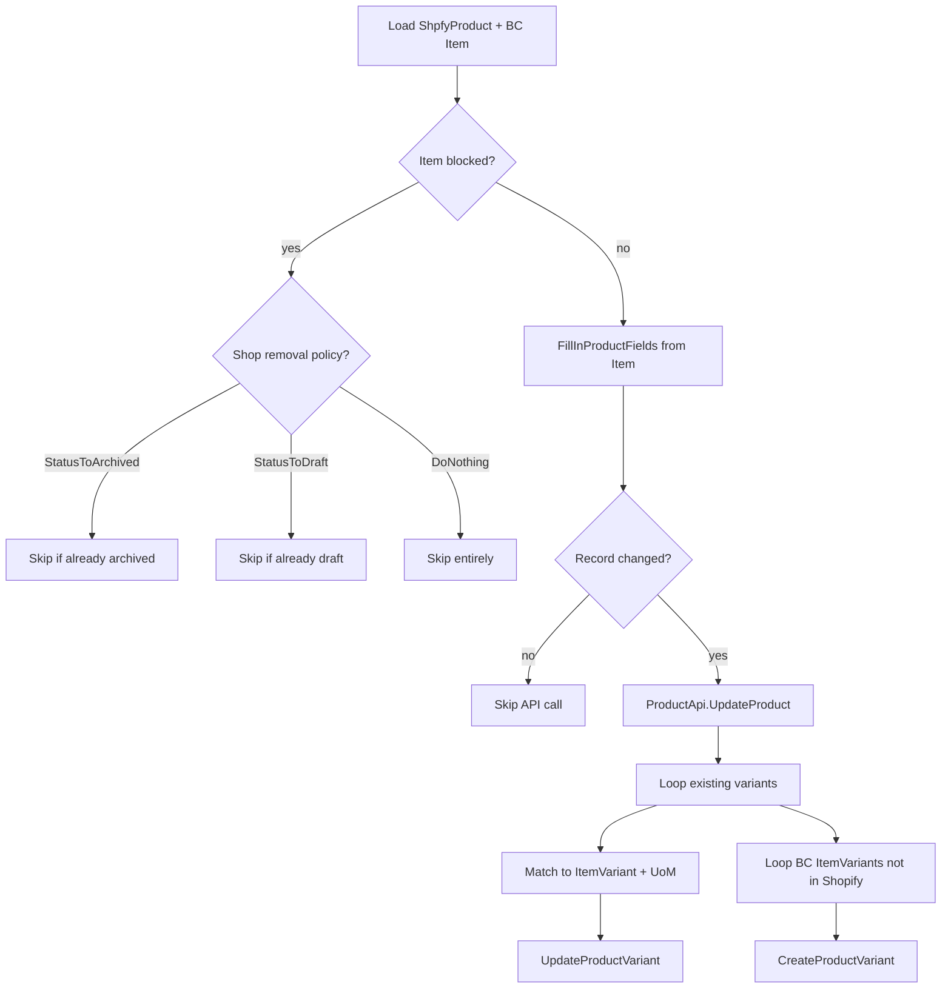
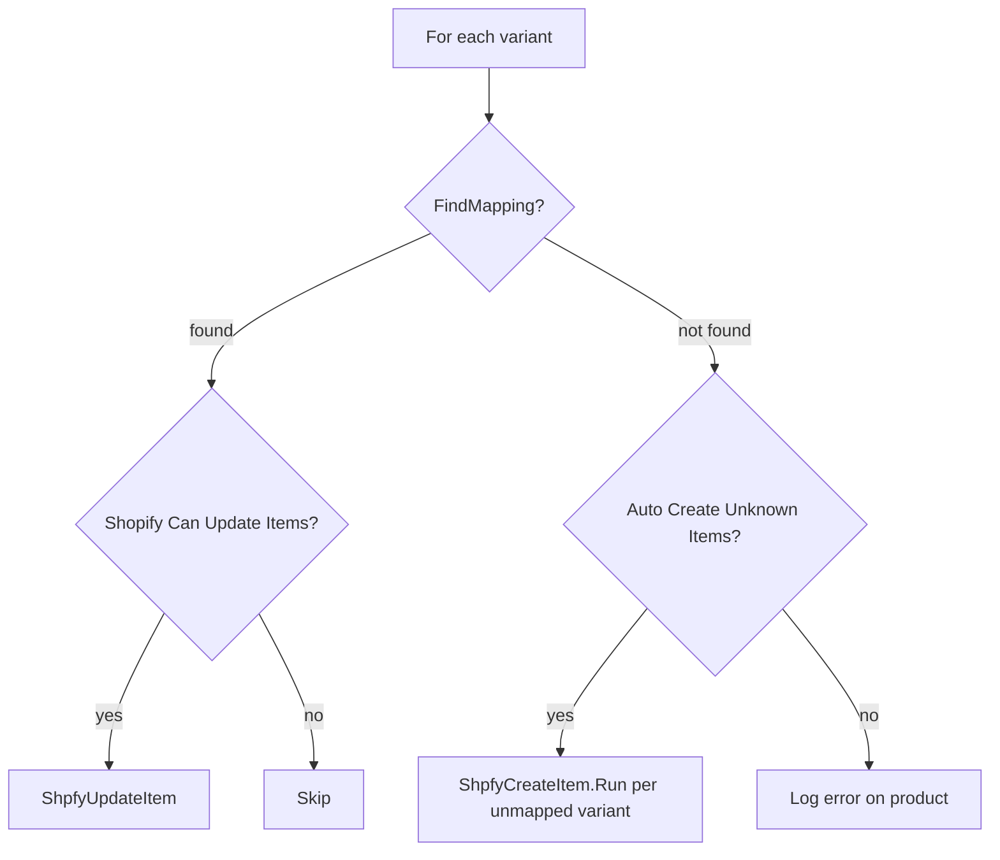

# Products business logic

Two primary flows: Export (BC to Shopify) and Import (Shopify to BC).

## Export flow

`ShpfyProductExport` is the entry point. It filters for products that have an
`Item SystemId` (i.e., already linked to a BC Item), then calls
`UpdateProductData` for each.

Change detection in `UpdateProductData` works by snapshotting the product record
before filling fields, then comparing every field via RecordRef. Only when at
least one field differs does it call the API. This avoids burning API quota on
unchanged products.

Variant handling branches on two axes: whether the item has variants, and whether
`UoM as Variant` is enabled. With UoM-as-variant, the connector searches all three
option slots to find the matching UoM value before deciding create-vs-update. The
logic in `UpdateProductData` is intentionally exhaustive -- it checks Option 1,
then Option 2, then Option 3 for the UoM match.

Price-only mode (`OnlyUpdatePrice`) skips all non-price fields and attempts a bulk
GraphQL mutation through `ShpfyBulkOperationMgt`. If bulk fails, it falls back to
per-variant API calls and reverts any partially applied changes.

### Product creation

When exporting a BC Item that has no Shopify product yet, `ShpfyCreateProduct`
handles initial creation. It builds temp Product and Variant records,
fills prices via `ShpfyProductPriceCalc`, resolves the initial status through
`ICreateProductStatusValue`, and calls `ProductApi.CreateProduct`. Blocked or
sales-blocked item variants are skipped with a logged reason. The 2048-variant
Shopify limit is enforced upfront -- if the expected variant count exceeds it,
the entire item is skipped.

### Price calculation

`ShpfyProductPriceCalc` creates a temporary Sales Quote header using the Shop's
posting groups, VAT settings, customer price group, and currency. It then inserts
a temporary Sales Line for the item/variant/UoM combination and reads the
calculated `Unit Price`, `Line Amount`, and `Unit Cost`. If ComparePrice is less
than or equal to Price after calculation, ComparePrice is zeroed out. Events fire
before and after to allow overrides.

Before any price calculation, `CalcPrice` validates the unit of measure via
`IsValidUoM`. This checks that the UoM code exists in the `Unit of Measure`
table and is a valid `Item Unit of Measure` for the given item. If validation
fails, the entire price sync for that item/variant/UoM combination is skipped
and a `Shpfy Skipped Record` entry is logged with a descriptive message
("Item price is not synchronized because the unit of measure %1 is not valid for
item %2"). This prevents errors when an item's Sales Unit of Measure has been
deleted or is otherwise misconfigured.

*Updated: 2026-04-08 -- CalcPrice now validates UoM before calculating and skips invalid combinations (PR #7498)*

### Image sync

`ShpfySyncProductImage` supports both directions. Export iterates products,
computes the image hash, and pushes changed images via bulk mutation. Import
downloads images by URL and writes them to the BC Item's Picture field. Variant
images are handled separately -- they update Item Variant pictures when the
variant maps to an Item Variant, or the Item picture when it maps to the Item
itself.

### Body HTML generation

`CreateProductBody` in `ShpfyProductExport` assembles the Shopify product
description from three optional sources: extended text lines, marketing text
(Entity Text), and item attributes rendered as an HTML table. Each source is
controlled by a Shop toggle. The result is wrapped in styled divs.

## Import flow

`ShpfyProductImport` processes one product at a time. For each variant it calls
`ShpfyProductMapping.FindMapping` to resolve a BC Item.

Mapping in `ShpfyProductMapping.DoFindMapping` is SKU-strategy-driven. Based on
the Shop's SKU Mapping setting, it tries to match the variant's SKU to an Item
No., Vendor Item No., Variant Code, Item No.+Variant Code (split by separator),
or Barcode. If SKU matching fails, it falls back to barcode matching as a last
resort. The `OnBeforeFindProductMapping` event fires before any of this, allowing
complete override.

Item creation in `ShpfyCreateItem` applies an Item Template (from Shop config or
event override), sets description, prices (converted from shop currency if
needed), vendor, and item category. For `Item No. + Variant Code` and `Variant
Code` SKU mappings, it also creates Item Variants and cross-references
(barcodes, vendor item references).
