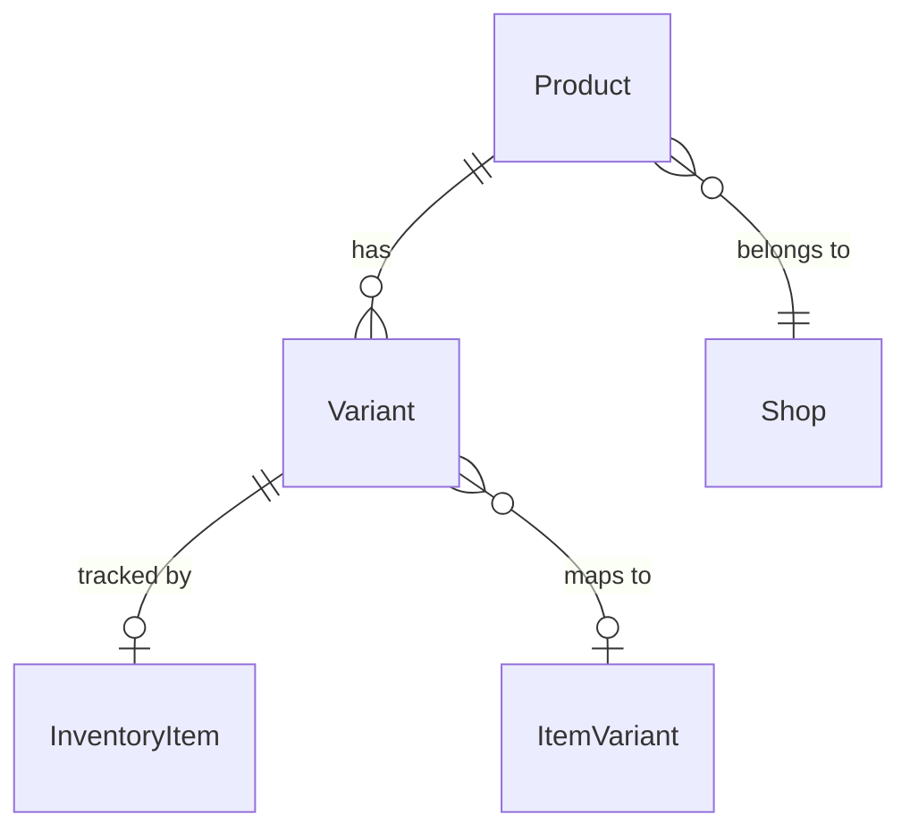

# Products data model

## Entity relationships

## Product (table 30127)

The central record linking a Shopify product to a BC Item. The link is through
`Item SystemId`, a Guid pointing at the BC Item's SystemId. A FlowField `Item No.`
resolves this to a human-readable code, but all logic operates on the Guid. The
secondary key `(Shop Code, Item SystemId)` enforces one product per item per shop.

Hash fields enable cheap change detection. `Description Html Hash`, `Tags Hash`, and
`Image Hash` are integer hashes computed by `Shpfy Hash` and stored alongside the
blob/tag data. Export compares the current hash to the stored one rather than
diffing the full content. `Last Updated by BC` timestamps the most recent export
so the connector can distinguish BC-initiated changes from Shopify-side edits.

The OnDelete trigger is where product removal policy lives. It reads the Shop's
"Action for Removed Products" setting, resolves it to an `IRemoveProductAction`
implementation, and calls `RemoveProductAction` before cascading deletes to
Variants and Metafields.

## Variant (table 30129)

Each Shopify variant belongs to a Product via `Product Id`. It maps to a BC Item
via `Item SystemId` and optionally to an Item Variant via `Item Variant SystemId`.
The `Mapped By Item` flag distinguishes variants that were matched to the item
itself (no variant code) from those matched to a specific Item Variant.

Shopify allows up to three option name/value pairs per variant. The connector uses
these for two different purposes depending on configuration. When `UoM as Variant`
is on, one option slot holds the Unit of Measure code and `UoM Option Id` (1, 2,
or 3) records which slot it occupies. When item attributes are marked "As Option",
the option slots hold attribute name/value pairs instead.

The `Image Hash` field tracks the variant-level image separately from the product
image, enabling per-variant image sync.

## InventoryItem (table 30126)

A Shopify inventory item, linked to a Variant by `Variant Id`. This is Shopify's
physical-goods record -- it holds country of origin, shipping requirements, and
whether inventory is tracked. There is no direct BC table counterpart; it exists
purely to mirror the Shopify data model.

## The "Has Variants" gotcha

When a Product's `Has Variants` is false, the product has a single default variant
in Shopify. The connector maps this variant directly to the BC Item with no Item
Variant needed. When `Has Variants` is true, the connector expects each non-default
Variant to carry an `Item Variant SystemId`. This flag drives branching throughout
export, import, and mapping -- if it gets out of sync with reality, mapping will
silently fail or skip variants.
