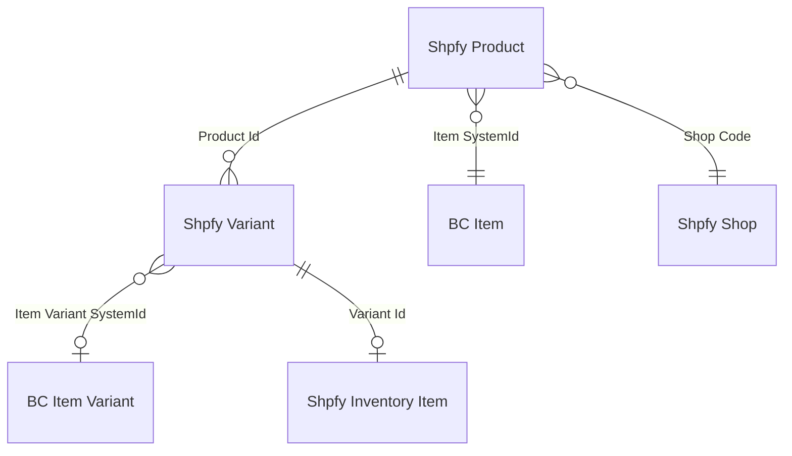

# Products data model

## Key relationships

`Shpfy Product` links to a BC Item through `Item SystemId` (Guid). The `"Item No."` field is a FlowField that resolves through this Guid -- it is never stored directly. This means renumbering an Item does not break the link.

`Shpfy Variant` carries both `Item SystemId` and `Item Variant SystemId`. When a product has no variants in the BC sense (no Item Variants), only `Item SystemId` is populated and `"Mapped By Item"` is set to true. When `"Has Variants"` is true on the parent product, each variant is expected to resolve to a distinct `Item Variant SystemId` unless it was mapped at the item level only.

`Shpfy Inventory Item` is keyed by its own Shopify `Id` and links back to a single `Shpfy Variant` via `Variant Id`. It stores inventory-tracking metadata (tracked, cost, country of origin) but not stock quantities -- those live in the Inventory module.

## Hash fields

Three integer hash fields on `Shpfy Product` drive change detection during export: `Image Hash` (computed from BC Item picture bytes), `Tags Hash` (from comma-separated tags), and `Description Html Hash` (from the HTML blob content). `Shpfy Variant` has its own `Image Hash`. The connector skips API calls when the hash has not changed since the last sync.

## UoM Option Id

When `Shop."UoM as Variant"` is on, each Item Unit of Measure becomes a separate Shopify variant. The `UoM Option Id` field (1, 2, or 3) records which of the variant's three option slots holds the UoM value. For a variant-only product (no UoM expansion), it is set to 0 or left unset. For UoM-only (no BC Item Variants), it is 1. For Item Variant + UoM, the variant code goes in Option 1 and UoM in Option 2, so `UoM Option Id` is 2. The export and mapping logic use this field to know which option value to match when looking up the UoM.

## Obsolete table

`Shpfy Shop Collection Map` (30128) is obsolete as of v28 and will be removed in v31. It was previously used for mapping tax groups/VAT posting groups to Shopify collections. The replacement is `Shpfy Product Collection` which uses a simpler model with an item filter blob.
