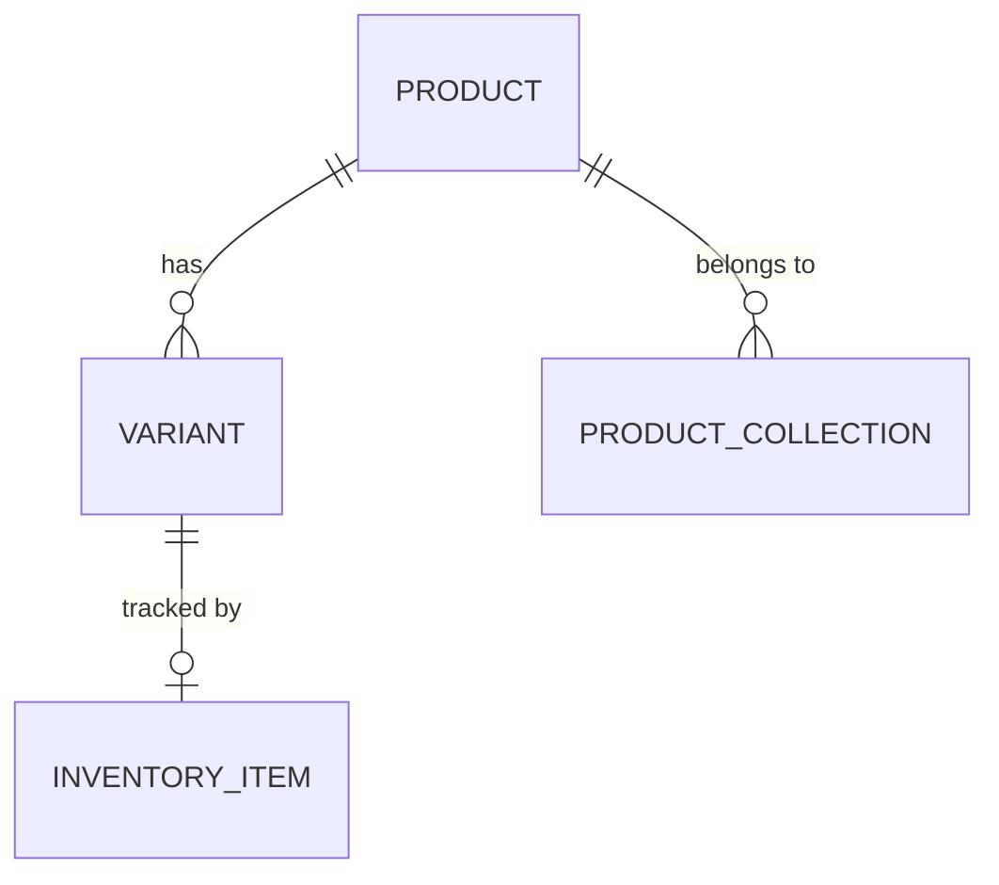
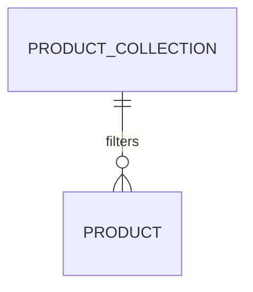

# Data model

## Overview

The product data model bridges two identity systems: BC uses `Item SystemId` (Guid) as the stable link, while Shopify uses BigInteger IDs for products, variants, and inventory items. Every Shopify record carries both identifiers, and a set of hash fields enable cheap change detection without re-comparing blob contents.

## Product-variant-inventory chain

`Shpfy Product` (30127) is the central record. It holds the Shopify product ID, shop code, and a `Item SystemId` Guid that points to the BC Item. The `Item No.` field is a FlowField with a CalcFormula lookup via SystemId -- it is not stored. Hash fields (`Image Hash`, `Tags Hash`, `Description Html Hash`) are integer hashes computed by `ShpfyHash` and stored on the record so the export can skip unchanged products without comparing blob content.

`Shpfy Variant` (30129) carries dual identity: `Item SystemId` for the BC item and `Item Variant SystemId` for the BC item variant. When a variant maps to an item without a BC variant (e.g., a single-variant product), `Mapped By Item` is set to true and `Item Variant SystemId` is cleared. Up to three option name/value pairs (`Option 1..3 Name`, `Option 1..3 Value`) represent Shopify product options. The `UoM Option Id` field (1, 2, or 3) indicates which option slot holds the unit of measure when UoM-as-variant mode is active -- this is critical for the order mapping module to resolve the correct UoM on imported order lines.

`Shpfy Inventory Item` (30126) exists for every variant regardless of whether inventory tracking is enabled. It captures Shopify's internal inventory concept: country/region of origin, tracking state, and unit cost. It is keyed by its own Shopify ID and links back to the variant via `Variant Id`.

## Collections

`Shpfy Product Collection` (30163) represents Shopify collections. The `Default` flag controls whether newly exported products are automatically assigned to the collection. The `Item Filter` blob stores a BC filter expression that determines which items belong to the collection during export. This replaced the older `Shpfy Shop Collection Map` (30128), which is obsolete since version 28 and removed in 31.

## SKU mapping strategies

The `Shpfy SKU Mapping` enum (30132) defines how the import side resolves a Shopify variant's SKU to a BC item. The mapping strategies are: `Item No.`, `Variant Code`, `Item No. + Variant Code` (split by the shop's `SKU Field Separator`), `Vendor Item No.` (checked against the Item Vendor table and item references), and `Bar Code` (checked against item references of barcode type). The `DoFindMapping` procedure in `ShpfyProductMapping.Codeunit.al` implements a fallback chain: first it tries the configured SKU strategy, then falls back to barcode lookup regardless of strategy. This means a barcode match can succeed even when SKU mapping is set to a different mode.

## Interface-driven extensibility

Two interfaces govern product lifecycle behavior during export:

- `ICreateProductStatusValue` determines whether a newly created product starts as Active or Draft. The implementations `ShpfyCreateProdStatusActive` and `ShpfyCreateProdStatusDraft` simply return the corresponding enum value based on the item record.
- `IRemoveProductAction` determines what happens to the Shopify product when a BC item is deleted or the product record is removed. Implementations are `ShpfyToArchivedProduct`, `ShpfyToDraftProduct`, and `ShpfyRemoveProductDoNothing`. The action fires from the product table's `OnDelete` trigger, not from the export codeunit.
