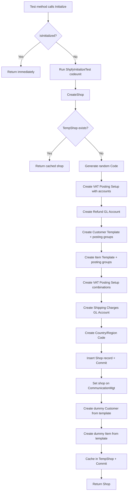
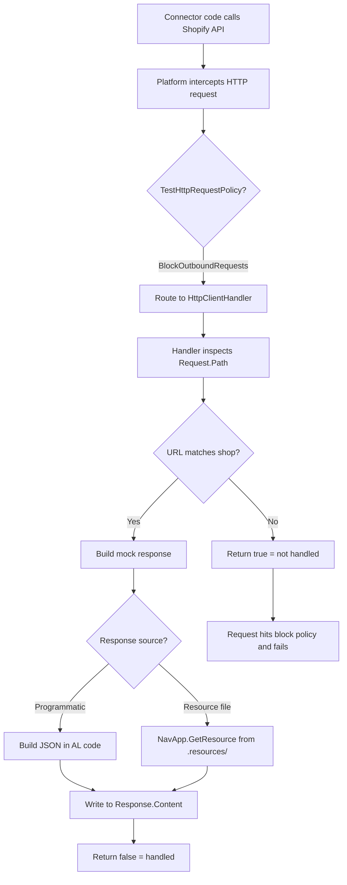
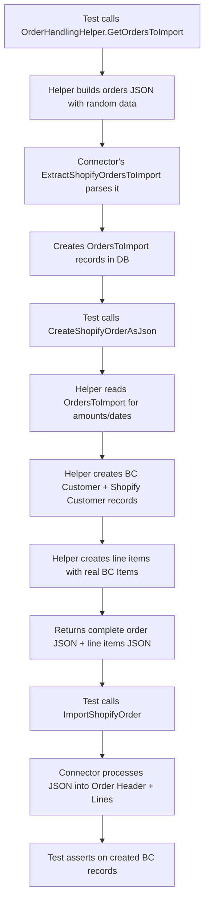

# Business logic

## Overview

The Shopify Connector Test app does not contain business logic in the traditional sense -- it verifies the business logic of the main Shopify Connector app. The "logic" here is the test infrastructure: how test environments are bootstrapped, how HTTP calls are intercepted, and how test data flows from initialization through assertion.

Understanding this infrastructure is essential because every test codeunit depends on it. The initialization creates a realistic-enough BC environment that the connector's mapping, posting, and sync code can execute without hitting missing-data errors. The HTTP mocking layer ensures tests exercise the connector's response-parsing code with known payloads.

## Shop initialization flow

Every test begins with `Initialize()`, which gates on an `isInitialized` boolean to run setup exactly once per session. The setup calls `ShpfyInitializeTest.CreateShop()`, which is the most important procedure in the test app.

The shop creation is deliberately thorough. It creates three VAT posting setup combinations (for the shop's posting group, for empty product group, and for the refund GL account's group) because the connector needs these when processing orders with different tax scenarios. The customer template gets its own customer posting group, general business posting group, and VAT business posting group. The item template gets inventory, general product, and VAT product posting groups.

The dummy customer and item are created from these templates so they inherit the posting group configuration. The customer gets a known email (`dummy@customer.com`) and the item gets a known description (`Dummy Item Description`) -- both are used as lookup keys by `GetDummyCustomer()` and `GetDummyItem()`.

## HTTP mocking infrastructure

The test app uses BC's `[HttpClientHandler]` attribute to intercept HTTP requests at the platform level. This is the modern approach -- it replaced earlier patterns that used event subscribers to mock communication.

There are two distinct patterns for building mock responses:

**Resource-based responses** are used when the response structure is stable and complex. The bulk operations tests load responses from `.resources/Bulk Operations/StagedUploadResult.txt`, `.resources/Bulk Operations/BulkMutationResponse.txt`, etc. These files contain JSON templates with `%1`, `%2` placeholders that are filled via `StrSubstNo`. This keeps large JSON payloads out of AL code.

**Programmatic responses** are used when the response content depends on test parameters. `ShpfyOrderHandlingHelper.CreateShopifyOrderAsJson()` builds an entire order JSON structure in AL, computing prices, tax, and discount amounts based on the order amount from `OrdersToImport`. Similarly, `ShpfyCustomerInitTest.DummyJsonCustomerObjectFromShopify()` builds customer JSON with parameterized IDs and today's date.

The inventory export tests demonstrate a more sophisticated pattern -- the `[HttpClientHandler]` uses the `ShpfyInventoryRetryScenario` enum as a state machine. The handler tracks `CallCount` and returns different responses based on the scenario (success, fail-then-succeed, always-fail). This lets tests verify that retry logic works correctly by asserting on the final call count.

## Domain-specific initialization

Beyond the base shop setup, each domain area has its own initialization codeunit that creates Shopify-side records.

**ShpfyCustomerInitTest** (SingleInstance) creates Shopify customer and address records with known field values. Its `ModifyFields()` procedure uses RecordRef to prepend "!" to all text fields on any record, producing a "modified" version for update-query tests. It also generates expected GraphQL query strings so tests can assert that the connector produces the correct mutation syntax.

**ShpfyProductInitTest** creates BC items with full setup: extended text, item attributes, vendor info, item references (barcodes), and optionally item variants. It creates Shopify product and variant records linked to these items. The `CreateSKUValue()` procedure generates SKU values appropriate to whatever `SKU Mapping` the shop is configured with (bar code, item no., variant code, etc.).

**ShpfyCompanyInitialize** creates B2B company records. **ShpfyOrderHandlingHelper** is the most complex -- it calls into the connector's `OrdersAPI.ExtractShopifyOrdersToImport` with programmatically built JSON, then builds a full order JSON response including line items, tax lines, addresses, and customer data. As a side effect, it creates real Shopify product, variant, and shop location records in the database.

## Test data flow for order processing

Order tests follow a distinctive pattern where the test first generates an "orders to import" payload, feeds it to the connector's extraction logic, then builds a detailed order JSON and feeds that to the import logic.

This two-phase approach (extract-then-import) mirrors how the real connector works: it first gets a lightweight list of orders to import, then fetches full details for each one. The test helper preserves this separation so the connector's actual import codeunits are exercised.

## Access token registration

Tests that make HTTP calls (even mocked ones) need a registered access token because the connector checks for it before making API calls. `ShpfyInitializeTest.RegisterAccessTokenForShop()` creates a `Shpfy Registered Store New` record with a comprehensive scope string and a random token value. This is called in the `Initialize()` of test codeunits that use `[HttpClientHandler]`, like `ShpfyInventoryExportTest` and `ShpfyBulkOperationsTest`.

## Interface mocking via enum extensions

The Shopify Connector uses AL interfaces for extensibility (e.g., `"Shpfy Stock Calculation"`, `"Shpfy IBulk Operation"`). The test app provides mock implementations by extending the corresponding enums:

- `ShpfyStockCalculationExt` adds value "Shpfy Return Const" backed by `ShpfyConstToReturn` -- a codeunit that returns a configurable decimal from `GetStock()`. Tests set the constant via `SetConstToReturn()` and then exercise stock calculation paths.

- `ShpfyBulkOperationType` enum extension adds "AddProduct" backed by `ShpfyMockBulkProductCreate` -- a codeunit that returns hardcoded GraphQL mutation text and input templates. The bulk operations tests use this to exercise the bulk operation lifecycle without needing a real operation type.

This pattern is preferable to event subscribers for interface mocking because it works through the same dispatch mechanism the production code uses.
