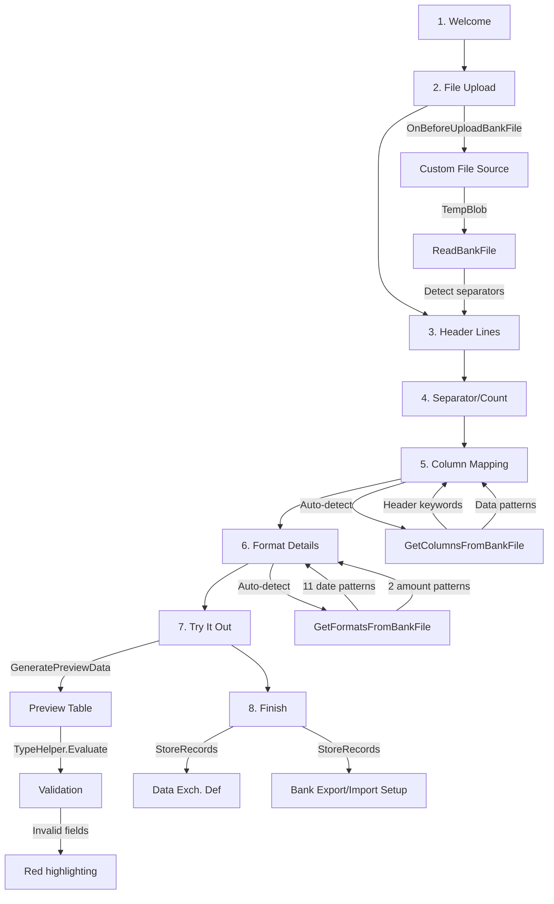

# Business Logic

## Wizard Flow

The Simplified Bank Statement Import wizard (Page 8850) guides users through an 8-step process to configure bank statement import from CSV files.

### Step 1: Welcome

Displays instructions and provides a sample CSV download link. The sample download is only available in demonstration companies.

### Step 2: File Upload

The file upload process follows this sequence:

1. **OnBeforeUploadBankFile** integration event fires, allowing custom file sources (e.g., API integration). If handled externally, the wizard skips the standard upload dialog.
2. **BLOBImportWithFilter** prompts the user to select a CSV file from disk.
3. **ReadBankFile()** analyzes the uploaded content:
   - Detects line separator (CRLF, CR, or LF)
   - Reads the first 50 lines
   - Uses regex to detect whether the file uses comma or semicolon as the field separator
   - Identifies the number of header lines by analyzing line structure

### Step 3: Header Lines

The user can adjust the header line skip count. A preview pane highlights which lines are treated as headers versus data rows.

### Step 4: Separator/Count

The user selects the field separator (Space, Comma, or Semicolon). The wizard validates consistency by checking separator usage across 20 sample lines, then populates the column count.

### Step 5: Column Mapping

The user specifies which column numbers contain Date, Amount, and Description data. **GetColumnsFromBankFile()** attempts to auto-detect these columns using:

1. **Header keyword matching**: Case-insensitive search for "Date", "Amount", and "Description" or "Detail" in the header row.
2. **Data pattern matching**: If keyword matching fails, the wizard applies regex patterns to detect:
   - Date columns (using the 11 date patterns described below)
   - Amount columns (numeric patterns with decimal separators)

### Step 6: Format Details

The user specifies the date format (free text) and decimal separator (Space, Dot, or Comma). **GetFormatsFromBankFile()** auto-detects these formats by testing:

- **11 date regex patterns** covering:
  - dd/MM/yyyy
  - MM/dd/yyyy
  - yyyyMMdd
  - Variations with dot, dash, and slash separators
- **2 amount patterns**:
  - Dot as decimal separator, with optional comma or quote thousands separators
  - Comma as decimal separator, with optional dot thousands separator
  - Swiss single-quote thousands separator (stripped before parsing)

### Step 7: Try It Out

**GeneratePreviewData()** populates the first 10 rows into the Bank Statement Import Preview table. The preview page validates each field using **TypeHelper.Evaluate()** with the appropriate culture context. Invalid fields are highlighted in red, allowing the user to adjust mappings or format settings before finalizing the configuration.

### Step 8: Finish

**StoreRecords()** creates the complete import configuration:

1. **Data Exch. Def** record:
   - Type: Bank Statement Import
   - File Type: Fixed Text
   - Reading/Writing XMLport: Data Exch. Import - CSV
2. **Data Exch. Line Def** record
3. **Data Exch. Mapping** record (target table: Bank Acc. Reconciliation Line)
4. **Three Data Exch. Field Mapping** records:
   - Date -> Field 5
   - Amount -> Field 7
   - Description -> Field 23
5. **Three Data Exch. Column Def** records (one for each mapped column)
6. **Bank Export/Import Setup** record (direction: Import)
7. Optionally updates the **Bank Account** record to link the new import format

## Format Detection Details

### Date Patterns

The wizard tests 11 regex patterns to identify date columns and formats:

- dd/MM/yyyy
- MM/dd/yyyy
- yyyy/MM/dd
- dd-MM-yyyy
- MM-dd-yyyy
- yyyy-MM-dd
- dd.MM.yyyy
- MM.dd.yyyy
- yyyy.MM.dd
- yyyyMMdd
- ddMMyyyy

### Amount Patterns

Two primary patterns detect amount columns:

1. **Dot decimal**: Matches numbers with a dot as the decimal separator. Supports comma or single-quote thousands separators (e.g., 1,234.56 or 1'234.56).
2. **Comma decimal**: Matches numbers with a comma as the decimal separator. Supports dot thousands separators (e.g., 1.234,56).

Swiss-style single-quote thousands separators are stripped from the text before parsing to ensure compatibility with TypeHelper.Evaluate().
