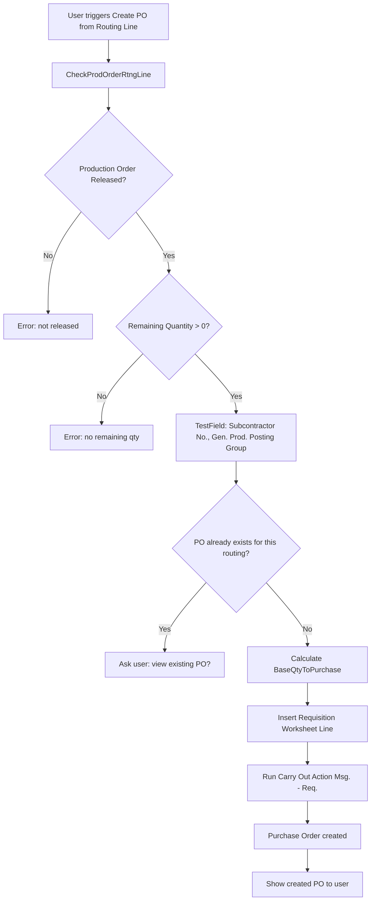
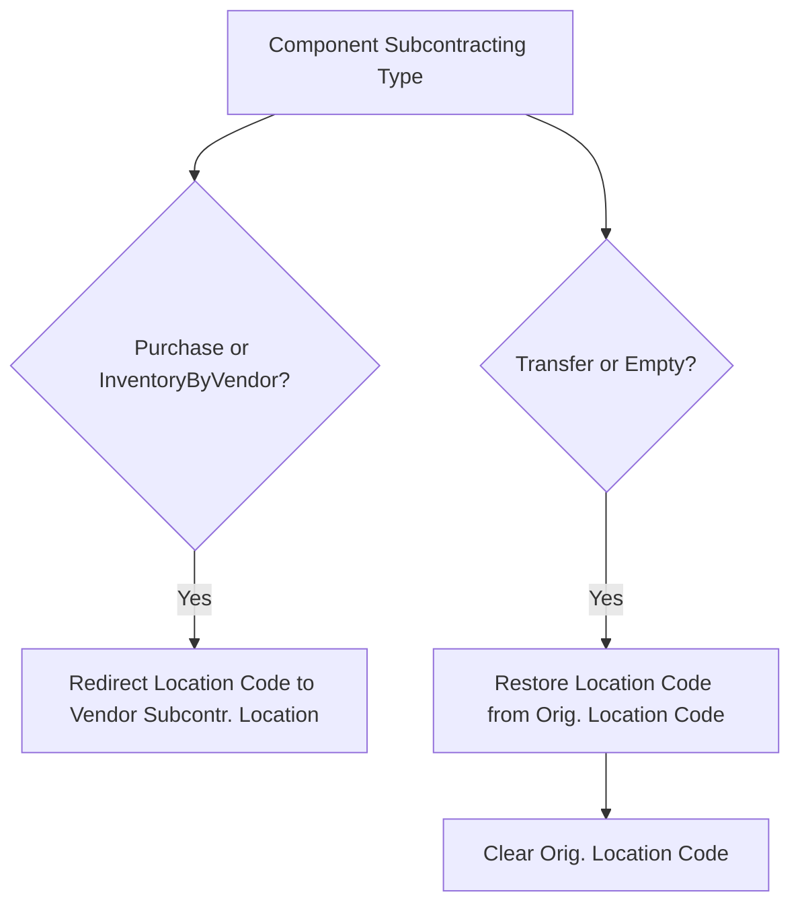
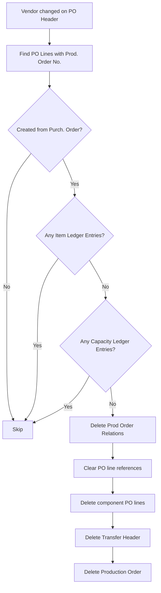

# Business logic

This document covers the major processing flows in the Subcontracting app. The logic is spread across a handful of core codeunits and a larger number of event subscriber codeunits that wire it all together.

## Create subcontracting purchase order from routing line

This is the primary flow. A user looks at a released production order's routing line, sees the work center has a subcontractor, and triggers PO creation. The logic lives in `SubcPurchaseOrderCreator.Codeunit.al`.

The quantity calculation in `GetBaseQtyToPurchase` is critical. It takes the prod order line's base quantity, adjusts for BOM scrap %, then adjusts for accumulated routing scrap factor and fixed scrap quantity. From that, it subtracts both the output quantity already on existing purchase orders AND the actual output quantity already posted. The result is the net quantity still needed.

The requisition line insertion (`InsertReqWkshLine`) is where costing happens. If the work center uses "Unit Cost Calculation = Units", the direct unit cost is the routing line's cost times the UOM conversion factor. If it uses time-based calculation, the cost is derived from the expected operation cost amount divided by total expected output quantity. The function also checks whether an existing purchase line already covers this routing operation -- if so, it creates a "Change Qty." or "Resched. & Chg. Qty." action message instead of "New".

**Gotcha**: The setup fields "Subcontracting Template Name" and "Subcontracting Batch Name" must be populated in SubcManagementSetup or the flow fails immediately with TestField errors.

## Component provisioning strategies

When a production order is refreshed and BOM components are transferred to Prod. Order Components, `SubcCalcProdOrderExt` fires on `OnAfterTransferBOMComponent`. It copies the "Subcontracting Type" from the Production BOM Line to the component and snapshots the current Location Code and Bin Code into "Orig. Location Code" and "Orig. Bin Code".

The provisioning strategy determines what happens to the component's location. The logic lives in `SubcontractingManagement.ChangeLocation_OnProdOrderComponent`:

**Purchase** (value 1, "Purchase with Service"): Components appear as additional item lines on the subcontracting purchase order. `TransferSubcontractingProdOrderComp` in `SubcPurchaseOrderCreator` finds all components with Subcontracting Type = Purchase and the matching Routing Link Code, then creates purchase lines for each. The component's location is redirected to the vendor's subcontracting location.

**InventoryByVendor** (value 2): The component's location is redirected to the vendor's location (same as Purchase), but no purchase lines are created. The assumption is the vendor already has the materials.

**Transfer** (value 3): The component stays at its original location. Transfer orders are created separately (via the "Create Transfer Order" report) to ship components from the production location to the subcontractor. The app handles reservation entry transfer from the Prod. Order Component to the Transfer Line, then back from Transfer Receipt to Prod. Order Component upon receipt.

**Gotcha**: The "Routing Link Code" is the join key between routing operations and components. If a component has no Routing Link Code, the provisioning type validation exits immediately and does nothing. You cannot have subcontracting provisioning without routing links.

## Component location management

When a routing line's work center changes, the linked components' locations must update. `UpdLinkedComponents` handles this. It finds all components matching the routing line's status, prod order no., routing reference, and routing link code. If the new work center has a subcontractor, components with Purchase/InventoryByVendor type get their location redirected; components with Transfer/Empty type get their original location restored.

The update prompts the user for confirmation ("If you change the Work Center, you will also change the default location for components...") unless ShowMsg is false. A separate flow `DelLocationLinkedComponents` resets components to the SKU's "Components at Location" when the routing link association changes.

## Quantity synchronization

`SubcSynchronizeManagement` handles bidirectional sync between purchase lines and production orders, but only for production orders with "Created from Purch. Order" = true.

**Date sync** (`SynchronizeExpectedReceiptDate`): When a purchase line's Expected Receipt Date changes and no receipts have been posted, the production order's Due Date is updated to match.

**Quantity sync** (`SynchronizeQuantity`): When a purchase line's Quantity or UOM changes and no receipts have been posted, the production order's Quantity is updated. This cascades: the prod order line's quantity is validated, which re-runs "Quantity per" validation on all components, recalculating expected quantities throughout.

**Gotcha**: Both sync paths check `PurchaseLine."Qty. Received (Base)" <> 0` as a guard. Once you've received anything against the PO, sync stops. This is a safety mechanism -- you shouldn't change production order quantities after partial receipt.

## Cascade delete

The most destructive flow in the app. It triggers in two scenarios.

**Vendor change on PO header** (`DeleteEnhancedDocumentsByChangeOfVendorNo`): When the Buy-from Vendor No. changes on a purchase header, the event subscriber in `SubcPurchaseHeaderExt` calls this procedure. For each purchase line with a Prod. Order No., it checks whether the linked production order was "Created from Purch. Order". If yes, and if no Item Ledger Entries or Capacity Ledger Entries exist for that production order, it:

1. Calls `ProductionOrder.DeleteProdOrderRelations()` (deletes all lines, components, routing lines)
2. Clears all subcontracting references on the purchase lines (ModifyAll on Prod. Order No., etc.)
3. Deletes component purchase lines linked via "Subc. Prod. Order No."
4. Finds and deletes the related transfer header (filtered by Source ID = vendor, Source Type = Subcontracting)
5. Deletes the production order itself

**Purchase line deletion** (`DeleteEnhancedDocumentsByDeletePurchLine`): Same logic but scoped to a single purchase line.

**Gotcha**: The ILE check uses `ItemLedgerEntry.IsEmpty()` on a variable named `ItemLedgerEntry2` but checks `ItemLedgerEntry.IsEmpty()` (the first variable's filter set). This looks like a potential bug in the transfer header deletion path -- the second ILE check may not have the correct filters applied.

## Price lookup

Price resolution lives in `SubcPriceManagement.Codeunit.al` and flows through `SetRoutingPriceListCost`. The lookup process is:

1. Build a filter set on SubcontractorPrice: Vendor No. exact, Work Center No. (exact or blank), Standard Task Code exact, Item No. (exact or blank), Variant Code (exact or blank), Starting Date range (0D to order date), Ending Date range (>= order date or 0D)
2. Call `FindLast()` -- the most recent matching price wins
3. Handle UOM conversion: if the price list UOM differs from the production UOM, convert through base UOM quantities
4. Apply minimum quantity filtering via `GetPriceByUOM`: re-filter on Minimum Quantity <= ordered quantity, FindLast again
5. Check minimum amount: if price * quantity < Minimum Amount, use Minimum Amount / quantity instead
6. Convert currency if the price list currency differs from the order currency
7. Round to Unit-Amount Rounding Precision

The price lookup is called from three paths: production order routing refresh (`ApplySubcontractorPricingToProdOrderRouting`), planning routing transfer (`ApplySubcontractorPricingToPlanningRouting`), and standard cost calculation (`CalcStandardCostOnAfterCalcRtngLineCost`). The standard cost path is notable because it uses the SingleInstanceDictionary to receive the Item record ID and calculation date from earlier event subscribers -- there's no direct parameter passing available.

**Gotcha**: The filter `SetFilter("Work Center No.", '%1|%2', WorkCenterNo, '')` means a price with blank Work Center matches any work center. Same for Item No. and Variant Code. This is the "fallback price" mechanism, but it means a poorly configured price list can produce unexpected matches.

## Production order creation from purchase line (wizard flow)

The wizard in `SubcCreateProdOrdOpt.Codeunit.al` creates a production order from a purchase line -- the reverse of the standard flow. It:

1. Validates the purchase line (must be item type, no existing prod order, open status, etc.)
2. Loads BOM and Routing from the best source (Stockkeeping Unit first, then Item)
3. Determines the scenario (BothAvailable, PartiallyAvailable, NothingAvailable)
4. Optionally shows the wizard page where users can edit BOM lines, routing lines, and resulting prod order components using temporary copies
5. Creates real BOM/Routing/Versions if they don't exist (or if modified)
6. Creates a Released Production Order with "Created from Purch. Order" = true
7. Transfers temporary components and routing lines to the real production order
8. Updates the purchase line to reference the new production order
9. Runs `TransferSubcontractingProdOrderComp` to create component purchase lines

The entire transfer-to-real-tables step runs under `[CommitBehavior(CommitBehavior::Ignore)]`, which means the calling code controls the transaction boundary.
