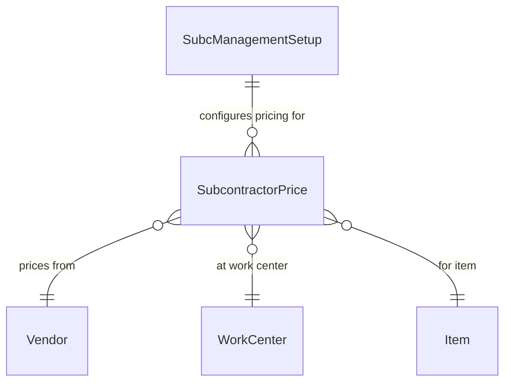
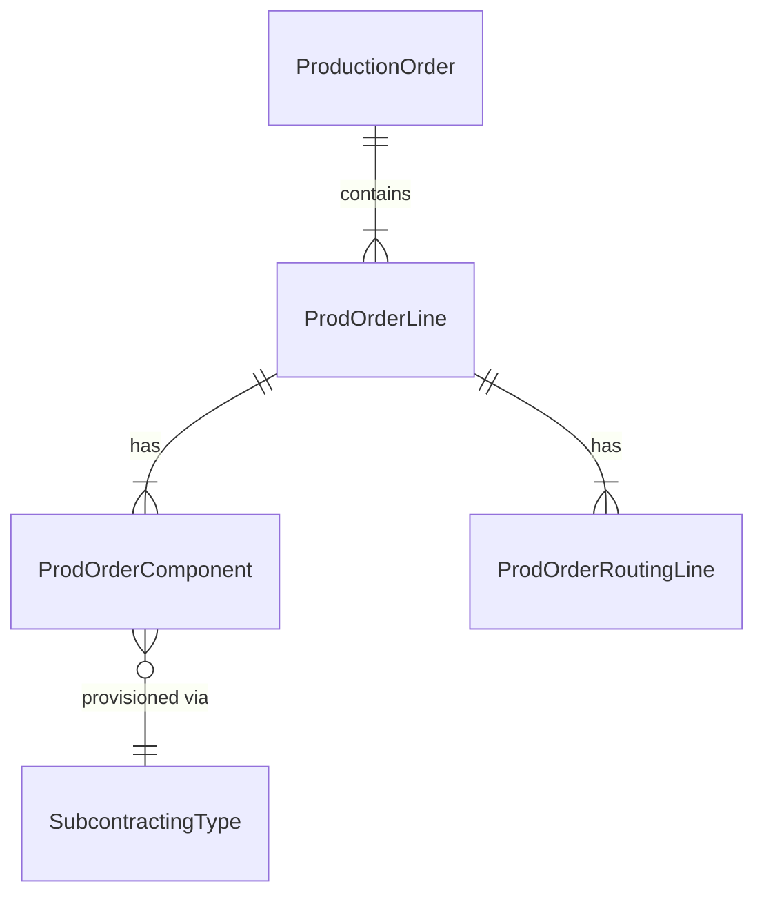
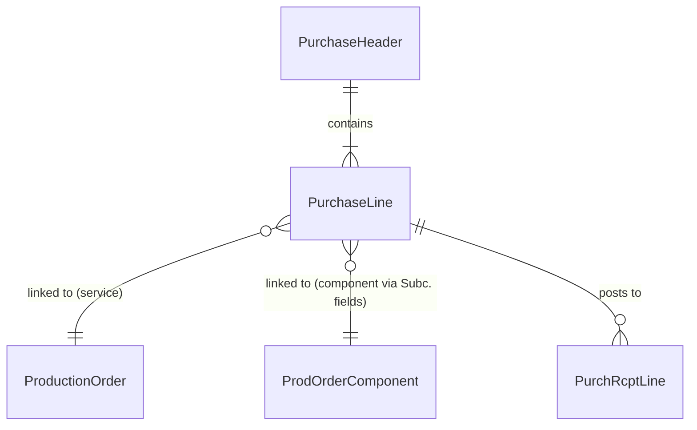
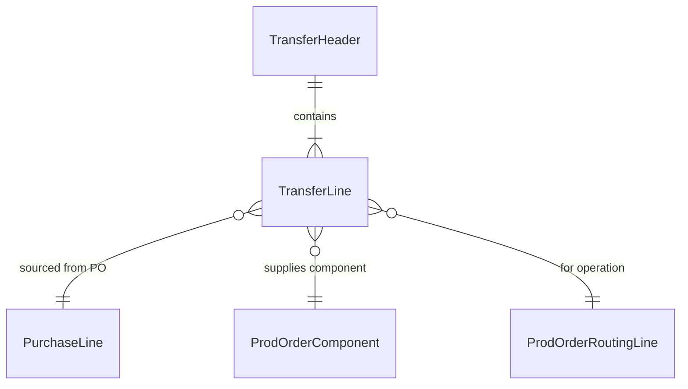
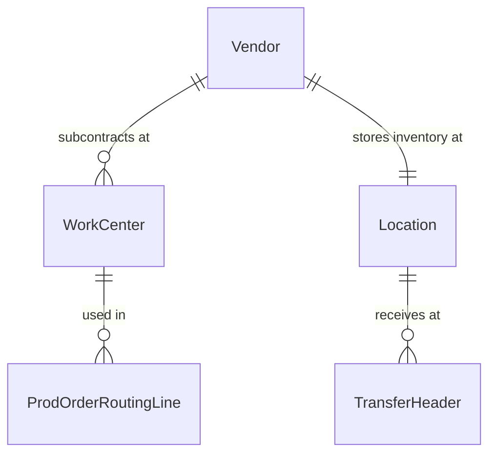

# Data model

The Subcontracting app introduces only two new tables and extends 26 existing ones. Understanding the data model means understanding how the app weaves references across BC's manufacturing, purchasing, and transfer domains.

## Pricing and setup

The `SubcontractorPrice` table (99001500) is the app's dedicated price list for subcontracting services. Its primary key is a 9-field composite: Vendor No., Item No., Work Center No., Variant Code, Standard Task Code, Starting Date, Unit of Measure Code, Minimum Quantity, and Currency Code. This is deliberately wide -- it lets you express "vendor X charges Y for item Z when processed at work center W in variant V using task T, starting from date D, for quantities above Q, in currency C." The price resolution in `SubcPriceManagement` uses `FindLast()` with range filters on this key, so the most-specific-match-wins behavior depends on key ordering and the filter ranges applied.

The table also carries "Minimum Amount" and "Ending Date" fields, plus two secondary keys that drop some dimensions for different query patterns. Worth noting: "Direct Unit Cost" is the only output field -- the rest of the key is pure input dimensions.

`SubcManagementSetup` (99001501) is the singleton configuration table. It controls the requisition worksheet template/batch used for PO creation, the "Common Work Center No." fallback, component location strategy, direct transfer settings, wizard UI show/edit behavior (six separate enum fields for three scenarios times two wizard steps), and miscellaneous flags like "Always Save Modified Versions" and "Create Prod. Order Info Line". If this record doesn't exist, many procedures silently exit via the cached `HasSubManagementSetup` flag.

## Manufacturing extensions

The Production Order gets a single boolean: "Created from Purch. Order". This flag is the master switch for reverse synchronization -- when true, changes to the linked purchase line's quantity or expected receipt date propagate back to the production order. When false, the production order and purchase order live independent lives.

Prod. Order Component receives the heaviest extension. The "Subcontracting Type" enum (Empty, Purchase, InventoryByVendor, Transfer) drives how components reach the subcontractor. "Orig. Location Code" and "Orig. Bin Code" snapshot the component's original location before the app redirects it to the vendor's subcontracting location -- they're the rollback mechanism when a transfer line is deleted or the subcontracting type changes back.

The component also gains four FlowFields that aggregate quantities across Item Ledger Entries and Transfer Lines: "Qty. transf. to Subcontr" (from ILE), "Qty. in Transit (Base)" (from Transfer Line), "Qty. on Trans Order (Base)" (from Transfer Line outstanding), plus return-order variants of the transit/outstanding fields. All four filter on a "Purchase Order Filter" FlowFilter, so the component shows transfer quantities scoped to a specific subcontracting purchase order.

Prod. Order Routing Line gets "Vendor No. Subc. Price" (override vendor for price lookups) and a "Subcontracting" boolean FlowField that checks whether the linked work center has a subcontractor. Production BOM Line and Planning Component both get "Subcontracting Type" to carry the provisioning strategy through the planning pipeline.

Capacity Ledger Entry gets "Subcontractor No." and purchase order reference fields, completing the audit trail from posted capacity back to the subcontracting PO.

## Purchase flow

Purchase Header gains "Subc. Location Code" (copied from vendor on validation) and "Subcontracting Order" -- a FlowField that returns true if any line has a non-empty Prod. Order No. This FlowField is used as a filter in the Prod. Order Component's "Purchase Order Filter" FlowFilter.

Purchase Line gets six "Subc." prefixed fields: Prod. Order No., Prod. Order Line No., Routing No., Rtng Reference No., Operation No., and Work Center No. These are the component-line references -- distinct from the base "Prod. Order No." / "Operation No." fields which link the service line. The service line uses base fields; the component lines use "Subc." fields. All are non-editable and filtered to Released production orders.

The same six-field pattern is replicated on Purch. Rcpt. Line, Purch. Inv. Line, Purchase Line Archive, Purchase Header Archive, and Purch. Cr. Memo Line -- ensuring the subcontracting context survives posting and archiving.

Requisition Line gets "Standard Task Code" (for price lookup), three UOM conversion fields ("Base UM Qty/PL UM Qty", "PL UM Qty/Base UM Qty", "UoM for Pricelist"), and "Pricelist Cost". These support the triple-conversion price display on the subcontracting worksheet where the price list UOM, the requisition UOM, and the base UOM may all differ.

## Transfer flow

Transfer Header gains source tracking fields ("Source ID", "Source Type", "Source Subtype", "Source Ref. No.") that identify the subcontracting context, plus "Subcontr. Purch. Order No.", "Return Order" boolean, and "Direct Transfer Posting" enum. The Direct Transfer Posting field is inherited from the destination Location on validation -- this is where the app controls whether transfers post as shipment+receipt pairs or as single direct transfer documents.

Transfer Line is the most heavily indexed extension in the app. It adds 10 fields (Subcontr. Purch. Order No., Subcontr. PO Line No., Prod. Order No., Prod. Order Line No., Prod. Order Comp. Line No., Routing No., Routing Reference No., Work Center No., Operation No., Return Order) and **five secondary keys**:

- Key99001500: PO No. + PO Line + Prod Order + Prod Line + Comp Line -- finding transfer lines for a specific purchase-to-component link
- Key99001501: Prod Order + Routing No. + Routing Ref + Operation + PO No. -- finding transfer lines for a routing operation
- Key99001502: PO No. + Prod Order + Prod Line + Operation -- finding transfer lines from a purchase order perspective
- Key99001503: Prod Order + Prod Line + Routing Ref + Routing No. + Operation -- similar to Key99001501 with different leading columns
- Key99001504: Prod Order + Prod Line + Comp Line + PO No. + Return Order -- the key used by FlowFields on Prod. Order Component, separating regular and return transfers

Transfer Receipt Line, Transfer Shipment Line, Direct Trans. Header, and Direct Trans. Line all mirror the same reference fields, ensuring posted documents carry the subcontracting context forward.

## Master data extensions

Vendor gets "Subcontr. Location Code" (the location where the subcontractor holds inventory), "Linked to Work Center" FlowField (whether any work center references this vendor), and "Work Center No." (the primary work center for this subcontractor). The "Subcontr. Location Code" is mandatory -- `GetSubcontractor()` calls `TestField` on it.

Location gets "Direct Transfer Posting" enum controlling how direct transfers are posted at that location. The extension also adds OnAfterValidate triggers on "Require Put-away", "Require Receive", "Use As In-Transit", and "Use Cross-Docking" that enforce `TestField("Direct Transfer Posting", Empty)` -- you cannot enable warehouse handling features on a location that uses direct transfer posting.

Item Ledger Entry gets "Prod. Order No.", "Prod. Order Line No.", "Subcontr. Purch. Order No.", "Subcontr. PO Line No.", and "Operation No.", plus a secondary key on these fields. This enables the FlowField on Prod. Order Component that aggregates transferred quantities.

Item Journal Line gets "Subcontracting" boolean and "Item Charge Sub. Assign." boolean, used during purchase posting to route item charge entries through the correct posting logic for subcontracting output entries.

## Cross-cutting concerns

**Cascading reference tracking**: Every document in the chain (purchase line, transfer line, item ledger entry, capacity ledger entry) carries references back to the production order AND the purchase order. This bidirectional referencing is what makes the factbox navigation work -- `SubcFactboxMgmt` can start from any document type and find the related documents by reading these reference fields.

**Status=Released filter everywhere**: Every TableRelation pointing to Production Order or its sub-tables filters on `Status = const(Released)`. This is a hard constraint -- the app only works with released production orders.

**Return Order flag separation**: Transfer Lines and Transfer Headers carry a "Return Order" boolean. The FlowFields on Prod. Order Component use this flag to separate regular transfer quantities from return transfer quantities, and the five secondary keys include it as a filter dimension. Return orders have empty Routing No. and Operation No., distinguishing them from outbound component transfers.
