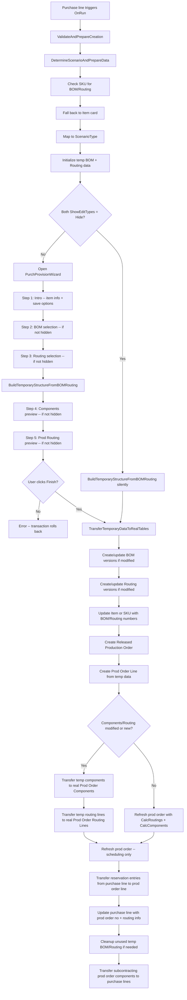

# Business logic -- Production Order Creation Wizard

## Overview

The Production Order Creation Wizard takes a purchase line for a subcontracted item and produces a fully configured Released Production Order with BOM components, routing operations, and reservation linkage. It is the most complex single feature in the Subcontracting app because it must handle multiple scenario paths (existing BOM+Routing, partial data, or nothing at all), let users preview and modify manufacturing data without touching real tables, create BOM/Routing versions when modifications are made, and atomically commit the result while wiring up the production order back to the purchase line.

The core challenge is that the wizard operates in two distinct phases: an interactive editing phase where everything lives in temporary tables, and a commit phase where temporary data is selectively materialized into real records. The orchestrator (`SubcCreateProdOrdOpt.Codeunit.al`) coordinates both phases, while `SubcTempDataInitializer.Codeunit.al` owns the temporary table state and `SubcVersionMgmt.Codeunit.al` handles BOM/Routing version resolution and creation.

The wizard UI itself is a five-step NavigatePage (`SubcPurchProvisionWizard.Page.al`) whose visible steps are dynamically controlled by the scenario type and the `Subc. Management Setup` configuration. Steps can be hidden, shown read-only, or shown with full editing, making the page flow a data-driven state machine.

## Scenario detection

When the wizard starts, `DetermineScenarioAndPrepareData` resolves BOM and Routing numbers from the best available source. The lookup order is:

- **Stockkeeping Unit first.** `GetBOMAndRoutingFromStockkeepingUnit` looks up the SKU using the purchase line's Location Code and Variant Code. If the SKU exists and has either a Production BOM No. or Routing No., the source type is set to `StockkeepingUnit` and the BOM/Routing numbers come from the SKU.
- **Item fallback.** If no SKU is found (or the SKU has neither BOM nor Routing), the code falls back to `Item."Production BOM No."` and `Item."Routing No."`. The source type is set to `Item` if either is populated, or `Empty` if neither exists.

The BOM/Routing presence then maps to one of three `SubcScenarioType` values defined in `SubcScenarioType.Enum.al`:

- `BothAvailable` -- both BOM No. and Routing No. are non-empty
- `PartiallyAvailable` -- exactly one of them is non-empty
- `NothingAvailable` -- both are empty

The `Subc. Management Setup` table has six fields that control wizard behavior per scenario. For each scenario type, there are two `Show/Edit Type` settings:

- **BOM/Routing Show/Edit** (`ShowRtngBOMSelect_Both`, `ShowRtngBOMSelect_Partial`, `ShowRtngBOMSelect_Nothing`) -- controls Steps 2 and 3 (BOM selection and Routing selection)
- **Prod Components/Routing Show/Edit** (`ShowProdRtngCompSelect_Both`, `ShowProdRtngCompSelect_Partial`, `ShowProdRtngCompSelect_Nothing`) -- controls Steps 4 and 5 (Components and Prod Order Routing preview)

The `Show/Edit Type` enum (`SubcShowEditType.Enum.al`) has three values: `Hide` (skip the steps entirely), `Show` (display read-only), and `Edit` (allow modifications). When both types are `Hide`, the wizard skips user interaction completely -- `ShouldSkipUserInteraction` returns true and the code calls `BuildTemporaryStructureFromBOMRouting` directly.

## Temporary data management

The entire editing phase works on temporary records managed by `SubcTempDataInitializer`. This codeunit holds nine temporary global tables:

- `TempGlobalProductionOrder` and `TempGlobalProdOrderLine` -- the prod order skeleton
- `TempGlobalProductionBOMHeader` and `TempGlobalProductionBOMLine` -- BOM data for the wizard's BOM step
- `TempGlobalRoutingHeader` and `TempGlobalRoutingLine` -- Routing data for the wizard's Routing step
- `TempGlobalProdOrderComponent` and `TempGlobalProdOrderRoutingLine` -- the production order components and routing operations for the preview steps
- `TempGlobalPurchaseLine` -- the originating purchase line, kept for reference

Initialization happens in stages. `InitializeTemporaryProdOrder` creates the temp prod order and prod order line from the purchase line (using a GUID-based temporary order number like `TEMP-xxxxxxxx`). Then `InitializeNewTemporaryBOMInformation` creates a default BOM header and a single BOM line using the preset component item from setup, and `InitializeNewTemporaryRoutingInformation` creates a default routing header and one or two routing lines (a subcontracting operation using the vendor's work center or the common work center, plus an optional put-away operation if the location requires warehouse handling).

If BOM/Routing already exist, `LoadBOMLines` and `LoadRoutingLines` copy the real records into the temp tables, filtered by the version code returned from `SubcVersionMgmt.GetDefaultBOMVersion` / `GetDefaultRoutingVersion`.

The wizard page binds to these temp tables via `SetTemporaryRecords` calls on each subpage. The `SubcTempProdOrdBind` codeunit subscribes to `OnBeforeBuildTemporaryStructureFromBOMRouting` to create a "dummy" real Prod. Order Line record so that temp routing line validation (which internally checks for a parent prod order line in the real table) does not fail. It also intercepts modify/delete events on temporary Prod. Order Routing Lines to create and clean up corresponding dummy real records. All dummies are deleted when the wizard page closes via the `OnClosePageEvent` subscriber.

When the user transitions from the Routing step to the Components step (forward navigation), `BuildTemporaryStructureFromBOMRouting` is called. This method explodes the temp BOM lines into temp Prod. Order Components (recursively flattening nested Production BOMs) and converts temp Routing Lines into temp Prod. Order Routing Lines. Component location codes are set based on subcontracting type -- `InventoryByVendor` and `Purchase` types use the vendor's subcontracting location, while `Transfer` types use the components location from the purchase line context. The vendor's subcontracting location code is passed to the components page via `SingleInstanceDictionary` under the key `SetSubcontractingLocationCodeFromVendor`.

## Version management

`SubcVersionMgmt.Codeunit.al` provides version resolution, selection UI, and existence checks for both BOMs and Routings.

When the wizard opens, it resolves the default version for each BOM and Routing using `GetDefaultBOMVersion` and `GetDefaultRoutingVersion`, which delegate to the standard `VersionManagement` codeunit with `WorkDate()` as the effective date. The wizard page lets the user pick a different version via assist-edit lookups (`ShowBOMVersionSelection`, `ShowRoutingVersionSelection`) that filter to Certified versions only.

If the user wants to edit BOM or Routing lines, they must first toggle the "Create New Version" checkbox on the wizard page. This generates a temporary version code (like `TEMP-VERSION-xxxxxxx`) and sets the lines as editable. The BOM lines are editable only when the version does not already exist in the real table -- `SetBOMRoutingEditable` checks `SubcVersionMgmt.CheckBOMExists` and enables editing only when it returns false.

During the commit phase in `SubcCreateProdOrdOpt`, version creation follows this logic:

- **No existing version code** (new BOM/Routing with no real record). `CreateBOMIfNotExists` and `CreateRoutingIfNotExists` allocate a new number from the Manufacturing Setup No. Series, insert a real BOM/Routing header and lines from the temp data, and certify the header.
- **Existing version code but record does not exist** (user created a new version). `SaveBOMVersionIfRequired` and `SaveRoutingVersionIfRequired` allocate a new version code from the BOM/Routing header's Version Nos. series, call `SubcTempDataInitializer.UpdateBOMVersionCode` / `UpdateRoutingVersionCode` to rewrite the temp lines with the real version code, insert a `Production BOM Version` or `Routing Version` record with the temp header's description and unit of measure, copy all temp lines to real lines, and certify the version.
- **Existing version code and record exists** (user did not modify). The check methods (`CheckBOMExists`, `CheckRoutingExists`) return true, so the save procedures exit immediately and the existing version is used as-is.

## Production order creation

The commit phase begins with `TransferTemporaryDataToRealTables`, which binds `SubcProdOrderCreateBind` to intercept events during production order creation.

`SubcProdOrderCreateBind` has three event subscriptions that shape the production order:

- It suppresses the routing-number-not-blank check on Prod. Order Routing Line (since the routing may not be assigned yet during intermediate steps).
- It intercepts `OnBeforeGetSubcontractor` to provide the vendor from the purchase line rather than requiring a work center lookup.
- It intercepts `OnAfterTransferSubcontractingFieldsBOMComponent` to set the correct component location code for transfer-type components during the refresh cycle.

`CreateReleasedProductionOrderFromTemp` initializes a new Production Order with status Released, copies source item, variant, due date, quantity, and location from the temp record, and sets `"Created from Purch. Order" := true`. A single Prod. Order Line is created from the temp data in `CreateProdOrderLineFromTemp`, which sets up the BOM/Routing references depending on whether components and routing will be transferred from temp tables or calculated by the standard refresh.

If the user modified components or routing in the wizard (tracked by `ProdCompRoutingModified`), or if the BOM/Routing are brand new, `TransferComponentsAndRoutingLines` copies each temp Prod. Order Component and Prod. Order Routing Line to real records. Components receive full field mappings including subcontracting-specific fields like `Subcontracting Type`, `Orig. Location Code`, and `Orig. Bin Code`. Routing lines receive time fields (Setup, Run, Wait, Move), the vendor subcontracting price reference, and routing link codes.

After transfer, the production order is refreshed via `CalculateProdOrder.Calculate`. If components and routing were transferred from temp data, the refresh runs with `CalcRoutings := false` and `CalcComponents := false` (scheduling only). If they were not transferred (existing BOM/Routing used unchanged), the refresh runs with both flags true so the standard engine generates them.

`FinalizeProductionOrderCreation` then:

1. Transfers reservation entries from the purchase line to the new prod order line by collecting them into a temp table, deleting the originals, and reinserting them with the prod order line as the source.
2. Updates the purchase line with `Prod. Order No.`, `Prod. Order Line No.`, routing info, operation number, and work center. It tries to find a routing line whose work center matches the purchase vendor, falling back to any subcontractor work center, and finally to the first routing line.
3. Calls `CleanupTemporaryBOMAndRoutingIfNotNeeded`, which deletes newly created BOMs/Routings if the user chose `Empty` for the save-to-source option (meaning they did not want to persist them to Item or SKU). It also deletes newly created BOM/Routing versions unless `Always Save Modified Versions` is enabled.
4. Calls `HandleSubcontractingAfterUpdate`, which creates additional purchase lines for subcontracting components by invoking `SubcPurchaseOrderCreator.TransferSubcontractingProdOrderComp`.

## Things to know

- The wizard modifies the purchase line on commit -- it overwrites `Prod. Order No.`, `Prod. Order Line No.`, `Routing No.`, `Routing Reference No.`, `Operation No.`, `Work Center No.`, `Description`, `Expected Receipt Date`, and resets quantity base fields to zero before re-validating through the work center pricing flow.
- If the BOM and Routing already exist and the user made no modifications, no new versions are created. The existing certified versions are referenced directly on the prod order line, and the standard `CalculateProdOrder` refresh generates components and routing operations from them.
- The `TransferTemporaryDataToRealTables` procedure is decorated with `[CommitBehavior(CommitBehavior::Ignore)]`, so the entire commit phase participates in the caller's transaction. If the wizard was cancelled (user did not click Finish), `Error('')` is raised, which rolls back everything.
- Cleanup can delete BOM/Routing records and versions that were created during the commit phase. This happens when `GlobalSubcRtngBOMSourceType` is `Empty` (user chose not to save to Item or SKU). The cleanup sets the status back to "Under Development" before deleting, since certified records cannot be deleted directly.
- Nested Production BOMs are supported. `CreateTemporaryComponentFromBOMLine` in `SubcTempDataInitializer` handles BOM lines of type `Production BOM` recursively, flattening sub-BOMs into the component list with multiplied quantities.
- The wizard uses dummy real database records (via `SubcTempProdOrdBind`) to satisfy validation logic on temporary Prod. Order Routing Lines. These dummies are inserted into the real Prod. Order Line and Prod. Order Routing Line tables and deleted on page close. If the wizard crashes without cleanup, orphan dummy records with GUID-based temp order numbers could remain.
- The `SubcRtngBOMSourceType` enum controls where BOM/Routing numbers are persisted after creation. `Item` writes them to the Item card, `StockkeepingUnit` writes them to the SKU (creating one if it does not exist), and `Empty` means the BOM/Routing are used only for this production order and not saved back to master data.
