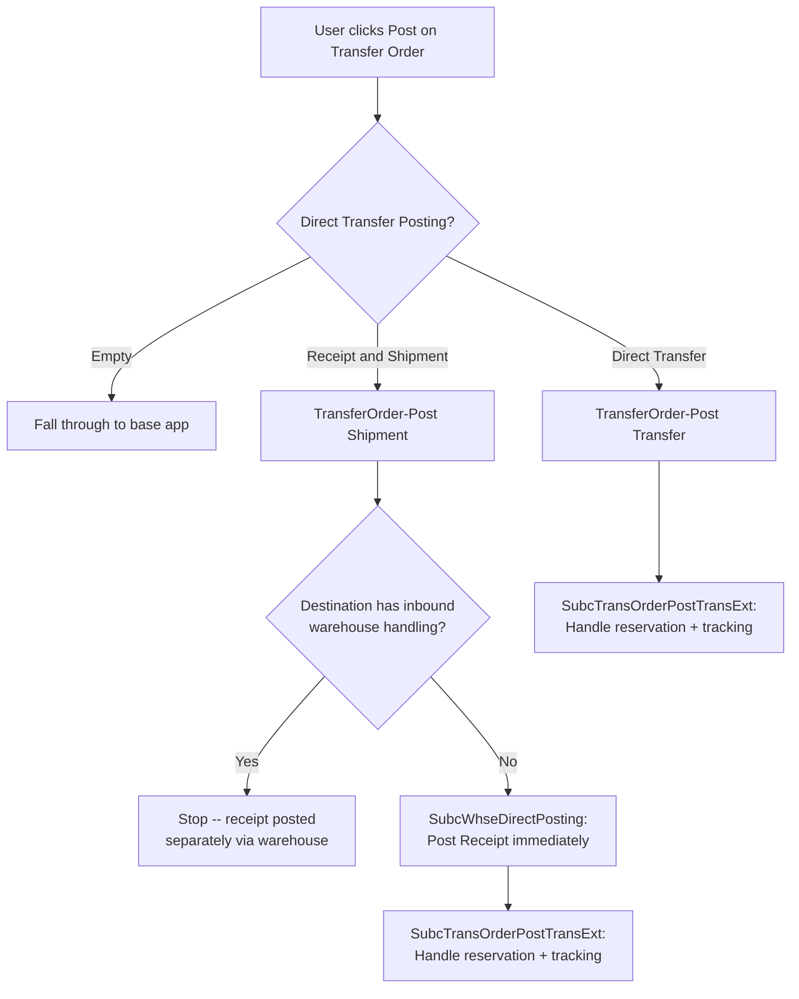

# Business logic -- Transfer domain

## Overview

The Transfer domain handles the physical movement of production order components between the company's own locations and a subcontractor's location. When a vendor performs manufacturing operations, the raw materials (components) need to get to that vendor's location and eventually come back. Transfer orders are the mechanism for this, and the subcontracting app extends the base app's transfer infrastructure with production order awareness, reservation chain management, and custom posting behavior.

This is the hardest part of the Subcontracting app to understand. A regular Business Central transfer order just moves inventory from A to B. A subcontracting transfer order must also maintain reservation links between the Prod. Order Component and the items in transit, preserve serial/lot/package tracking through the entire shipment-receipt cycle, and update the component's location code on the production order so consumption posting works correctly at the destination. The complexity is compounded by two fundamentally different posting modes (shipment+receipt vs. direct transfer), warehouse handling integration, and return order support.

The Transfer domain spans 13 codeunits in `Codeunits/Extensions/Transfer/`, 9 table extensions in `Tableextensions/Transfer/`, and 8 page extensions in `Pageextensions/Transfer/`. The core orchestration also lives partly in `SubcontractingManagement.Codeunit.al` which contains the reservation entry transfer procedures.

## Component transfer creation

Transfer orders for subcontracting components are created by two processing-only reports, not by codeunit calls.

**Outbound transfers** are created by `SubcCreateTransfOrder.Report.al`. It iterates over purchase lines on a subcontracting purchase order, finding Prod. Order Components linked via the routing link code that have `Subcontracting Type` = `Transfer`. For each qualifying component, it calculates the needed quantity (via `MfgCostCalculationMgt.CalcActNeededQtyBase`) minus what's already on transfer orders or in transit, then creates transfer lines.

The transfer-from location is the component's current location (or its original location if the component was already moved to the subcontractor location by a previous `InventoryByVendor` setup). The transfer-to location is the vendor's subcontracting location, resolved from the purchase header's `Subc. Location Code` field or falling back to `Vendor."Subcontr. Location Code"`.

The report reuses existing open transfer headers when one already exists for the same vendor, from/to location pair, and return order = false. This avoids creating separate transfer orders for each component line on the same purchase order.

After inserting each transfer line, the report:

1. Saves the component's original location/bin in `Orig. Location Code` / `Orig. Bin Code`
2. Calls `TransferReservationEntryFromProdOrderCompToTransferOrder` to move reservation entries from the Prod. Order Component to the outbound Transfer Line
3. Updates the component's location code to the transfer-to location (the subcontractor's location)
4. Calls `CreateReservEntryForTransferReceiptToProdOrderComp` to create matching inbound reservation entries between the Transfer Line (inbound direction) and the Prod. Order Component at the new location

**Return transfers** are created by `SubcCreateSubCReturnOrder.Report.al`. The flow is similar but reversed: transfer-from is the subcontractor's location, transfer-to is the component's original location. The Transfer Header gets `Return Order` = true. The report also checks that a return transfer order doesn't already exist for the same purchase line/prod order combination (`CheckTransferLineExists`).

## Transfer posting

Transfer posting is where the subcontracting app diverges most from base app behavior. The `Direct Transfer Posting` enum on Location (and propagated to Transfer Header) controls which path is taken.

### The posting override -- SubcTransferPostExt

When a user clicks "Post" on a transfer order, the base app fires the `OnCodeOnBeforePostTransferOrder` event. `SubcTransferPostExt.Codeunit.al` subscribes to this and overrides the default dialog entirely via `OverrideDefaultTransferPosting`. Based on the `Direct Transfer Posting` value on the Transfer Header:

- **Receipt and Shipment**: Runs `TransferOrder-Post Shipment` followed by `TransferOrder-Post Receipt` sequentially. This creates shipment and receipt documents with in-transit inventory between them.
- **Direct Transfer**: Runs `TransferOrder-Post Transfer` which posts in a single step without in-transit.
- **Empty**: Exits without posting (falls through to base app behavior).

### Field propagation during posting

Six copy-field codeunits ensure subcontracting fields survive through posting. When a Transfer Shipment Header is created from a Transfer Header, `SubcTransShptHeaderExt` copies Source Type, Source ID, Return Order, and the purchase order reference. `SubcTransOrderPostShptExt` does the same for shipment lines and their item journal lines. The receipt side mirrors this via `SubcTransRcptHeaderExt` and `SubcTransOrderPostRcptExt`. For direct transfers, `SubcDirectTransferLineExt` copies fields to Direct Trans. Line, and `SubcTransOrderPostTransExt` copies them to the item journal line.

The receipt posting codeunit (`SubcTransOrderPostRcptExt`) also validates the Prod. Order Component's location code on `OnCheckTransLine` -- if the component's location doesn't match the transfer-to location, it updates the component.

### One-step warehouse posting -- SubcWhseDirectPosting

When a transfer uses `Receipt and Shipment` posting but the destination location has no inbound warehouse handling (no Require Put-away, no Require Receive), `SubcWhseDirectPosting.Codeunit.al` orchestrates posting both the shipment and receipt as a single atomic operation. It suppresses commits on the shipment side, then calls `PostRelatedInboundTransfer` to immediately post the receipt after the shipment completes. The `IsDirectTransfer` check (confusingly named -- it checks for one-step Receipt and Shipment, not the Direct Transfer enum value) returns true when `Direct Transfer` is false on the header, the destination has no inbound warehouse handling, and the posting type is `Receipt and Shipment`.

This codeunit also customizes the warehouse activity posting confirmation dialog via `WhseActYesNoQuestion` to inform users that both the outbound and inbound transfer will be posted together.

## Reservation entry management

This is the most intricate part of the transfer domain. Reservation entries link supply to demand in Business Central, and subcontracting transfers must maintain these chains as components move through multiple states.

### Phase 1 -- Creation-time transfer (Prod. Order Component to Transfer Line)

When a transfer order is created (in `SubcCreateTransfOrder.Report.al`), `TransferReservationEntryFromProdOrderCompToTransferOrder` in `SubcontractingManagement` moves existing reservations from the Prod. Order Component to the outbound Transfer Line. It uses `ReservationEntry.TransferReservations` with Direction::Outbound (source subtype 0) and stores the original entries in `TempGlobalReservationEntry` for the next phase.

Then `CreateReservEntryForTransferReceiptToProdOrderComp` creates new reservation entries linking the inbound Transfer Line (source subtype 1, using `Derived From Line No.` to identify the line) back to the Prod. Order Component at its new location. Only entries with item tracking (lot/serial/package) that have `Reservation` status are processed.

### Phase 2 -- Post-time rewiring (Transfer Line to Item Ledger Entry to Prod. Order Component)

After a direct transfer posts, `SubcTransOrderPostTransExt.HandleDirectTransferReservationAndTracking` runs. This is triggered by both `OnAfterPostItemJnlLineReceipt` (for Receipt and Shipment mode where the receipt posting fires with `Direct Transfer` = true on the item journal line) and `OnAfterPostItemJnlLineDirectTransfer` (for actual Direct Transfer mode).

The procedure collects the Item Entry Relations from the posting, then:

1. **HandleReservationEntries**: Finds old reservation pairs where one side is the inbound Transfer Line and the other is the Prod. Order Component. For each pair, it matches by serial/lot/package number against the newly created Item Ledger Entries. When a match is found, it creates a new reservation linking the Item Ledger Entry to the Prod. Order Component via `CreateReservEntryForProdOrderComp`, then deletes the old reservation pair.

2. **HandleItemTrackingSurplus**: For any Item Ledger Entries with tracking that didn't get matched to an existing reservation (no Reservation-status entry exists for them), it creates Surplus-status reservation entries linking the Item Ledger Entry to the Prod. Order Component. The `ShouldCreateSurplusForComponent` check verifies item no., variant code, and location code match.

### Item tracking preservation

Serial numbers, lot numbers, and package numbers are preserved by matching. During `HandleReservationEntries`, the old reservation entry's tracking fields are compared against the Item Ledger Entry created by posting. The `CreateReservEntryForProdOrderComp` procedure uses `CreateReservEntry.CreateReservEntryFor` / `CreateReservEntryFrom` to build a new reservation pair that carries the tracking forward. The "For" side is the Item Ledger Entry (supply), and the "From" side uses `FromTrackingSpecification.SetSourceFromReservEntry(OldReservationEntryPair)` to point back at the Prod. Order Component (demand).

For surplus entries, `CreateSurplusEntryForProdOrderComp` builds the pair in the opposite direction: the "For" side is the Prod. Order Component and the "From" side is the Item Ledger Entry. The reservation status is always `Surplus`, and `SetItemLedgEntryNo` ties it to the specific ledger entry.

## Return orders

Return orders reverse the flow -- they move components from the subcontractor's location back to the company. The `Return Order` boolean on Transfer Header/Line is the distinguishing flag, set to true during creation by `SubcCreateSubCReturnOrder.Report.al`.

**Location reversal**: For returns, the transfer-from location is the subcontractor's location and the transfer-to location is the component's `Orig. Location Code` (the location the component was at before being sent to the subcontractor). The `GetTransferToLocationCode` procedure in the return report resolves this differently depending on `Subcontracting Type` -- for `Purchase` type it uses the purchase line's location, for `Transfer` type it uses the `Components at Location` setup.

**Separate FlowFields**: The `SubcProdOrderCompExt` table extension defines separate FlowFields for returns: `RetQtyInTransit (Base)` and `RetQtyOnTransOrder (Base)`. These filter on `Return Order` = true on Transfer Line, parallel to the regular `Qty. in Transit (Base)` and `Qty. on Trans Order (Base)` which filter on `Return Order` = false. This separation prevents return quantities from netting against outbound quantities.

**Reservation handling**: Returns follow the same reservation transfer pattern as outbound orders. The return report calls `TransferReservationEntryFromProdOrderCompToTransferOrder` and `CreateReservEntryForTransferReceiptToProdOrderComp` in the same way. The component's location is updated to the transfer-to location (which is the original location for returns).

**Guard against duplicates**: The `CheckTransferLineExists` procedure in the return report prevents creating a return transfer order if one already exists for the same purchase line, prod order, and prod order line combination.

## Things to know

- The `SubcTransferLineExt` codeunit handles Transfer Line deletion by calling `UpdateLocationCodeInProdOrderCompAfterDeleteTransferLine` to restore the Prod. Order Component's original location code. If you delete a transfer line, the component goes back to where it was before.

- The `SubcProdOrderCompExt` codeunit blocks opening Item Tracking Specification on a component that already has reservation entries on a linked transfer line (`ValidateSubcontractingReservationConstraints`). It also blocks changing location code or quantity per on a component when a transfer order or purchase order exists.

- The `IsDirectTransfer` method in `SubcWhseDirectPosting` is counterintuitively named -- it returns true for Receipt and Shipment one-step posting, not for the Direct Transfer enum value. It checks that `Direct Transfer` (the base app boolean) is false, the destination has no inbound warehouse handling, and `Direct Transfer Posting` is `Receipt and Shipment`.

- When the `Direct Transfer Posting` enum on Transfer Header is set to `Direct Transfer`, `ValidateDirectTransferPosting` in the table extension auto-enables the base app's `Direct Transfer` boolean. It uses a `Do Not Validate` flag to prevent recursive validation. There's a TODO comment noting this causes Quality Management test failures.

- All subcontracting fields on Transfer Line use the 99001xxx field ID range. The table extension adds five secondary keys for efficient lookups by purchase order, prod order, routing, and operation number combinations.

- The `Orig. Location Code` and `Orig. Bin Code` fields on Prod. Order Component are critical breadcrumbs. They record where the component was before subcontracting moved it. If these are blank when you try to create a return order, the return report won't know where to send components back. They're set during transfer order creation and cleared when the transfer line is deleted.

- Transfer receipt posting (`SubcTransOrderPostRcptExt`) quietly updates the Prod. Order Component's location code if it doesn't match the transfer-to location. This is a side effect that can be surprising if you're debugging location mismatches after receipt posting.
