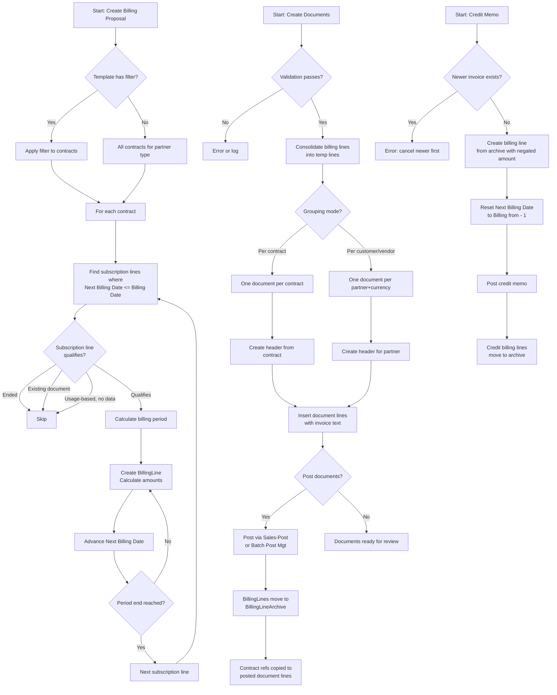

# Business logic

This document covers the key business processes implemented in the Billing
module's codeunits.

## Billing proposal creation

**Codeunit: `BillingProposal.Codeunit.al` (8062)**

The billing proposal is the first step in the billing pipeline. It scans
contract subscription lines and creates BillingLine records for periods
that are due for invoicing.

### Entry point

`CreateBillingProposal(BillingTemplateCode, BillingDate, BillingToDate)`
is the main entry point, called from the RecurringBilling page or from
`BillingTemplate.BillContractsAutomatically()` for automated runs.

### Flow

The process starts by deleting any billing lines marked `Update Required`
for the template (these are stale lines where the underlying subscription
line changed after the proposal was created). It then reads the template's
stored filter and applies it to Customer or Vendor Subscription Contract
records.

For each matching contract, `ProcessContractServiceCommitments` finds
subscription lines where `Next Billing Date <= BillingDate` and the
billing rhythm matches the template's filter. Each qualifying subscription
line enters `ProcessServiceCommitment`, which applies a series of skip
checks:

- **Ended subscription line** -- `Next Billing Date > End Date` means the
  line has been fully billed
- **Existing billing line with a document** -- the subscription line
  already has an unposted invoice or credit memo; skip it (and mark the
  credit memo for display if running interactively)
- **Usage-based billing** -- the subscription line is usage-based but no
  unbilled UsageDataBilling records exist; skip it
- **Extension point** -- `OnCheckSkipSubscriptionLineOnElse` lets
  subscribers add custom skip logic

### Period calculation

`CalculateBillingPeriod` determines the billing window:

- `BillingPeriodStart` is the subscription line's `Next Billing Date`
- If a `BillingToDate` was specified, that becomes the period end
- For usage-based lines, the period is derived from the charge start/end
  dates in UsageDataBilling records
- Otherwise, the period end is calculated by advancing through billing
  rhythm intervals until the end date passes `BillingDate`

### Billing line creation (recursive)

`UpdateBillingLine` is the core logic and it recurses. For a single
subscription line, it may create multiple billing lines if the billing
period spans several rhythm intervals. For example, a monthly billing
rhythm with a 3-month billing-to date produces three billing lines.

Each iteration:

1. Sets `Billing from` to the current start date
2. Calculates `Billing to` as the lesser of the next rhythm boundary and
   the period end
3. Populates line fields from the subscription line and contract
4. Calculates unit amounts via `CalculateBillingLineUnitAmountsAndServiceAmount`
5. Inserts the billing line
6. Advances `Next Billing Date` on the subscription line
7. If the period end hasn't been reached and the subscription line hasn't
   ended, recurses for the next interval

### Amount calculation

For standard (non-usage) lines, `ServiceCommitment.UnitPriceAndCostForPeriod`
prorates the subscription line's price/cost for the billing period relative
to the billing rhythm. The result is rounded per the currency's precision
settings.

For usage-based lines, amounts come from aggregating `UsageDataBilling`
records. The billing line's amount is the sum of usage amounts (or cost
amounts for vendor lines), with the subscription line's discount
percentage applied on top.

### Harmonized billing

When a customer contract type has harmonized billing enabled, the billing
to date is capped at the contract's `Next Billing To` date. This aligns
billing periods across all subscription lines in the contract so they can
be invoiced together.

## Document creation

**Codeunit: `CreateBillingDocuments.Codeunit.al` (8060)**

This codeunit transforms billing lines into actual sales or purchase
documents. It runs as a `TableNo = "Billing Line"` codeunit, receiving
filtered billing lines.

### Validation

Before creating documents, the codeunit runs several checks:

- **Single partner type** -- all billing lines must be for the same
  partner type (Customer or Vendor)
- **No "Update Required" lines** -- forces the user to refresh the
  proposal first
- **Consistency check** -- for each subscription line entry, the filtered
  billing line count must match the total count; partial selections that
  create gaps in the billing period are rejected
- **Item Unit of Measure** -- verifies that the subscription's unit of
  measure exists on the invoicing item

In automated mode, validation failures are logged to
`ContractBillingErrLog` instead of raising errors. The affected billing
lines get the error log entry number stamped on them.

### Temporary billing line consolidation

`CreateTempBillingLines` consolidates multiple billing lines for the same
subscription line into a single temporary line for document creation.
This means if a subscription line has three monthly billing lines, they
produce one document line with aggregated amounts and a combined billing
period (earliest `Billing from` to latest `Billing to`).

The temporary line also determines the document type: positive net amount
= Invoice, negative = Credit Memo. Discount lines invert this logic.

### Document grouping strategies

The grouping depends on the template's `Customer Document per` (or Vendor
equivalent):

**Per contract** (`CreateSalesDocumentsPerContract` /
`CreatePurchaseDocumentsPerContract`):
- One document per contract
- Document type (Invoice vs Credit Memo) is determined by net amount
  across all billing lines for that contract
- Contract description lines are inserted before the billing lines

**Per customer** (`CreateSalesDocumentsPerCustomer`):
- One document per unique combination of Partner No. + Detail Overview +
  Currency Code
- When a document spans multiple contracts, the posting description
  changes to "Multiple Customer Subscription Contracts"
- Address information from the contract can be inserted in collective
  invoices (`Contractor Name in coll. Inv.`, `Recipient Name in coll.
  Inv.` settings on the contract)

**Per vendor** (`CreatePurchaseDocumentsPerVendor`):
- One document per unique combination of Partner No. + Currency Code

### Invoice text generation

Sales lines get their description from a configurable pipeline. The
`Subscription Contract Setup` defines what text appears in the main
invoice line description and up to five additional description lines. Each
slot can be set to show: Service Object description, Subscription Line
description, Customer Reference, Serial No., Billing Period, Primary
Attribute, or blank. The `OnGetAdditionalLineTextElseCase` event allows
adding custom text types.

Purchase lines use a simpler scheme: the subscription line description
plus a billing period description line.

### Posting

If `PostDocuments` is enabled, sales documents are posted after creation.
A single document posts directly via `Sales-Post`. Multiple documents use
`Sales Batch Post Mgt.` with error message management so failures don't
block the entire batch.

Purchase document posting is not supported from this codeunit.

## Sales and purchase document lifecycle

**Codeunits: `SalesDocuments.Codeunit.al` (8063),
`PurchaseDocuments.Codeunit.al` (8066)**

These SingleInstance codeunits manage the relationship between billing
lines and sales/purchase documents throughout their lifecycle.

### On document/line deletion

When a sales or purchase document is deleted, the codeunits determine
the cleanup strategy based on context:

- **Credit memo with Applies-to Doc. No.** -- the billing lines are
  deleted and the subscription line's `Next Billing Date` is reset (the
  credit memo was correcting a specific invoice)
- **Document created from contract (Billing Template Code = '')** -- the
  billing lines are deleted and Next Billing Date is reset (this was a
  direct contract invoice that should be fully unwound)
- **Document created from Recurring Billing page** -- the document
  reference is cleared from the billing lines but the lines themselves
  remain (the user can regenerate documents from the proposal)

### On document posting

When a sales/purchase document is posted, the billing lines are moved to
BillingLineArchive with the posted document number, then deleted. The
posted document lines receive the contract reference fields
(`Subscription Contract No.`, `Subscription Contract Line No.`) from the
billing lines.

The `Recurring Billing` flag is also transferred to Customer/Vendor
Ledger Entries via `OnBeforeCustLedgEntryInsert` /
`OnBeforeVendLedgEntryInsert` subscribers.

### Subscription item handling (SalesDocuments only)

`SalesDocuments` has extensive logic for "Subscription Items" -- items
whose value comes entirely from subscription billing rather than the
sales order. When posting sales orders containing these items:

- Unit prices and discount amounts are zeroed before posting (so no
  revenue is recognized on the order)
- Quantities are restored after posting to preserve the order line state
- `Qty. to Invoice` is always forced to zero
- Posted invoice headers/lines are suppressed if *all* lines are
  subscription items
- Subscriptions (Service Objects) are created from shipped item lines with
  associated subscription lines

## Billing correction

**Codeunit: `BillingCorrection.Codeunit.al` (8061)**

Credit memos for subscription billing are created exclusively through the
"Create Corrective Credit Memo" function on posted invoices, which uses
Copy Document Management internally.

### Chronological enforcement

The codeunit enforces strict chronological ordering of corrections. Before
creating a credit memo billing line, it checks:

```
if ServiceCommitment."Next Billing Date" - 1 > RecurringBillingToDate then
    Error('...cancel the newer invoices first.');
```

This means you must credit the most recent invoice first, then work
backwards. The reason: crediting an older invoice without crediting newer
ones would leave a gap in the billing timeline, making Next Billing Date
inconsistent.

### What the correction does

1. Reads BillingLineArchive records for the original posted invoice line
2. Creates new BillingLine records with negated amounts
3. Sets `Correction Document Type` = Invoice and `Correction Document No.`
   to the posted invoice number
4. Resets the subscription line's `Next Billing Date` to `Billing from - 1`
   (the day before the credited period started)
5. For usage-based lines, duplicates the UsageDataBilling records as credit
   memo entries

### Copy restrictions

The codeunit blocks copying recurring billing documents for any purpose
other than creating a credit memo from a posted invoice. Attempting to
copy to an invoice or from a non-posted document raises the error
"Copying documents with a link to a contract is not allowed."

## Billing automation

**Codeunits: `AutoContractBilling.Codeunit.al` (8014),
`SubBillingBackgroundJobs.Codeunit.al` (8034)**

Automated billing uses the BC Job Queue. The flow is:

1. A `BillingTemplate` has `Automation` set to "Create Billing Proposal
   and Documents"
2. `SubBillingBackgroundJobs.ScheduleAutomatedBillingJob` creates a
   recurring Job Queue Entry running codeunit 8014 with the template's
   RecordId
3. At the scheduled interval, the Job Queue runs
   `AutoContractBilling.OnRun`, which loads the template and calls
   `BillContractsAutomatically`
4. This method creates the billing proposal, then creates documents
   (without posting, without request page interaction)

Key constraints:

- Only Customer templates can be automated (Vendor templates raise an
  error on `Automation` validation)
- The user must have `Auto Contract Billing Allowed` in User Setup to
  modify automation settings, clear proposals, or delete documents when
  any automation template exists
- Errors during automated runs go to `ContractBillingErrLog` rather than
  raising errors
- Date calculations use `Today()` instead of `WorkDate()` for background
  processes

## End-to-end flow



## Document change management

**Codeunit: `DocumentChangeManagement.Codeunit.al` (8074)**

This codeunit is the guard that prevents manual edits to billing-generated
documents. It subscribes to `OnBeforeValidateEvent` on most fields of
Sales Header, Sales Line, Purchase Header, and Purchase Line. When the
document is flagged `Recurring Billing = true`, any attempt to change
protected fields raises an error.

Protected fields include: customer/vendor identity and addresses, currency
code, posting groups, VAT settings, prices including VAT, dimensions,
invoice discount, and on lines: type, no., quantity, unit price/cost, unit
of measure, amounts, discounts, and billing period dates.

The `OnBeforeModifyEvent` subscribers provide a second layer of protection
by comparing the full record state before and after modification.

The `OnBeforePreventChangeOnDocumentHeaderOrLine` integration event
provides an escape hatch for extensions that need to allow specific field
changes.
