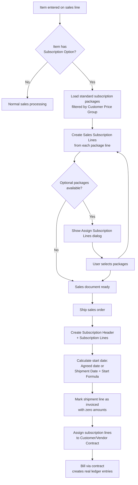

# Business logic

## Subscription line creation during sales

The entry point is `SalesLineOnAfterInsertEvent` in
`SalesSubscriptionLineMgmt.Codeunit.al`. When a sales line is inserted with
`RunTrigger = true`, it calls `AddSalesServiceCommitmentsForSalesLine`, which
first checks that the line is an Item type with a non-empty "No." on a
supported document type (Quote, Order, or Blanket Order) via
`IsSalesLineWithSalesServiceCommitments`. Temporary records and lines with
`Line No. = 0` are skipped.

The method then loads `Item Subscription Package` records for the item,
filtered to the header's `Customer Price Group` and `Standard = true`. If no
packages exist for that price group, the filter widens first to blank price
group, then drops the price-group filter entirely. This cascading filter
strategy means a customer-price-group-specific package takes priority, but
the system always falls back rather than showing nothing.

For each matching package, `InsertSalesServiceCommitmentFromServiceCommitmentPackage`
iterates the package's `Subscription Package Line` records and calls
`CreateSalesServCommLineFromServCommPackageLine`. This procedure inserts a
`Sales Subscription Line`, then populates it field by field from the package
line: Invoicing via, Item No., Description, Extension Term, Notice Period,
Initial Term, Partner, Calculation Base Type, Billing Base Period, Usage
Based Billing/Pricing, Calculation Base %, Sub. Line Start Formula, Billing
Rhythm, Discount, Price Binding Period, Period Calculation, and Create
Contract Deferrals. After all fields are set, it calls
`CalculateCalculationBaseAmount` and, for customer partner lines,
`CalculateUnitCost`. The line is then modified.

After standard packages, `AddAdditionalSalesServiceCommitmentsForSalesLine`
runs the optional-package dialog. It builds a filter of package codes already
assigned (via `GetPackageFilterForItem` with `RemoveExistingPackageFromFilter`),
applies Customer Price Group filtering, and opens the "Assign Service
Commitments" page in lookup mode. If the user selects packages and clicks OK,
those packages are inserted using the same
`InsertSalesServiceCommitmentFromServiceCommitmentPackage` path.

Contract renewal lines are prohibited from adding additional packages --
the method errors with "Additional Subscription Lines cannot be added to a
Contract Renewal".

## Calculation base amount computation

`CalculateCalculationBaseAmount` in `SalesSubscriptionLine.Table.al` branches
on Partner (Customer vs. Vendor), then on Calculation Base Type.

For customer lines:

- **Item Price** creates a temporary copy of the sales line and calls
  `UpdateUnitPrice` to get the item's list price independent of any document
  discount. The result goes into `Calculation Base Amount`.
- **Document Price** uses the sales line's `Unit Price` directly.
- **Document Price And Discount** uses `Unit Price` and also copies
  `Line Discount %` from the sales line into the subscription line's
  `Discount %`. This is the only path where sales line discounts propagate
  to subscription lines.

For vendor lines:

- **Item Price** calls `Sub. Contracts Item Management.CalculateUnitCost` and
  converts to document currency if the sales header uses a foreign currency.
- **Document Price** uses the sales line's `Unit Cost`.

After the base amount is set, `CalculatePrice` derives `Price` as
`Calculation Base Amount * Calculation Base % / 100`. If the line is a
Discount line, the base amount is forced negative. The `CalculateServiceAmount`
method then computes the final `Amount` as
`Price * Quantity - Discount Amount`, enforcing that Amount cannot exceed
`Price * Quantity`.

## Recalculation on sales line changes

The `SalesLine.TableExt.al` modify triggers on Quantity, Unit Price,
Unit Cost, Unit Cost (LCY), Line Discount %, and Line Discount Amount all
call `UpdateSalesServiceCommitmentCalculationBaseAmount`. This procedure
compares old and new values and, if anything changed, iterates every attached
Sales Subscription Line and calls `CalculateCalculationBaseAmount` on each.
This keeps subscription pricing synchronized as users edit the sales document.

When `Line Discount %` or `Line Discount Amount` changes, the table
extension also calls `NotifyIfDiscountIsNotTransferredFromSalesLine` in the
codeunit. This sends a dismissible notification if any customer-side
subscription line uses a Calculation Base Type other than "Document Price And
Discount", alerting the user that the discount they just entered will not
flow through to subscription billing.

## Item number resolution

`GetItemNoForSalesServiceCommitment` determines which item number goes on each
Sales Subscription Line. The logic depends on the parent item's Subscription
Option:

- **Service Commitment Item** -- uses the package line's `Invoicing Item No.`
  if set, otherwise the item itself.
- **Sales with Service Commitment** -- requires `Invoicing Item No.` on the
  package line when invoicing via Contract (enforced by `TestField`). Uses
  the invoicing item.

This separation matters because Service Commitment Items represent pure
subscriptions (the item is the subscription), while "Sales with Service
Commitment" items are physical goods that also carry a subscription (the
invoicing item captures the recurring charge separately).

## Shipment and subscription creation

When a sales order is shipped, for each line with a Subscription Option, the
posting engine (outside this subfolder) creates a `Subscription Header` and
`Subscription Line` records. The Sales Subscription Line's
`Subscription Header No.` and `Subscription Line Entry No.` fields are
populated to link back.

The start date for each subscription line is determined by a priority:

1. **Agreed Sub. Line Start Date** -- if the user entered a date here, it
   overrides everything. This is the "individually agreed" start.
2. **Shipment Date + Sub. Line Start Formula** -- if no agreed date, the
   system applies the date formula from the package line to the shipment
   posting date. A common formula is `-CM+1M` which calculates the first
   day of the following month (Current Month start, plus one month).
3. **Shipment Date** -- if no formula and no agreed date, the shipment date
   itself becomes the start date.

Cancellation-related dates are derived from the start: the Cancellation
Possible Date is typically calculated as
`Start Date + Initial Term - Notice Period`. The Term Until date equals
`Start Date + Initial Term - 1D` (the last day of the initial term).

After shipment, `DeleteSalesServiceCommitmentOnBeforeSalesLineDeleteAll`
(subscriber on Sales-Post `OnBeforeSalesLineDeleteAll`) removes the Sales
Subscription Lines from the now-posted sales document.

## Undo shipment behavior

`RemoveQuantityInvoicedForServiceCommitmentItems` subscribes to Undo Sales
Shipment Line and zeros out `Quantity Invoiced` and `Qty. Invoiced (Base)`
on the shipment line for service commitment items. This is necessary because
the posting engine marks these items as "invoiced" at shipment even though
no sales invoice exists. Without this reset, the undo-shipment logic would
fail trying to un-invoice quantity that was never invoiced through the normal
sales invoice path.

## The auto-invoicing illusion

Service commitment items behave differently from normal items during posting.
When shipped, the system marks them as fully invoiced on the shipment line
even though no sales invoice is generated. The item ledger entries and value
entries created at shipment have `Invoiced Quantity = 0`, `Sale Amount = 0`,
and `Cost Amount = 0`. The item appears "sold" from an inventory perspective
but carries no financial amounts.

The actual billing happens later through the contract engine: when the
subscription is assigned to a Customer Subscription Contract and billed,
separate item/value ledger entries are created with the real
`Invoiced Quantity` and `Sales Amount`. This split means you cannot look at
the original shipment's value entries to see subscription revenue -- it only
appears on the contract billing entries.

This design also means `Exclude from Doc. Total` is set to `true` for
service commitment items on the sales line. The item's line amount is
excluded from the document total because the customer will be billed through
the contract, not through the sales invoice. If you sum the sales order
total, service commitment items do not contribute.

## Renewal lines on sales documents

When a sales document carries contract renewal lines (Process = "Contract
Renewal"), several special behaviors activate. The `IsContractRenewal` check
on the sales line looks for any attached Sales Subscription Line with
`Process = "Contract Renewal"`.

Renewal lines cannot be individually deleted if they are the last remaining
renewal line on the document -- the `OnDelete` trigger checks
`IsOnlyRemainingLineForContractRenewalInDocument` and errors, forcing the
user to delete the entire sales line instead.

The `UpdateHeaderFromContractRenewal` method on the Process field's validate
trigger calls `SetExcludeFromDocTotal` and `UpdateUnitPrice`, which adjusts
the sales line to exclude the renewal amount from document totals.

`HasOnlyContractRenewalLines` on the Sales Header extension checks whether
every non-blank-type line in the document is a contract renewal, which other
parts of the system use to apply renewal-specific posting logic.

## Report printing behavior

The report extensions for Standard Sales Quote
(`ContractStandardSalesQuote.ReportExt.al`) and Order Confirmation
(`ContractSalesOrderConf.ReportExt.al`) follow identical patterns. On the
Header's `OnAfterAfterGetRecord`, they call `FillServiceCommitmentsForLine`
(which populates a temporary `Sales Line` dataset with subscription details
per document line) and `FillServiceCommitmentsGroupPerPeriod` (which
aggregates subscription amounts into groups by billing rhythm).

On each line's `OnAfterAfterGetRecord`, `ExcludeItemFromTotals` subtracts
service commitment items from the report's running totals. This prevents
subscription amounts from inflating the document subtotals.

The grouped summary at the bottom of the report shows subscription costs
organized by billing period (e.g., "Monthly: 50.00", "Yearly: 200.00"). For
contract renewal lines, the grouping uses a special "Contract Renewal"
identifier and calculates the amount using
`DateFormulaManagement.CalculateRenewalTermRatioByBillingRhythm` to
prorate across the renewal term. For regular lines, amounts are scaled by
the ratio `RhythmPeriodCount / BasePeriodCount` to normalize everything to
the billing rhythm period.

The Blanket Sales Order report extension
(`ContractBlanketSalesOrder.ReportExt.al`) is simpler -- it only excludes
service commitment items from totals without adding the per-line detail or
grouped summary.

## VAT calculation for subscription lines

`CalcVATAmountLines` in `SalesSubscriptionLine.Table.al` builds a temporary
`Sales Service Commitment Buff.` table aggregating subscription amounts by
billing rhythm and VAT setup. It handles Normal VAT, Reverse Charge VAT,
Full VAT, and Sales Tax. For prices including VAT, it reverse-calculates the
base; for prices excluding VAT, it forward-calculates the VAT amount. The
buffer groups by a `Rhythm Identifier` (a combination of period count and
date formula type), which lets the report extensions show separate VAT
breakdowns per billing rhythm.

## Archive round-trip

The archive workflow uses two event subscribers in the codeunit.
`StoreSalesServiceCommitmentLines` fires on
`ArchiveManagement.OnAfterStoreSalesLineArchive` and copies each Sales
Subscription Line to the archive table, setting `Version No.` from the
archive header and `Doc. No. Occurrence` from the sales header.

`RestoreSalesServiceCommitment` fires on
`ArchiveManagement.OnAfterRestoreSalesLine` and copies archive records back
to the live table. The `SingleInstance` flag `SalesLineRestoreInProgress` is
set before the restore (on `OnRestoreDocumentOnBeforeDeleteSalesHeader`) and
cleared after (on `OnAfterRestoreSalesDocument`). While this flag is true,
the `SalesLineOnAfterInsertEvent` subscriber exits immediately, preventing
the system from re-running package auto-creation on lines that already have
their subscription data being restored from the archive.

## Sales-to-subscription flow

