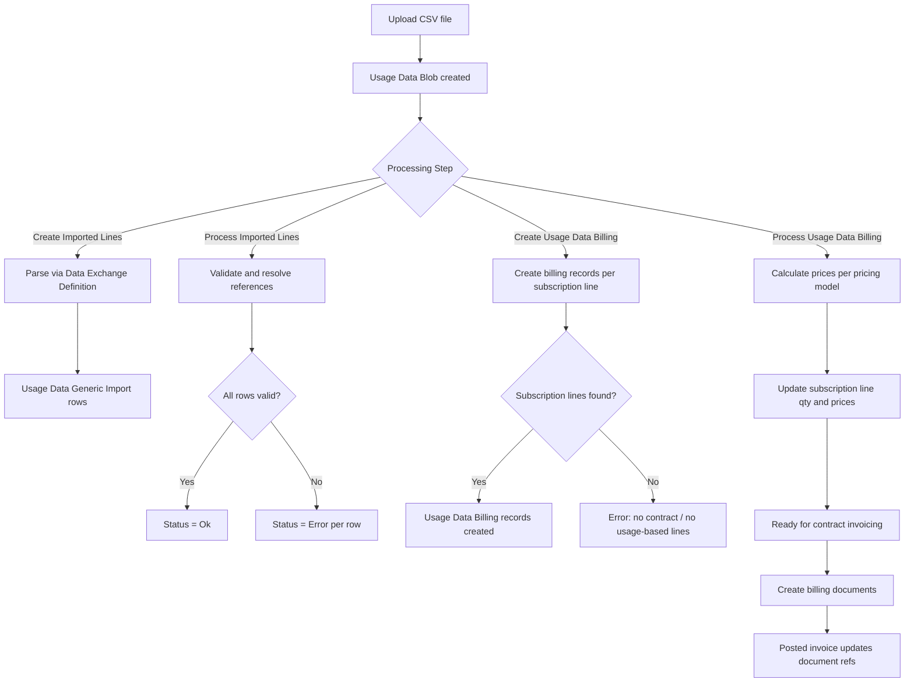

# Business logic -- usage based billing

## Import-to-bill pipeline

## Import flow

`ProcessUsageDataImport.Codeunit.al` (CU 8027) is the entry point. It
wraps `ImportAndProcessUsageData.Codeunit.al` (CU 8025) in
`Codeunit.Run` for error isolation -- if the inner codeunit fails, the
error is captured in the import's Reason field rather than propagating.

CU 8025 dispatches based on `"Processing Step"`:

- **Create Imported Lines**: resolves the supplier's type, gets the
  `"Usage Data Processing"` interface, calls `ImportUsageData`. For the
  generic connector (`GenericConnectorProcessing.Codeunit.al`), this reads
  each Usage Data Blob with status Ok, creates a `"Data Exch."` record
  from the blob's InStream, then runs the Data Exchange Definition's
  XMLport and column mapping. `GenericImportMappings.Codeunit.al` (CU 8030)
  is the mapping codeunit that initializes each Generic Import row from the
  current Usage Data Import.

- **Process Imported Lines**: again dispatches through the interface.
  `GenericConnectorProcessing.ProcessUsageData` iterates each Generic
  Import row and:
  1. Creates Usage Data Customers if `"Create Customers"` is enabled
  2. Creates Usage Data Subscriptions if `"Create Supplier Subscriptions"` is
     enabled
  3. Resolves the subscription line via `GetServiceCommitmentForSubscription`
     (looks up Supplier Reference -> Subscription Line with matching
     `"Supplier Reference Entry No."`, preferring vendor-partner lines with
     no end date)
  4. Validates the subscription line start date against the billing period
  5. Assigns the Subscription Header No. if the subscription is not
     deinstalled
  6. Sets `"Service Object Availability"` (Connected / Available /
     Not Available)

## Billing record creation

`CreateUsageDataBilling.Codeunit.al` (CU 8023) handles the
**Create Usage Data Billing** step. For each Generic Import row:

1. `CollectServiceCommitments` gathers all subscription lines on the
   service object that have `"Usage Based Billing" = true` and an end date
   >= the subscription end date (or no end date).
2. `CheckServiceCommitments` verifies at least one line exists and all
   have a contract assigned. If not, the Generic Import row gets an error.
3. `CreateUsageDataBillingFromTempServiceCommitments` creates one Usage
   Data Billing record per subscription line. For vendor partners or when
   `"Unit Price from Import"` is false, unit price and amount are zeroed
   (they'll be calculated in the next step). `UpdateRebilling` checks
   metadata for overlapping invoiced periods. `InsertMetadata` stores the
   original invoiced-to date for future rebilling reversal.

If billing records already exist for an import (retry scenario), the user
is prompted whether to retry only failed Generic Import lines.

## Pricing calculation

`ProcessUsageDataBilling.Codeunit.al` (CU 8026) handles the
**Process Usage Data Billing** step. Two phases:

### Phase 1 -- calculate customer prices

`CalculateCustomerUsageDataBillingPrice` runs for each customer-partner
billing record:

- **Unit Price from Import**: uses the imported unit price and amount
  directly.
- **Usage Quantity**: calls `GetSalesPriceForItem` to look up the customer
  price list price for the item, then `UnitPriceForPeriod` scales it to the
  billing period. Amount = scaled unit price x abs(quantity).
- **Fixed Quantity**: same as Usage Quantity but uses the subscription
  line's original quantity (from `CalcFields`) instead of imported quantity.
- **Unit Cost Surcharge**: unit price = unit cost x (1 + surcharge% / 100).
  Amount = unit price x quantity.

The result is rounded to the currency's unit-amount rounding precision.
Negative quantities flip the amount sign.

### Phase 2 -- update subscription lines

`ProcessServiceCommitment` runs once per unique subscription line entry no.:

- **Usage Quantity**: sums all billing record quantities and cost amounts
  for the charge end date, updates the service object's quantity to the
  total. If rebilling, adds back the original object quantity.
- **Fixed Quantity**: no quantity change (the whole point).
- **Unit Cost Surcharge**: sums cost amounts and calculates average unit
  cost.

For vendor-partner lines, unit price is set equal to unit cost. The service
object quantity is updated (which triggers recalculation of subscription
lines via the validate trigger). Then the subscription line's price, unit
cost, and calculation base amount are updated, with currency exchange
conversion if needed.

## Error handling

Errors are tracked at three levels:

1. **Usage Data Import** -- `"Processing Status"` and `Reason` blob.
   FlowFields aggregate error counts from child tables.
2. **Usage Data Generic Import** -- per-row `"Processing Status"` and
   `Reason`. Common errors: missing subscription reference, deinstalled
   service object, subscription line start date after billing period.
3. **Usage Data Billing** -- per-record `"Processing Status"` and `Reason`.
   Common errors: no contract assigned, no billing data found.

Each level can be corrected independently. After fixing the cause, the
user can re-run the processing step -- the pipeline skips rows with
status Ok or Closed.

## Billing integration

Usage Data Billing records feed into the standard contract billing
proposal through event subscribers in
`UsageBasedContrSubscribers.Codeunit.al` (CU 8028):

- **Document creation**: `CollectCustomerContractsAndCreateInvoices` /
  `CollectVendorContractsAndCreateInvoices` on Usage Data Import gather
  affected contract nos. and line nos., then open the billing document
  creation pages with pre-applied filters.
- **Posting**: `OnAfterPostSalesDoc` / `OnAfterPostPurchaseDoc` subscribers
  update each Usage Data Billing record with the posted document no. and
  type. For credit memos, `CreateAdditionalUsageDataBilling` clones the
  billing record with cleared document fields so the period can be
  re-invoiced. `SetMetadataAsInvoiced` marks metadata records.
- **Deletion**: When sales/purchase documents or lines are deleted,
  subscribers either clear document values (invoices) or delete billing
  records entirely (credit memos). When billing lines are deleted, the
  billing line entry no. is zeroed on related usage data billing records.
- **Billing line archival**: When billing lines move to archive (during
  posting), the `"Billing Line Entry No."` on Usage Data Billing is updated
  to point to the archive entry.

## Extension points

Integration events for customization:

- `OnAfterCollectServiceCommitments` -- add or filter subscription lines
  before billing records are created
- `OnAfterCreateUsageDataBillingFromTempSubscriptionLine` -- modify billing
  records after creation
- `OnUsageBasedPricingElseCaseOnCalculateCustomerUsageDataBillingPrice` --
  implement custom pricing models
- `OnUsageBasedPricingElseCaseOnProcessSubscriptionLine` -- custom
  subscription line update logic for new pricing models
- `OnBeforeProcessUsageDataBilling` / `OnAfterProcessUsageDataBilling` --
  pre/post hooks on the billing processing step
- `OnBeforeCalculateUsageDataUnitPriceForPeriod` /
  `OnAfterCalculateUsageDataUnitPriceForPeriod` -- observe or override the
  period-scaled unit price calculation
- `OnAfterImportUsageDataBlobToUsageDataGenericImport` -- post-import hook
  per blob
