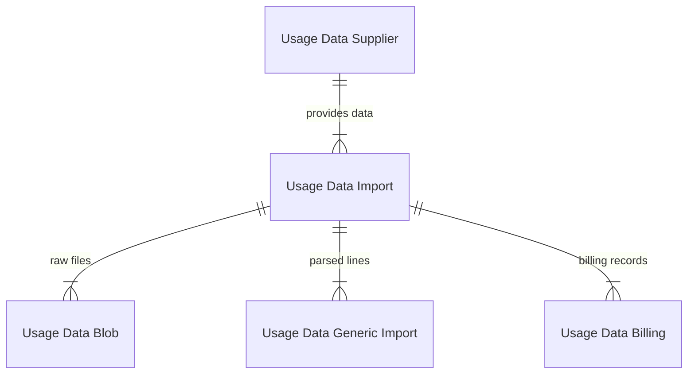
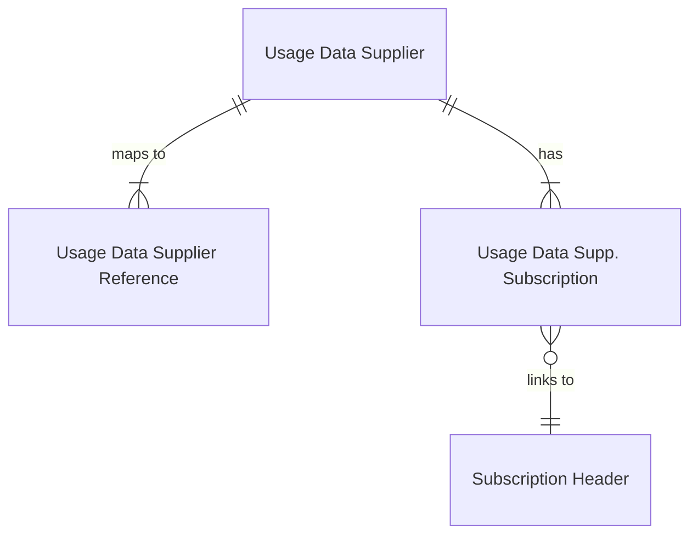

# Data model -- usage based billing

## Import pipeline

**Usage Data Supplier** (table 8014) -- master record keyed by `No.`. The
`Type` field (enum `"Usage Data Supplier Type"`) drives interface dispatch.
`"Vendor No."` links to a Vendor for cost-side billing. `"Unit Price from
Import"` controls whether customer prices come from the imported data or are
calculated from subscription line pricing.

**Usage Data Import** (table 8013) -- batch header, auto-increment PK. The
`"Processing Step"` / `"Processing Status"` pair tracks pipeline progress.
FlowFields count dependent records at each stage: `"No. of Usage Data Blobs"`,
`"No. of Imported Lines"`, `"No. of Imported Line Errors"`,
`"No. of Usage Data Billing"`, `"No. of UD Billing Errors"`. Reason is
stored as both a preview Text(80) and a full Blob for long error messages.
The `ProcessUsageDataImport` procedure dispatches each processing step to
the appropriate codeunit.

**Usage Data Blob** (table 8011) -- raw file storage. The `Data` Blob holds
the uploaded file content. A `"Data Hash Value"` (HMACMD5) enables
deduplication. `"Import Status"` tracks whether the blob was successfully
read.

**Usage Data Generic Import** (table 8018) -- one row per parsed usage
record. Contains supplier-side identifiers (`"Customer ID"`,
`"Supp. Subscription ID"`, `"Product ID"`), billing period dates, financial
amounts (Cost, Price, Quantity, Amount), and a currency field. The
`"Service Object Availability"` enum indicates whether the row has been
matched to a Subscription Header (Not Available / Available / Connected).
Fields Text1-3 and Decimal1-3 provide extensibility slots for custom data.
The `"Data Exch. Entry No."` links back to the Data Exchange framework
during import.

**Usage Data Billing** (table 8006) -- final billing record linked to a
contract line. The `Partner` enum (Customer/Vendor) plus conditional
TableRelation on `"Subscription Contract No."` and
`"Subscription Contract Line No."` creates a polymorphic FK to either
Customer or Vendor contract lines. Document tracking fields
(`"Document Type"`, `"Document No."`, `"Document Line No."`,
`"Billing Line Entry No."`) are populated when the billing record is
attached to an invoice. The `Rebilling` flag indicates overlap with a
previously invoiced period. A secondary key on
`(Import Entry No., Subscription Header No., Subscription Line Entry No., Partner, Document Type, Charge End Date)`
with `SumIndexFields = Quantity, Amount` enables efficient aggregation.

**Usage Data Billing Metadata** (table 8021, Access = Internal) --
audit/tracking table for rebilling. Stores `"Original Invoiced to Date"` so
the subscription line's `"Next Billing Date"` can be reverted if billing
records are deleted. The `Invoiced` flag is set when the parent document is
posted. `"Billing Document Type"` and `"Billing Document No."` are
FlowFields from Usage Data Billing.

## Supplier-subscription linking

**Usage Data Supplier Reference** (table 8015) -- flexible mapping between
external IDs and internal records. The `Type` enum (Customer / Subscription
/ Product) categorizes each reference. The `"Supplier Reference"` is
always lowercased on validate for case-insensitive matching. A secondary key
on `(Supplier No., Supplier Reference, Type)` optimizes lookups.

**Usage Data Supp. Subscription** (table 8016) -- represents a supplier-side
subscription. Links to a BC Subscription Header and Subscription Line via
`"Subscription Header No."` and `"Subscription Line Entry No."`. The
`"Connect to Sub. Header No."` / `"Connect to Sub. Header Method"` /
`"Connect to Sub. Header at Date"` fields drive the service object
connection wizard. When method is `"Existing Service Commitments"`, the code
validates that usage-based subscription lines already exist. When
`"New Service Commitments"`, existing lines are closed at the specified date
and new ones created via `ExtendContract`.

**Usage Data Supp. Customer** (table 8012) -- maps a supplier's customer ID
to a BC Customer No. When a Customer No. is assigned, it optionally
propagates to all matching Usage Data Subscriptions. The
`"Supplier Reference Entry No."` links back to the reference table.

**Generic Import Settings** (table 8017) -- per-supplier configuration for
the generic connector. `"Data Exchange Definition"` controls CSV parsing.
`"Create Customers"` and `"Create Supplier Subscriptions"` auto-create
records during processing. `"Additional Processing"` and
`"Process without UsageDataBlobs"` handle edge cases.

## Key design decisions

- **Conditional foreign keys on Usage Data Billing**: The `Partner` enum
  drives TableRelation to either Customer or Vendor contract lines and
  document tables. This avoids splitting into two tables at the cost of
  complex conditional TableRelation definitions.
- **Processing Status on multiple tables**: Both Generic Import and Billing
  tables carry their own Processing Status. Errors must be checked at both
  levels -- the Import header aggregates errors via FlowFields.
- **Blob storage for raw data**: Keeping original files in Usage Data Blob
  allows re-processing if the Data Exchange Definition changes.
- **Supplier Reference indirection**: Rather than storing external IDs
  directly on subscription lines, the Supplier Reference table provides a
  normalized mapping layer that supports multiple reference types per
  supplier.
- **Metadata for rebilling**: Usage Data Billing Metadata records the
  original invoiced-to date so that deleting a billing record can correctly
  revert the subscription line's Next Billing Date.
