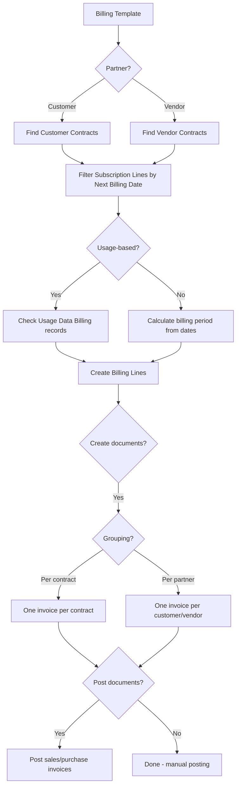
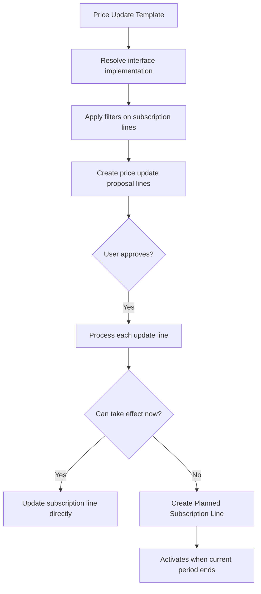

# Business logic

## Billing flow

The billing pipeline has three stages: proposal creation, document creation, and posting. Each stage can run independently or be chained through automation.

**Billing proposal creation** (`BillingProposal.Codeunit.al`, codeunit 8062). `CreateBillingProposal` takes a billing template code, billing date, and optional billing-to date. It loads the template, applies any stored contract filters, then iterates over matching contracts. For each contract, it finds subscription lines where `Next Billing Date <= BillingDate` and creates `Billing Line` records. The billing line captures the billing period (from/to), amounts calculated from the subscription line's pricing, and a reference back to the contract and subscription. Before creating new billing lines, the process deletes any existing lines flagged with `Update Required`, which handles stale proposals after contract changes. For usage-based subscription lines, the process checks for pending `Usage Data Billing` records rather than using the standard date-based calculation.

**Document creation** (`CreateBillingDocuments.Codeunit.al`, codeunit 8060). This codeunit runs against billing lines that have no document yet (`Document Type = None`). It branches on Partner (Customer/Vendor) and on grouping (per contract or per customer/vendor). For customer billing, it creates sales invoices -- one per contract or one per customer, depending on the billing template's `Customer Document per` setting. For vendor billing, it creates purchase invoices similarly. Each billing line becomes a sales/purchase line with the subscription line's invoicing item, amounts, and billing period text. The codeunit also supports automatic posting of created documents via the `PostDocuments` flag.

**Billing automation** (`AutoContractBilling.Codeunit.al`, codeunit 8014). This is a thin job-queue entry handler. It reads the `Billing Template` from the job queue's `Record ID to Process`, then calls `BillingTemplate.BillContractsAutomatically()` which chains proposal creation and document creation. Only customer billing templates support automation -- the `BillingTemplate.Automation` field enforces `Partner = Customer`.

## Billing corrections

`BillingCorrection.Codeunit.al` handles credit memos. When a posted contract invoice needs correction, the system creates credit memo billing lines from the archived billing lines, then generates a credit memo document. The credit memo reverses the original billing period and resets the subscription line's `Next Billing Date` backward so the corrected period can be re-billed.

## Sales document integration

`SalesDocuments.Codeunit.al` (codeunit 8063) subscribes to sales posting events to bridge between standard BC sales flow and subscription billing. When a sales order with subscription items is posted, it creates `Subscription Header` and `Subscription Line` records from the posted `Sales Subscription Line` records. Subscription items are treated as "invoiced on shipment" -- the shipment creates the subscription, but the actual invoicing happens through the contract billing pipeline, not through the sales invoice.

`SalesSubscriptionLineMgmt.Codeunit.al` (codeunit 8069) handles the sales-side lifecycle. When a sales line for a subscription item is inserted, it auto-creates `Sales Subscription Line` records from the item's assigned subscription packages. It also handles the "Assign Service Commitments" page for adding non-standard packages to a sales line.

## Price updates

Price updates follow a template-driven proposal-and-execute pattern, using the `Contract Price Update` interface.

`PriceUpdateManagement.Codeunit.al` (codeunit 8009) orchestrates the process. `CreatePriceUpdateProposal` loads the `Price Update Template`, resolves its `Price Update Method` enum to the corresponding interface implementation, and calls three interface methods: `SetPriceUpdateParameters`, `ApplyFilterOnServiceCommitments`, and `CreatePriceUpdateProposal`. The filtering is sophisticated -- it applies default filters (excluding usage-based lines, excluding lines with existing planned subscription lines), then layers on template-specific filters stored as blobs for contracts, subscriptions, and subscription lines.

Three implementations exist:

- **Calculation Base by %** (`CalculationBaseByPerc.Codeunit.al`) -- adjusts the `Calculation Base Amount` by the template's `Update Value %`, then recalculates the price from the new base
- **Price by %** (`PriceByPercent.Codeunit.al`) -- adjusts the `Price` directly by the percentage
- **Recent Item Prices** (`RecentItemPrice.Codeunit.al`) -- pulls the current price from BC price lists for the subscription's invoicing item, ignoring the percentage value

`ProcessPriceUpdate.Codeunit.al` (codeunit 8013) executes the approved proposal. For each price update line, it checks whether the update can take effect immediately or must be deferred. If the "Perform Update On" date is after the subscription line's next billing date, or an unposted document exists, or the next billing date is before the next price update date, it creates a `Planned Subscription Line` instead of updating the current line. Otherwise, it applies the new prices directly to the subscription line.

## Contract renewals

Renewal is a three-step process: create renewal lines, generate sales quotes, post quotes to extend terms.

`SubContractRenewalMgt.Codeunit.al` (codeunit 8003) starts from a customer contract. `StartContractRenewalFromContract` opens the `Contract Renewal Selection` page, which shows renewable contract lines (those with end dates and renewal terms). Selected lines feed into `CreateSubContractRenewal.Codeunit.al`.

`CreateSubContractRenewal.Codeunit.al` (codeunit 8002) validates each renewal line (must have end date, renewal term, no existing planned subscription line, not already in a sales quote), then creates a sales quote. The sales quote contains lines for the subscription items being renewed, with prices and terms from the current subscription lines.

`PostSubContractRenewal.Codeunit.al` handles what happens when the renewal sales quote is posted (converted to a sales order and shipped). It creates `Planned Subscription Line` records with `Type Of Update = Contract Renewal` that extend the subscription line's term dates. When the current period ends and the planned line activates, the subscription line's dates are updated.

Renewal only works for customer contracts -- vendor subscription lines do not support the renewal workflow.

## Usage-based billing

Usage-based billing imports metered consumption data from external suppliers and feeds it into the standard billing pipeline.

`ImportAndProcessUsageData.Codeunit.al` (codeunit 8025) dispatches to the supplier's connector via the `Usage Data Processing` interface. It has two processing steps: "Create Imported Lines" (import raw data into the staging table) and "Process Imported Lines" (validate, match to subscriptions, and prepare for billing). The interface allows different supplier types to implement their own import/processing logic.

`GenericConnectorProcessing.Codeunit.al` implements the generic connector. It reads `Usage Data Generic Import` records, creates `Usage Data Supp. Customer` and `Usage Data Supp. Subscription` mappings, validates that subscription lines exist and dates are correct, and prepares records for billing creation.

`CreateUsageDataBilling.Codeunit.al` takes processed import records and creates `Usage Data Billing` entries linked to subscription lines and contracts. These billing entries are then picked up by the billing proposal process (which checks for usage-based billing lines with `Document Type = None`) and flow into the standard billing line and document creation pipeline.

`ProcessUsageDataBilling.Codeunit.al` handles post-processing of usage data billing records after invoices are posted, updating statuses and connecting billing entries to posted documents.

## Deferral release

`ContractDeferralsRelease.Report.al` (report 8051) is a processing-only report that releases deferred revenue and cost. It takes a posting date and a "Post Until Date", filters customer and vendor contract deferrals that have not been released yet and fall within the date range, then creates and posts G/L journal entries that move amounts from deferral accounts to revenue/cost accounts.

The release process handles both customer deferrals (revenue side) and vendor deferrals (cost side) in sequence. It uses `General Journal Template` and `General Journal Batch` from the setup, creates temp journal lines, and posts them through the standard BC general journal posting engine.

## Subscription creation from sales

When a sales order with subscription items is posted, the system creates subscriptions automatically. The flow is:

1. Sales line insert triggers `SalesSubscriptionLineMgmt.AddSalesServiceCommitmentsForSalesLine` which creates `Sales Subscription Line` records from the item's subscription packages
2. On sales order posting, `SalesDocuments.Codeunit.al` intercepts the posting events
3. For each posted line with subscription items, it creates a `Subscription Header` and `Subscription Line` records
4. Subscription lines reference their assigned contracts, completing the link from sales to billing

Negative quantities (returns) skip subscription creation and show a notification instead.
