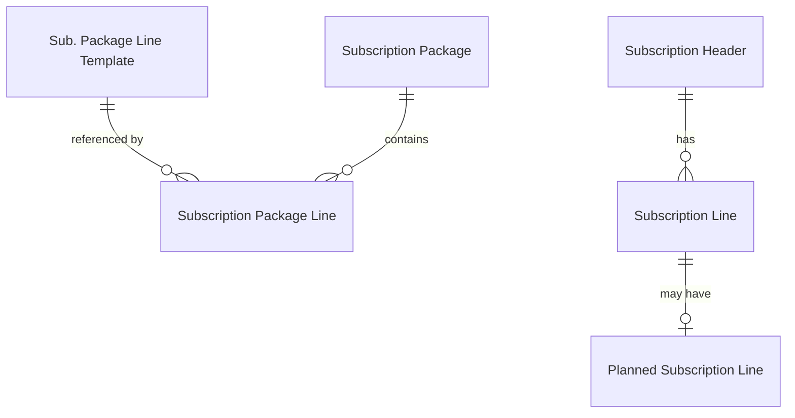
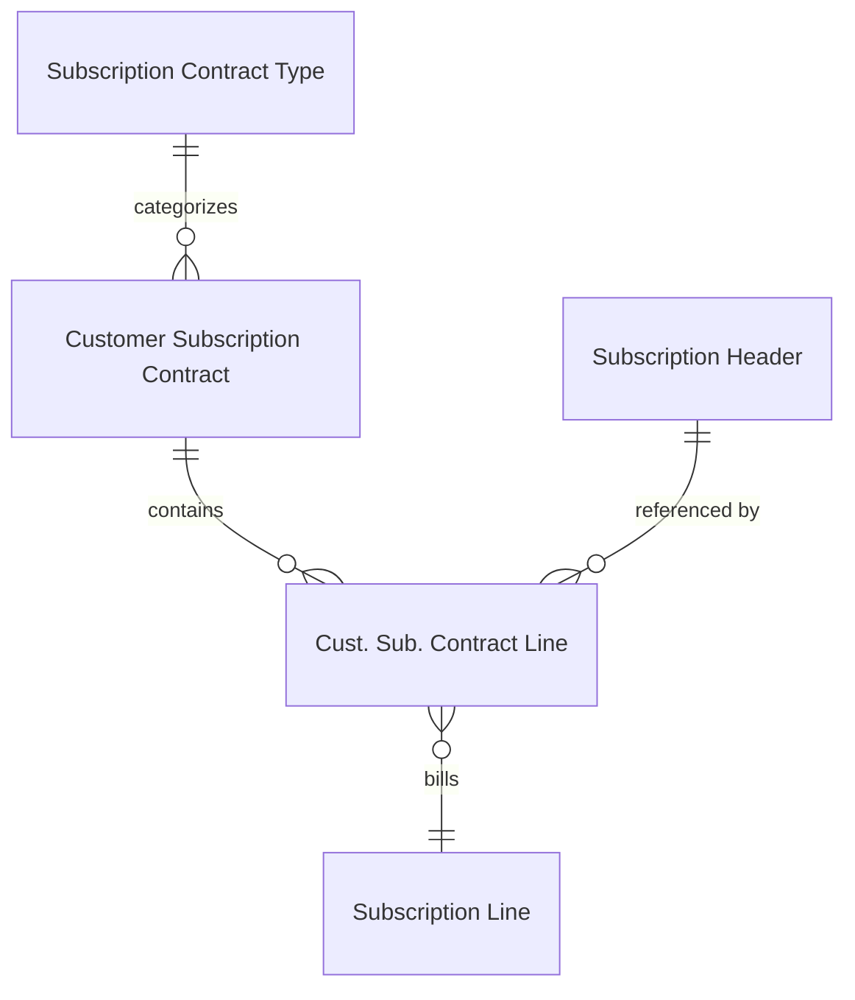
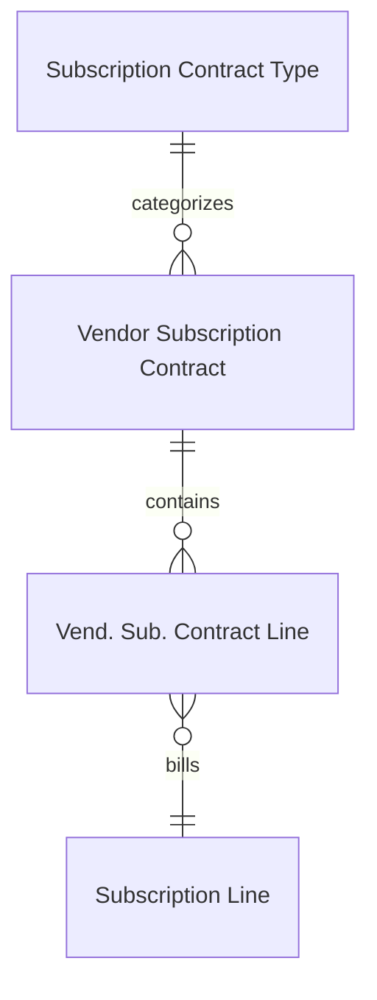
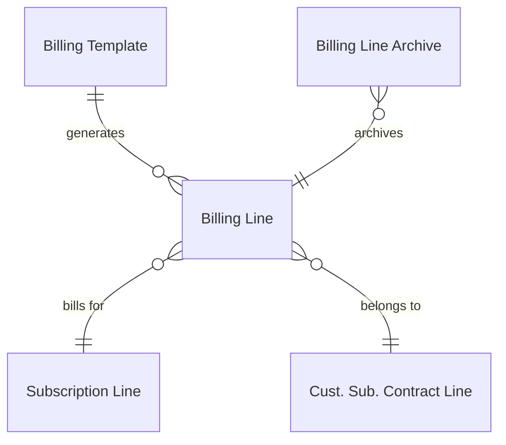
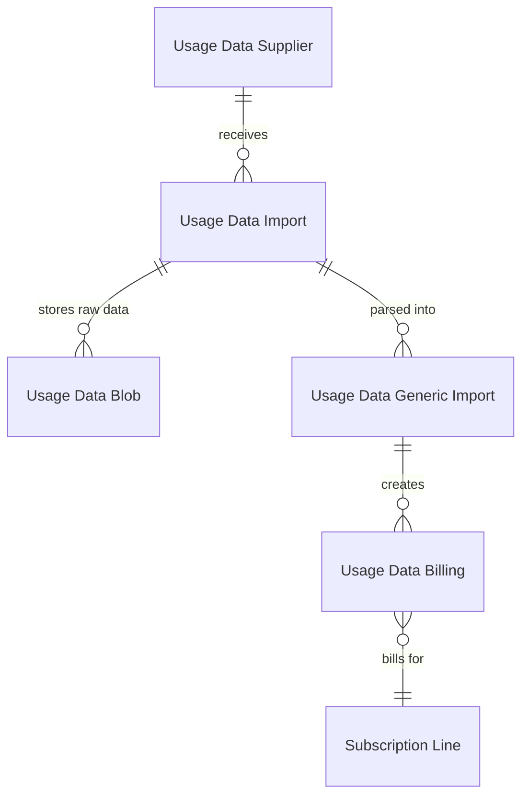

# Data model

## Subscriptions and subscription lines

A Subscription (`Subscription Header`, table 8057) represents the physical service or product being tracked -- a software license, a maintenance contract, a leased device. It carries the dual-customer model: an "End-User Customer No." (who uses the service) and a "Bill-to Customer No." (who pays for it). These can differ, enabling scenarios where a parent company pays for subsidiaries.

Subscription Lines (`Subscription Line`, table 8059) are the billing rules attached to a subscription. Each line belongs to one subscription, references a package and template, and carries its own pricing (calculation base, percentage, price, discount), billing rhythm, term dates (start, end, initial term, extension term, notice period), and contract assignment. The Partner enum on each line determines whether it bills through a customer or vendor contract.

The template hierarchy flows downward: a `Sub. Package Line Template` (8054) defines default billing parameters. A `Subscription Package` (8055) groups related `Subscription Package Line` records (8056), each referencing a template. Packages are assigned to items via `Item Subscription Package` (which also carries a `Price Group` for customer-specific pricing). When items are sold, the package lines become `Sales Subscription Line` records, and upon posting, become actual `Subscription Line` records on a `Subscription Header`.

`Planned Subscription Line` (8002) is a future-dated copy of a subscription line that stores pending changes from price updates or contract renewals. It activates (replaces the current line values) when the current billing period ends.

## Contracts

Contracts are the billing vehicles. `Customer Subscription Contract` (8052) and `Vendor Subscription Contract` (8063) are structurally similar but separate tables -- they share no common base table. Each has its own contract line table: `Cust. Sub. Contract Line` (8062) and `Vend. Sub. Contract Line` (8065).

A contract line links a contract to a specific subscription line. The contract line carries references to both the `Subscription Header No.` and the `Subscription Line Entry No.`, creating a bridge between the physical service and the billing agreement. Contract lines also have a `Closed` boolean field -- the soft-delete pattern that preserves closed lines for audit rather than removing them.

`Subscription Contract Type` (8053) categorizes contracts and controls two important behaviors: whether harmonized billing is enabled (aligning all lines to a common billing date, customer contracts only) and whether contract deferrals are created by default.

`Subscription Contract Setup` (8051) is the singleton setup table holding number series, invoice text formatting, dimension configuration, and the overdue date formula.

## Billing

The `Billing Line` table (8061) is the central staging area between contracts and posted documents. A billing line is created by the billing proposal process and references a contract, a contract line, and the subscription line being billed. The Partner enum on each billing line drives conditional foreign keys to either customer or vendor contracts, documents, and partners.

Key fields on billing lines: `Billing from` / `Billing to` define the period, `Document Type` / `Document No.` link to the created sales/purchase document, and `Update Required` flags stale proposals that need regeneration. `Billing Line Archive` (8069) preserves billing lines after posting.

`Billing Template` (8060) controls the billing proposal: which partner type, contract filters, date formulas, grouping rules, and automation settings. The `Automation` enum supports `None` or `Create Billing Proposal and Documents` -- the latter drives fully automated billing via `Auto Contract Billing` (codeunit 8014) through job queue entries.

## Deferrals

`Cust. Sub. Contract Deferral` (8066) and `Vend. Sub. Contract Deferral` (8067) store deferred revenue/cost entries created during invoice posting. When a contract invoice is posted with deferrals enabled, the posting redirects amounts to a deferral G/L account instead of the revenue/cost account. The `Contract Deferrals Release` report (8051) then releases these deferrals monthly by posting journal entries that move amounts from the deferral account to the actual revenue/cost account.

Deferral enablement cascades: `Subscription Contract Type."Create Contract Deferrals"` sets the default, `Sub. Package Line Template."Create Contract Deferrals"` can override per template (`No` or `Contract-dependent`), and the resulting value flows down through package lines to subscription lines.

## Price updates

`Price Update Template` (8003) defines a price update strategy: which partner, which contracts/subscriptions to include (via blob-stored filters), the update method (enum-driven interface), the percentage, and date formulas. `Sub. Contr. Price Update Line` (8004) holds the calculated proposal -- old vs. new prices per subscription line.

The three update methods implement the `Contract Price Update` interface: `Calculation Base By Perc` adjusts the calculation base amount by a percentage, `Price By Percent` adjusts the price directly, and `Recent Item Price` pulls the current item price from BC price lists.

## Usage-based billing

Usage-based billing has a multi-stage data pipeline. `Usage Data Supplier` (8014) defines the external supplier and its connector type. `Usage Data Import` (8013) represents a batch import operation. `Usage Data Blob` (8005) stores raw imported data. `Usage Data Generic Import` (8011) holds parsed line-level data. `Usage Data Billing` (8006) maps processed usage data to subscription lines and contracts for billing.

Supporting tables track the supplier's customer and subscription mappings: `Usage Data Supp. Customer` maps supplier customer IDs to BC customers, and `Usage Data Supp. Subscription` maps supplier subscription IDs to BC subscriptions. `Usage Data Supplier Reference` provides a generic reference mapping layer.

The `Usage Data Processing` interface allows different connector types (the `Usage Data Supplier Type` enum) to implement their own import and processing logic.

## Contract analysis and renewal

`Sub. Contr. Analysis Entry` (8019) provides a denormalized view of contract data for analytical reporting.

`Sub. Contract Renewal Line` (8070) stages contract lines for renewal. The renewal process creates sales quotes from expiring contract lines, and posting those quotes extends subscription terms by creating planned subscription lines that activate when the current period ends.

## Key design decisions

**Subscription-contract decoupling.** A subscription can exist without any contract, and one subscription can be billed through multiple contracts. This enables scenarios like splitting a subscription's vendor cost and customer revenue into separate contracts.

**Partner-driven conditional foreign keys.** Rather than creating separate customer and vendor billing tables, a single `Billing Line` table uses the `Service Partner` enum to switch its `TableRelation` for partner numbers, contract numbers, and document references. This keeps the billing engine unified but means all queries must include a Partner filter.

**Template hierarchy with override at each level.** Templates set defaults, package lines can override, and subscription lines can be further adjusted. This cascade means the "source of truth" for any given subscription line's billing parameters is the line itself, not any template.

**Dual-customer model.** The `Subscription Header` has both an End-User Customer (who uses the service, drives address/ship-to) and a Bill-to Customer (who receives invoices). This is distinct from the contract's Sell-to/Bill-to, which controls the billing document's customer.

**Soft-delete on contract lines.** The `Closed` boolean on `Cust. Sub. Contract Line` and `Vend. Sub. Contract Line` hides lines from active views without deleting them. This preserves billing history and prevents gaps in the audit trail.

**Multi-stage usage data pipeline.** Raw supplier data goes through import, parsing, validation, and billing stages with explicit status tracking at each step. This allows manual intervention and error correction at any stage before billing lines are created.
