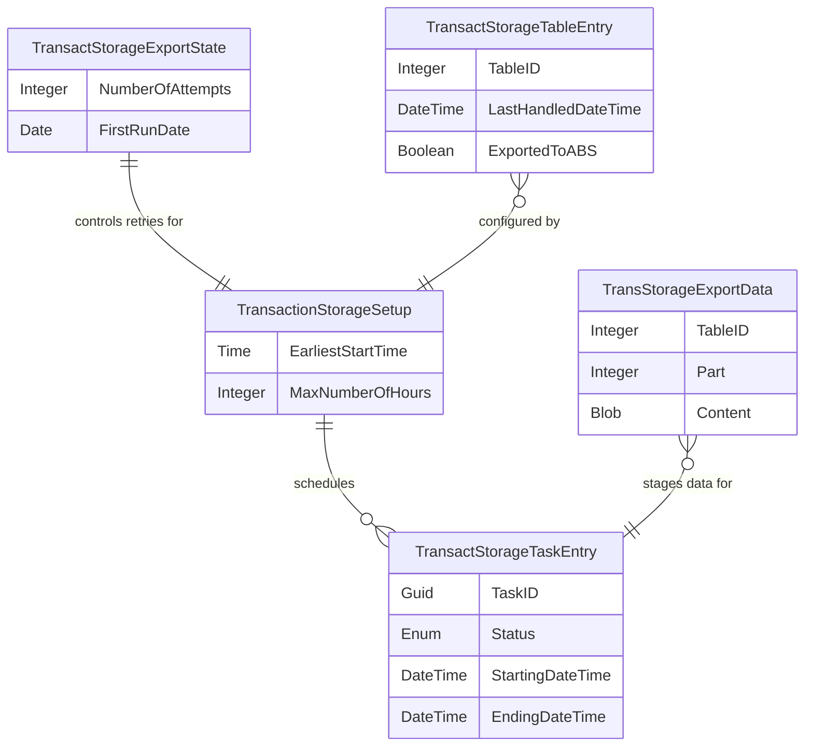

# Transaction Storage Data Model

The Transaction Storage extension uses six core tables to manage scheduled exports of transaction data to Azure Blob Storage. The model separates concerns: configuration, execution tracking, retry state, per-table incremental progress, and temporary staging.

## Entity Relationships

## Configuration Layer

**TransactionStorageSetup (6201)** is a singleton that controls when exports can run. It defines an earliest start time (default 02:00) and a maximum window of hours (default 3, minimum 3). On insert, the system calculates a distributed export time for the tenant to spread load across the time window. This prevents all tenants from starting exports simultaneously.

## Execution Tracking

**TransactStorageTaskEntry (6202)** maintains an audit trail of every export task. Each entry records a task ID (GUID), execution status (via the TransStorageExportStatus enum), start and end times, and error details if the task failed. The error call stack is stored in a blob field and can be retrieved or displayed via dedicated procedures. The table tracks whether each execution is a first attempt and when it was originally scheduled.

## Retry State

**TransactStorageExportState (6203)** is a singleton that tracks retry attempts. It starts with a configurable number of attempts (default 3) and decrements on each failure. The First Run Date field is country-aware -- for Denmark, it defaults to 2024-01-01. A ResetSetup procedure allows the retry counter to be reset when needed.

## Per-Table Progress

**TransactStorageTableEntry (6204)** tracks the export state for each table being monitored. Each record uses the table ID as its primary key and includes a flow field for the table name. The table maintains incremental export state via Filter Record To DT and Last Handled Date/Time fields, allowing the system to resume from where it left off. It records the number of exported records, any record filters applied (up to 2048 characters), whether the data has been exported to Azure Blob Storage, and the blob name used.

## Temporary Staging

**TransStorageExportData (6205)** is a temporary table used during export operations. It has a composite primary key of Table ID and Part, allowing large datasets to be chunked into multiple JSON arrays. The Content blob field stores each chunk, and Record Count tracks how many records are in that part. Data is added via an Add procedure and cleared between runs.

## Status Enumeration

**TransStorageExportStatus (6201)** defines five states: None, Scheduled, Started, Completed, and Failed. This enumeration is not extensible, ensuring consistent status tracking across the export lifecycle.

## Data Flow

During an export cycle, the setup table determines when execution can begin. The export state singleton controls retry logic. For each configured table in the table entry records, the system reads incremental changes, stages them in temporary export data chunks, and writes them to Azure Blob Storage. The task entry table records each execution attempt with full error details if failures occur.
