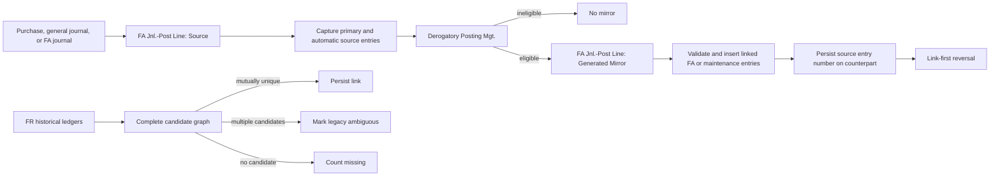

# Introduction

This plan completes the partially implemented redesign of derogatory depreciation mirroring. It establishes `Derogatory Posting Mgt.` as the single policy authority, creates exactly one explicitly linked tax-book counterpart for every eligible FA or maintenance source, makes reversal use persisted links, removes localization double producers, and safely links French historical entries. The expected impact is posting-path-independent accounting behavior, deterministic reversal, and a non-destructive, observable French upgrade.

The key words "MUST", "MUST NOT", "REQUIRED", "SHALL", "SHALL NOT", "SHOULD", "SHOULD NOT", "RECOMMENDED", "MAY", and "OPTIONAL" in this document are to be interpreted as described in RFC 2119.

**Cross-reference conventions**: This document uses standardized prefixes for traceability — `FR-` (functional requirements), `NFR-` (non-functional requirements), `FM-` (failure modes), `AC-` (acceptance criteria), and `RD-` (resolved decisions). Identifiers from `redesign-derogatory-mirroring.req.md` are referenced directly.

| Workflow Todo | Status | Completion evidence |
|---------------|--------|---------------------|
| Purpose Review | Completed | Requirements FR-001 through FR-022, NFR-001 through NFR-008, FM-001 through FM-013, assumptions, alternatives, and AC-001 through AC-037 were analyzed. |
| Deep Research | Completed | AL semantic definitions, references, call graphs, localization overrides, upgrade paths, tests, and AL-Go build metadata were inspected across W1, FR, and affected localizations. |
| Draft the Plan | Completed | Architecture, decisions, traceability, files, tests, release gates, and atomic implementation items are populated below. |
| Review and Refine | Completed | An independent SddPlanner compliance review identified reversal, corrective-upgrade, localization, CLEAN29, compatibility, event, and file-specificity gaps; all blocking and high-severity findings were resolved in this version. |
| PRD Review | DONE | EPIC-001 requirements, traceability, files, tests, dependencies, constraints, and pre-existing worktree changes were reviewed. |
| Implementation | DONE | EPIC-001 posting/linkage invariants and EPIC-002 link-authoritative FA/maintenance reversal were completed with focused tests. |
| Review | DONE | Independent code review findings were resolved; W1 BaseApp and Fixed Asset test projects compile successfully. |

## 1. Goals and Non-Goals

- **Goal 1**: Every eligible FA or maintenance source MUST create exactly one linked derogatory-book counterpart, independent of posting path or localization.
- **Goal 2**: Generated mirrors and their automatic companions MUST be contained, captured, linked, and reversible without recursive or configurable duplication side effects.
- **Goal 3**: Reversal MUST locate new counterparts through persisted links before consulting mutable setup.
- **Goal 4**: French historical linkage MUST be prerequisite-aware, mutually unique, idempotent, non-destructive, and observable.
- **Goal 5**: The affected W1, FR, and localization implementation MUST compile and pass focused accounting regression tests, including CLEAN29.
- **Non-Goal 1**: The implementation MUST NOT support one normal depreciation book mapping to multiple derogatory books.
- **Non-Goal 2**: The implementation MUST NOT change accelerated-depreciation formulas, posting accounts, report results, or supported FA posting types.
- **Non-Goal 3**: The implementation MUST NOT redesign the configurable `Duplicate Depr. Book` capability beyond suppressing it for generated mirrors.
- **Non-Goal 4**: The implementation MUST NOT introduce a table or setup option for upgrade outcome counters.

### In Scope

- W1 setup validation, policy, posting context, ledger linkage, automatic companions, acquisition adjustments, and reversal.
- Removal or neutralization of active `Is Derogatory` outer producers in APAC, BE, CH, ES, FI, IT, NA, NO, and RU, plus semantic verification of DACH, GB, NL, and SE.
- FR feature-disabled legacy routing, feature-enabled centralized routing, CLEAN29 exclusion, historical linkage, compatibility procedures, and telemetry.
- W1/FR/localization tests, standard builds, CLEAN29 build, runtime suites, and ledger/G/L verification.

### Out of Scope (deferred)

- One-to-many derogatory-book relationships — incompatible with the existing single-code FlowField and FR-001.
- New-entry heuristic reversal — prohibited by FR-019; only marked French legacy sources may use the fallback.
- Physical consolidation of both acquisition execution adapters — AL posting transaction state requires the existing thin general-journal and FA-journal adapters.
- Removal of the French upgrade shim at CLEAN29 — ambiguous historical entries require it beyond that cleanup boundary.

## 2. Terminology

| Term | Definition |
|------|------------|
| Source | An eligible normal-book FA or maintenance posting executed with posting role `Source`. |
| Generated mirror | The single tax-book counterpart produced by the centralized workflow; it cannot produce another mirror. |
| Link | The counterpart-side `"Derogatory Source Entry No."` value identifying its normal-book source ledger entry. |
| Automatic companion | A catch-up, acquisition-cost, custom-depreciation, or salvage entry created as part of a source posting. |
| Mutual uniqueness | A historical source has exactly one candidate and that candidate has exactly one source in the complete candidate graph. |
| Active localization | A localization with an `Is Derogatory` consumer in its `Gen. Jnl.-Post Line` implementation. |
| CLEAN29 | The compilation symbol that excludes the superseded French legacy implementation. |
| Corrective upgrade | A forward-only rerunnable linkage pass that may rebuild links/markers but never changes accounting amounts. |

## 3. Solution Architecture

The implementation uses one policy boundary and one-way persisted links:

1. `FA Jnl.-Post Line` posts the source and captures all inserted primary and automatic ledger identities.
2. `Derogatory Posting Mgt.` resolves the single relationship, determines eligibility, builds counterpart lines, prepares acquisition adjustments, and validates link integrity.
3. The same shared boundary recursively posts a `Generated Mirror` context with duplicate-book and insurance side effects disabled.
4. `FA Insert Ledger Entry` returns inserted identities and rejects invalid or duplicate links.
5. Reversal searches the dedicated link key first, creates the normal reversal, and links the tax-book reversal to that new normal reversal. If no link exists, a marked legacy source uses the fallback; an unmarked source errors only when current centralized eligibility proves that a counterpart is required, otherwise reversal proceeds without a counterpart.
6. FR upgrade code builds complete FA and maintenance candidate graphs in memory, writes only mutually unique links, marks ambiguous sources, emits six outcome counts, and sets the upgrade tag only after prerequisites and writes succeed.
7. Localization outer producers are removed or bypassed so inherited W1 posting remains the only mirror producer.

The schema remains one-way: source entries retain a zero link; counterpart entries store the source number. FA Key13 and Maintenance Key10 on (`"Derogatory Source Entry No."`, `"Depreciation Book Code"`) MUST serve new-entry posting and reversal lookups. No new persistent object, interface, factory, feature flag, or configuration field is introduced.

## 4. Requirements

**Summary**: The plan implements all 22 functional and eight non-functional requirements from the requirements document. Existing schema and the policy codeunit are retained; incomplete lifecycle, localization, migration, compatibility, and verification behavior is corrected.

**Items**:

| ID | Implementation constraint | Planned items |
|----|---------------------------|---------------|
| FR-001, FR-002 | Enforce one relationship in table validation and reject ambiguous imported data at runtime. | ITEM-001, ITEM-002 |
| FR-003, FR-004 | Retain link schema/keys and make `Derogatory Posting Mgt.` the sole policy authority. | ITEM-001, ITEM-002, ITEM-006 |
| FR-005, FR-006 | Contain generated mirrors and produce them only at `FA Jnl.-Post Line`. | ITEM-003, ITEM-004 |
| FR-007, FR-008 | Insert exactly one validated counterpart and preserve returning/non-returning insertion APIs. | ITEM-005, ITEM-006 |
| FR-009, FR-010 | Capture/link salvage and all automatic-only source/mirror identities. | ITEM-005 |
| FR-011, FR-012 | Keep calculation ownership unchanged and retain only thin acquisition execution adapters. | ITEM-007 |
| FR-013 | Remove or neutralize every active localization outer producer. | ITEM-012, ITEM-013, ITEM-014, ITEM-026 |
| FR-014, FR-015 | Perform link-first FA/maintenance reversal with explicit missing/multiple errors and reversal-chain linkage. | ITEM-008, ITEM-009 |
| FR-016, FR-018 | Sequence relationship transfer before linkage/tagging and make retries duplicate-safe. | ITEM-015, ITEM-017 |
| FR-017, FR-019 | Use complete mutually unique historical matching and marker-gated fallback. | ITEM-016, ITEM-017 |
| FR-020 | Keep feature-disabled FR legacy routing under `not CLEAN29`; use only central routing otherwise; retain the shim. | ITEM-010, ITEM-015 |
| FR-021 | Preserve removed public APIs with source-compatible overloads/delegates. | ITEM-011 |
| FR-022 | Emit six upgrade outcome dimensions without a new table. | ITEM-018 |
| NFR-001, NFR-004 | Prove zero posting-path variance and total-row equality using complete test matrices. | ITEM-019, ITEM-020, ITEM-021 |
| NFR-002 | Use dedicated link keys for new posting and reversal; prohibit heuristic scans for unmarked sources. | ITEM-006, ITEM-008, ITEM-022 |
| NFR-003 | Modify only links/markers in upgrade, provide a forward corrective rebuild, and prove repeated execution changes nothing. | ITEM-016, ITEM-017, ITEM-021, ITEM-025 |
| NFR-005 | Compile W1 BaseApp/tests, FR BaseApp/tests, affected localizations, and FR with CLEAN29. | ITEM-023, ITEM-027, ITEM-028 |
| NFR-006 | Publish/run focused suites and inspect representative FA, maintenance, and G/L results. | ITEM-024 |
| NFR-007 | Preserve public procedures and validate subscriber/event ordering at the central boundary. | ITEM-011, ITEM-020 |
| NFR-008 | Complete AL-semantic and runtime verification for all listed localizations. | ITEM-012, ITEM-013, ITEM-014, ITEM-022, ITEM-026 |
| CON-001 | Authoritative editable source is `src/Layers/**`; generated `src/Views/**` MUST NOT be edited directly. | All items |
| CON-002 | Accounting amounts, posting formulas, and posting-account selection MUST remain unchanged. | ITEM-003 through ITEM-024 |
| GUD-001 | Stable AL object/procedure/field identifiers MUST be used as anchors when line numbers drift. | All items |
| PAT-001 | Existing single-parameter public insertion/reversal procedures MUST delegate to context-aware or returning overloads. | ITEM-006, ITEM-011 |

## 5. Risk Classification

**Risk**: 🔴 HIGH RISK

**Summary**: The change affects accounting posting, reversal, country-layer overrides, database upgrade behavior, and public AL procedures. Static compilation alone cannot establish correctness; release requires runtime ledger and G/L evidence.

**Items**:

- **RISK-001**: A remaining localization outer producer can create an unlinked duplicate. Mitigation: AL semantic reference sweep plus total-row runtime assertions in every active localization.
- **RISK-002**: Generated-mirror recursion or copied control state can create duplicate-book/insurance side effects. Mitigation: clear/bypass those controls before recursive posting and test configured duplication.
- **RISK-003**: Incomplete automatic identity capture can make salvage or automatic-only entries irreversible. Mitigation: return and map every inserted companion identity.
- **RISK-004**: Setup-first reversal can silently bypass linked history. Mitigation: search the persisted link key before any current-setup check; on zero results, apply RD-004.
- **RISK-005**: Greedy historical matching can persist false links. Mitigation: construct the entire bipartite candidate graph and write only mutual one-to-one pairs.
- **RISK-006**: Premature upgrade tagging can strand feature-disabled companies. Mitigation: execute linkage after relationship transfer and tag only after successful completion.
- **RISK-007**: IT and RU contain divergent posting/insertion implementations. Mitigation: treat each as a distinct implementation surface and run its own compile/runtime regression; do not assume the ES edit applies.
- **RISK-008**: Changed public procedures can break dependent apps. Mitigation: restore compatibility overloads/delegates and compile semantic consumers.
- **ASSUMPTION-001**: Field numbers and keys stated in FR-003 are the final schema.
- **ASSUMPTION-002**: Feature-disabled FR companies use legacy behavior until CLEAN29; enabled and CLEAN29 companies use only W1 central behavior.
- **ASSUMPTION-003**: AL-Go Clean mode injects `CLEAN29` from `.github/AL-Go-Settings.json`; product `app.json` MUST NOT be modified.

## 6. Dependencies

**Summary**: The implementation depends only on existing Business Central AL objects, test infrastructure, upgrade tags, feature telemetry, localization layers, and the repository build/publish environment.

**Items**:

- **DEP-001**: W1 `Derogatory Posting Mgt.` codeunit 5869 and `Derogatory Posting Role` enum 5869.
- **DEP-002**: FA Ledger Entry Key13 and Maintenance Ledger Entry Key10 plus fields specified by FR-003.
- **DEP-003**: `AcceleratedDepreciationUpgradeTag` relationship transfer completes before `DerogatoryLinkageUpgradeTag`.
- **DEP-004**: `Feature Telemetry.LogUsage` accepts the six dimensions defined by FR-022.
- **DEP-005**: AL semantic definition/reference tooling is available for the cross-localization sweep.
- **DEP-006**: A Business Central test environment is available to publish W1/FR/localization apps and run focused codeunits.
- **DEP-007**: `.github/workflows/CICD.yaml` and `.github/workflows/_BuildALGoProject.yaml` compile projects selected from the `build/projects/Apps W1/.AL-Go/settings.json`, `Apps FR`, `Apps APAC`, `Apps BE`, `Apps CH`, `Apps DACH`, `Apps ES`, `Apps FI`, `Apps GB`, `Apps IT`, `Apps NA`, `Apps NL`, `Apps NO`, `Apps RU`, and `Apps SE` equivalents; Clean mode injects `CLEAN29` from `.github/AL-Go-Settings.json`.

## 7. Quality & Testing

**Summary**: Tests are layered as schema/unit validation, posting/reversal/upgrade integration matrices, semantic localization verification, compilation, runtime execution, and final ledger/G/L inspection. Assertions MUST count all tax-book rows as well as linked rows.

**Items**:

- **TEST-001**: Extend codeunit 134166 to cover relationship validation, ambiguous runtime resolution, link-validation errors, generated-mirror containment, and insertion overload identities.
- **TEST-002**: Extend codeunit 134149 and related W1 FA suites with purchase/general/FA journal, maintenance, G/L on/off, no-asset-book, automatic-only, salvage, final, negative, acquisition, and total-row cases.
- **TEST-003**: Add FA and maintenance reversal cases for setup removal/change, missing/multiple/already-reversed counterparts, two-step reversal, reversal-of-reversal, and salvage.
- **TEST-004**: Extend FR codeunit 134167 with prerequisite/tag ordering, mutual uniqueness including unequal distance, missing, maintenance code, canceled asset, reversal chains, automatic acquisition adjustments, partial retry, and true repeated execution.
- **TEST-005**: Add localization regressions for APAC, BE, CH, ES, FI, IT, NA, NO, and RU; verify DACH, GB, NL, and SE semantically and compile them.
- **TEST-006**: Compile all required applications and tests, including a dedicated FR build with `CLEAN29`.
- **TEST-007**: Publish and execute all focused suites with 100% pass and inspect representative FA, maintenance, and G/L entries.

### Acceptance Criteria

| ID | Criterion | Verification | Traces To |
|----|-----------|--------------|-----------|
| AC-001 | First relationship assignment succeeds; duplicate, changed-to-occupied, self, chain, and reverse assignments fail with the specified setup errors. | Automated AL tests | FR-001 |
| AC-002 | Runtime relationship resolution rejects two matching derogatory books and posts no counterpart. | Automated AL test | FR-002, FM-001 |
| AC-003 | W1 and FR tables contain the specified fields and indexed keys; sources store zero and counterparts store the source entry number. | Schema validation and automated test | FR-003 |
| AC-004 | Eligibility is false for non-Source roles, missing relationship, or missing tax-book asset record; invalid, inconsistent, and duplicate links are rejected. | Automated AL tests | FR-004, FM-002, FM-011 |
| AC-005 | A generated mirror creates no recursive mirror, duplicate-book entry, or insurance side effect. | Automated AL test | FR-005 |
| AC-006 | Purchase invoice, general journal, and FA journal inputs converge on the central boundary and each produce exactly one counterpart; raw internal insertion produces none. | Posting-path matrix | FR-006, NFR-001 |
| AC-007 | Each eligible FA and maintenance source has one total tax-book row and one linked row; a second insertion fails. | Automated AL tests | FR-007, FM-005 |
| AC-008 | Existing insertion callers compile unchanged and returning overloads yield the inserted non-zero FA/maintenance identity. | Compilation and unit tests | FR-008 |
| AC-009 | Every source automatic companion, including salvage, has exactly one linked mirror companion and reverses through that link. | Automated AL test | FR-009, FM-009 |
| AC-010 | A depreciation posting with no primary entry still produces linked mirror entries for all automatic source entries. | Automated AL test | FR-010 |
| AC-011 | Acquisition-cost depreciation posts the calculated source and one counterpart with G/L integration on and off; adapters perform no policy or amount calculation. | Automated AL tests and code inspection | FR-011 |
| AC-012 | Normal, final, negative, acquisition, and automatic-only calculations preserve amounts and create at most one counterpart per eligible source line. | Automated AL tests | FR-012 |
| AC-013 | Every active localization produces one total counterpart; no path invokes both central and outer producers; declare-only layers have no semantic consumer. | AL semantic sweep and runtime tests | FR-013, NFR-008, FM-005 |
| AC-014 | FA and maintenance reversal locate linked history despite setup removal/change and create exactly one linked tax-book reversal. With no link, marked legacy uses fallback; an unmarked currently eligible source raises missing; an unmarked currently ineligible source reverses without a counterpart. | Automated AL tests | FR-014, FM-010 |
| AC-015 | A currently eligible unmarked source with no counterpart and a source with multiple counterparts raise their explicit errors; reversal-of-reversal preserves reversal marks and links. | Automated AL tests | FR-015, FM-003, FM-004 |
| AC-016 | Relationship transfer precedes linkage; a disabled-to-enabled or CLEAN29 transition links history; the tag is written only after success. | FR upgrade tests | FR-016, FM-006 |
| AC-017 | Upgrade links only mutually unique full-identity pairs, includes maintenance code/canceled assets/reversal chains/primary automatic Derogatory adjustments, and changes no amount. | FR upgrade tests and before/after comparison | FR-017, NFR-003, FM-007, FM-012 |
| AC-018 | A partial or repeated pass creates no additional link or marker change when the established outcome is already valid. | FR upgrade tests | FR-018, NFR-003, FM-008 |
| AC-019 | Ambiguous sources are marked and unlinked; only marked legacy sources use heuristic reversal; new W1 sources never use it. | Automated AL tests | FR-019 |
| AC-020 | Disabled FR uses only the guarded legacy builder; enabled/CLEAN29 uses only central posting; CLEAN29 excludes legacy code; shim documentation states post-CLEAN29 retention. | Automated tests, compilation, documentation review | FR-020 |
| AC-021 | Removed/signature-changed public procedures have compatible overloads/delegates and all semantic consumers compile. | AL semantic sweep and compilation | FR-021, NFR-007, FM-013 |
| AC-022 | Each completed upgrade emits matching `FALinked`, `FAAmbiguous`, `FAMissing`, `MaintenanceLinked`, `MaintenanceAmbiguous`, and `MaintenanceMissing` counts. | Automated test and telemetry inspection | FR-022 |
| AC-023 | New-entry counterpart/reversal resolution performs one indexed lookup and no document/amount heuristic scan. | AL code inspection and representative timing | NFR-002 |
| AC-024 | All specified posting, reversal, depreciation, localization, and upgrade matrices assert total rows and links. | Test-suite inspection | NFR-004 |
| AC-025 | W1 BaseApp/tests, FR BaseApp/tests, affected localization apps/tests, and FR CLEAN29 compile with zero errors. | Build logs | NFR-005 |
| AC-026 | Focused published suites pass 100%; inspected ledgers/G/L have correct links, reversal chains, values, and counts with no duplicate mirrors. | Runtime execution and ledger evidence | NFR-006 |
| AC-027 | `Derogatory Posting Mgt.` exposes no mutable integration event. Generic events `OnBeforeFAJnlPostLine`, `OnBeforeGenJnlPostLine`, `OnBeforePostDeprUntilDate`, `OnPostFixedAssetOnBeforeInsertEntry`, and `OnPostMaintenanceOnBeforeInsertEntry` retain ordering; none may mutate posting role/link identity after validation, and final link validation runs immediately before insert. | Semantic inspection and subscriber regression | NFR-007 |

## 8. Security Considerations

- **Data handling**: Ledger entry numbers and telemetry counts are business data but contain no credentials. Telemetry MUST contain aggregate counts only, not FA numbers, document numbers, amounts, or customer data.
- **Input validation**: Imported or historical relationship/link inconsistencies MUST fail through ambiguity, source-existence, identity, and duplicate checks before writes.
- **Access control**: Existing posting, reversal, feature-management, and upgrade permission boundaries MUST remain unchanged; no new public entry point or permission set is required.
- **Secrets**: No secrets, credentials, tokens, or connection strings are introduced.

## 9. Deployment & Rollback

1. Merge product and test changes only after all builds and focused suites pass.
2. Deploy W1 and localization application changes using the normal application upgrade sequence.
3. In FR companies, transfer the legacy relationship before invoking historical linkage; commit `DerogatoryLinkageUpgradeTag` only after all link/marker writes and telemetry complete.
4. Monitor upgrade telemetry for the six outcome counts. Non-zero ambiguous/missing counts are supported outcomes and MUST be investigated before reversing affected legacy sources; they MUST NOT be auto-linked.
5. After deployment, inspect representative FA, maintenance, and G/L entries for one-to-one links and correct reversal chains.
6. Before production upgrade, rollback MAY restore the prior app/database backup. After linkage has run, rollback MUST be forward-only: retain accounting entries and apply a corrective upgrade that clears/rebuilds only link fields and ambiguity markers. Product rollback MUST NOT attempt to reverse accounting amounts.
7. The French shim MUST remain deployed beyond CLEAN29 until a separately approved cleanup version removes all need for marked-legacy fallback.

## 10. Resolved Decisions

| ID | Decision | Rationale |
|----|----------|-----------|
| RD-001 | `FA Jnl.-Post Line` is the sole forward-mirror execution boundary; `Derogatory Posting Mgt.` is the sole policy boundary. | All posting paths converge there while policy remains testable and free of transaction adapters. |
| RD-002 | `FAJnlPostLineWithContext` MUST guard both `DuplicateDeprBook.DuplicateFAJnlLine` and `DuplicateDeprBook.DuplicateGenJnlLine` so neither dispatcher runs for `Generated Mirror`; the existing `Source` sequence remains unchanged. Unused `Reversal` and `Internal` enum values remain unwired. | Both dispatchers can create insurance and explicit/list duplication, so guarding them before invocation is deterministic and smaller than clearing copied fields. |
| RD-003 | Automatic companion identities are captured individually and mapped by companion role, including salvage. | A single primary identity cannot represent automatic-only or multi-companion posting shapes. |
| RD-004 | Reversal first searches links globally. One result is reversed regardless of current setup; more than one errors. With zero results, a marked legacy source may use fallback; an unmarked source is evaluated by current centralized eligibility and raises `MissingDerogatoryCounterpartErr` only when eligible, otherwise it reverses without a counterpart. | Persisted history survives setup changes, while a zero link alone cannot distinguish a legitimate never-eligible source from corruption. |
| RD-005 | Historical matching uses a complete in-memory bipartite candidate graph and mutual one-to-one uniqueness; entry-number proximity is not identity. | Greedy proximity can persist objectively false accounting relationships. |
| RD-006 | Public procedures removed or changed by the branch are restored through delegates/overloads rather than documented as new breaking changes. | The stated redesign only identifies `Is Derogatory` as intentionally breaking and source compatibility is cheaper and safer here. |
| RD-007 | IT and RU are fully in scope as independent divergent posting surfaces, not deferred. | FR-013/NFR-008 require every active localization to satisfy exactly-one production. |
| RD-008 | FR linkage emits telemetry only and introduces no persistent counter table. | Counts are operational evidence, not application state. |
| RD-009 | The FR linkage shim survives CLEAN29; the legacy posting implementation does not. | Marked ambiguous history may still require fallback after the posting cleanup boundary. |
| RD-010 | CLEAN29 validation uses AL-Go `Clean` mode from `.github/AL-Go-Settings.json`; FR project selection comes from `build/projects/Apps FR/.AL-Go/settings.json`, and compilation executes through `.github/workflows/_BuildALGoProject.yaml`. | This is the repository-defined symbol-injection mechanism and does not modify product `app.json`. |
| RD-011 | `Upgrade Derogatory Linkage` exposes internal procedure `RunAfterRelationshipTransfer(ForceCorrective: Boolean)`. Feature enablement and CLEAN29 transfer call it after the relationship copy. `false` honors the original linkage tag; `true` ignores that tag and is invoked once by new corrective tag `MS-581204-DerogatoryLinkageCorrectiveUpgradeTag-20260805`. | Existing databases may already carry the premature original tag; a separately tagged forward correction is deterministic and preserves upgrade history. |

## 11. Alternatives Considered

| Alternative | Pros | Cons | Decision |
|-------------|------|------|----------|
| Mirror in raw ledger insertion | Covers every insert call automatically. | Creates mirrors for balance, cancellation, disposal, reversal, and internal entries; lacks posting context. | Rejected — use the shared posting boundary. |
| Keep journal `Is Derogatory` coordination | Small localized changes. | Depends on copied mutable buffers/subscribers and permits duplicate producers. | Rejected — remove or neutralize outer producers. |
| Store links on both source and counterpart | Direct bidirectional navigation. | Requires synchronized writes, more schema, and additional failure modes. | Rejected — retain one-way indexed links. |
| Match history by nearest entry number | Simple and fast. | Not an accounting identity and fails unequal-distance ambiguity. | Rejected — use mutual uniqueness over full identity. |
| Fail every ambiguous legacy reversal | Removes heuristic code. | Breaks supported reversal of historical French entries that cannot be linked uniquely. | Rejected — marker-gate the existing fallback. |
| Document all API removals as breaking | Less compatibility code. | Contradicts proposal scope and risks dependent apps. | Rejected — restore delegates/overloads. |
| Fix ES only | Small localization patch. | Leaves equivalent active consumers and divergent IT/RU paths unproven. | Rejected — sweep and test every declared layer. |

## 12. Files

- **FILE-001**: `src/Layers/W1/BaseApp/FixedAssets/FixedAsset/DerogatoryPostingMgt.Codeunit.al` — policy, eligibility, construction, and link validation.
- **FILE-002**: `src/Layers/W1/BaseApp/FixedAssets/FixedAsset/DerogatoryPostingRole.Enum.al` — retained posting-role contract.
- **FILE-003**: `src/Layers/W1/BaseApp/FixedAssets/FixedAsset/FAJnlPostLine.Codeunit.al` — central source/mirror lifecycle and automatic identity capture.
- **FILE-004**: `src/Layers/W1/BaseApp/FixedAssets/FixedAsset/FAInsertLedgerEntry.Codeunit.al` — returning insertion, validation, and link-first reversal.
- **FILE-005**: `src/Layers/W1/BaseApp/FixedAssets/FixedAsset/FAJnlPostBatch.Codeunit.al` — thin FA acquisition adapter and compatibility delegate.
- **FILE-006**: `src/Layers/W1/BaseApp/Finance/GeneralLedger/Posting/GenJnlPostLine.Codeunit.al` — thin G/L acquisition adapter.
- **FILE-007**: `src/Layers/W1/BaseApp/FixedAssets/Depreciation/DepreciationBook.Table.al` — relationship validation.
- **FILE-008**: `src/Layers/W1/BaseApp/FixedAssets/FixedAsset/FALedgerEntry.Table.al` — FA link/marker schema and key.
- **FILE-009**: `src/Layers/W1/BaseApp/FixedAssets/Maintenance/MaintenanceLedgerEntry.Table.al` — maintenance link/marker schema and key.
- **FILE-010**: `src/Layers/FR/BaseApp/FixedAssets/Depreciation/UpgradeDerogatoryLinkage.Codeunit.al` — safe historical graph matching, tagging, and telemetry.
- **FILE-011**: `src/Layers/FR/BaseApp/FixedAssets/Depreciation/AcceleratedDeprFeature.Codeunit.al` — feature-enable sequencing.
- **FILE-012**: `src/Layers/FR/BaseApp/FixedAssets/Depreciation/UpgradeAcceleratedDepr.Codeunit.al` — CLEAN29 transfer sequencing.
- **FILE-013**: `src/Layers/FR/BaseApp/FixedAssets/FixedAsset/FAJnlPostLine.Codeunit.al` — feature gating.
- **FILE-014**: `src/Layers/FR/BaseApp/FixedAssets/FixedAsset/FAJnlPostBatch.Codeunit.al` — legacy-only versus central-only routing.
- **FILE-015**: `src/Layers/FR/BaseApp/FixedAssets/FixedAsset/FAInsertLedgerEntry.Codeunit.al` — compatibility reversal overloads and legacy fallback.
- **FILE-016**: `src/Layers/FR/BaseApp/FixedAssets/FixedAsset/FALedgerEntry.Table.al` — FR schema parity.
- **FILE-017**: Active posting files: `src/Layers/APAC/BaseApp/Finance/GeneralLedger/Posting/GenJnlPostLine.Codeunit.al`, `src/Layers/BE/BaseApp/Finance/GeneralLedger/Posting/GenJnlPostLine.Codeunit.al`, `src/Layers/CH/BaseApp/Finance/GeneralLedger/Posting/GenJnlPostLine.Codeunit.al`, `src/Layers/ES/BaseApp/Finance/GeneralLedger/Posting/GenJnlPostLine.Codeunit.al`, `src/Layers/FI/BaseApp/Finance/GeneralLedger/Posting/GenJnlPostLine.Codeunit.al`, `src/Layers/NA/BaseApp/Finance/GeneralLedger/Posting/GenJnlPostLine.Codeunit.al`, and `src/Layers/NO/BaseApp/Finance/GeneralLedger/Posting/GenJnlPostLine.Codeunit.al`.
- **FILE-018**: Divergent active posting files: `src/Layers/IT/BaseApp/Finance/GeneralLedger/Posting/GenJnlPostLine.Codeunit.al`, `src/Layers/IT/BaseApp/FixedAssets/FixedAsset/FAJnlPostLine.Codeunit.al`, `src/Layers/IT/BaseApp/FixedAssets/FixedAsset/FAJnlPostBatch.Codeunit.al`, `src/Layers/RU/BaseApp/Finance/GeneralLedger/Posting/GenJnlPostLine.Codeunit.al`, `src/Layers/RU/BaseApp/FixedAssets/FixedAsset/FAJnlPostLine.Codeunit.al`, and `src/Layers/RU/BaseApp/FixedAssets/FixedAsset/FAInsertLedgerEntry.Codeunit.al`. IT inherits W1 `FA Insert Ledger Entry`; no IT override exists.
- **FILE-019**: `GenJournalLine.Table.al` declarations at `src/Layers/APAC/BaseApp/Finance/GeneralLedger/Journal/GenJournalLine.Table.al`, `src/Layers/BE/BaseApp/Finance/GeneralLedger/Journal/GenJournalLine.Table.al`, `src/Layers/CH/BaseApp/Finance/GeneralLedger/Journal/GenJournalLine.Table.al`, `src/Layers/DACH/BaseApp/Finance/GeneralLedger/Journal/GenJournalLine.Table.al`, `src/Layers/ES/BaseApp/Finance/GeneralLedger/Journal/GenJournalLine.Table.al`, `src/Layers/FI/BaseApp/Finance/GeneralLedger/Journal/GenJournalLine.Table.al`, `src/Layers/GB/BaseApp/Finance/GeneralLedger/Journal/GenJournalLine.Table.al`, `src/Layers/IT/BaseApp/Finance/GeneralLedger/Journal/GenJournalLine.Table.al`, `src/Layers/NA/BaseApp/Finance/GeneralLedger/Journal/GenJournalLine.Table.al`, `src/Layers/NL/BaseApp/Finance/GeneralLedger/Journal/GenJournalLine.Table.al`, `src/Layers/NO/BaseApp/Finance/GeneralLedger/Journal/GenJournalLine.Table.al`, `src/Layers/RU/BaseApp/Finance/GeneralLedger/Journal/GenJournalLine.Table.al`, and `src/Layers/SE/BaseApp/Finance/GeneralLedger/Journal/GenJournalLine.Table.al`.
- **FILE-027**: `PostedGenJournalLine.Table.al` compatibility declarations at `src/Layers/APAC/BaseApp/Finance/GeneralLedger/Journal/PostedGenJournalLine.Table.al`, `src/Layers/BE/BaseApp/Finance/GeneralLedger/Journal/PostedGenJournalLine.Table.al`, `src/Layers/CH/BaseApp/Finance/GeneralLedger/Journal/PostedGenJournalLine.Table.al`, `src/Layers/ES/BaseApp/Finance/GeneralLedger/Journal/PostedGenJournalLine.Table.al`, `src/Layers/FI/BaseApp/Finance/GeneralLedger/Journal/PostedGenJournalLine.Table.al`, `src/Layers/GB/BaseApp/Finance/GeneralLedger/Journal/PostedGenJournalLine.Table.al`, `src/Layers/IT/BaseApp/Finance/GeneralLedger/Journal/PostedGenJournalLine.Table.al`, `src/Layers/NA/BaseApp/Finance/GeneralLedger/Journal/PostedGenJournalLine.Table.al`, `src/Layers/NL/BaseApp/Finance/GeneralLedger/Journal/PostedGenJournalLine.Table.al`, `src/Layers/NO/BaseApp/Finance/GeneralLedger/Journal/PostedGenJournalLine.Table.al`, `src/Layers/RU/BaseApp/Finance/GeneralLedger/Journal/PostedGenJournalLine.Table.al`, and `src/Layers/SE/BaseApp/Finance/GeneralLedger/Journal/PostedGenJournalLine.Table.al`. DACH has no override. These fields MUST remain for source compatibility unless semantic references prove removal is safe.
- **FILE-020**: `src/Layers/W1/Tests/Fixed Asset/ERMDerogatoryDeprPosting.Codeunit.al` — total-row, posting, automatic, and reversal matrix.
- **FILE-021**: `src/Layers/W1/Tests/Fixed Asset/UTTABFADerogatoryDepr.Codeunit.al` — setup, policy, insertion, and containment unit tests.
- **FILE-022**: `src/Layers/FR/Tests/Fixed Asset/UTDerogatoryLinkageUpgrade.Codeunit.al` — complete upgrade matrix.
- **FILE-023**: `src/Layers/ES/Tests/Fixed Asset/ERMFixedAssetsGLJournal.Codeunit.al`, `src/Layers/IT/Tests/Fixed Asset/ERMFixedAssetsGLJournal.Codeunit.al`, and `src/Layers/RU/Tests/Fixed Asset/ERMFixedAssetsGLJournal.Codeunit.al` — local regressions for divergent paths. APAC, BE, CH, FI, NA, and NO MUST execute inherited W1 codeunit 134149 in their composed test projects; no duplicate local test file is created.
- **FILE-024**: `openspec/changes/redesign-derogatory-mirroring/proposal.md` — public compatibility statement reconciliation.
- **FILE-025**: `openspec/changes/redesign-derogatory-mirroring/design.md` — shim lifetime and final architectural decisions.
- **FILE-026**: `openspec/changes/redesign-derogatory-mirroring/tasks.md` — implementation and verification status after evidence is complete.

## 13. Simplicity Rationale

- **Scope justification**: EPIC-001 implements FR-001 through FR-012; EPIC-002 implements FR-014/FR-015; EPIC-003 implements FR-020/FR-021; EPIC-004 through EPIC-006 implement FR-013/NFR-008; EPIC-007 implements FR-016 through FR-019, FR-022, and NFR-003; EPIC-008 implements NFR-001/NFR-004; EPIC-009 implements NFR-005 through NFR-008. EPIC-009 is enabling work that cannot be folded into product epics because release evidence spans every implementation surface.
- **Abstractions check**: No new AL interface, base class, factory, strategy, enum, or table is introduced. The existing policy codeunit and role enum are sufficient. The FR upgrade MAY use temporary records, dictionaries, or lists local to the codeunit to construct its candidate graph; these are implementation data structures, not public abstractions.
- **Configuration check**: No feature flag, setup option, extension point, or persistent configuration is added. CLEAN29 remains a build symbol, and existing French feature state remains the runtime gate.
- **Could this be simpler?**: The simplest patch would fix the confirmed ES duplicate and move reversal lookup ahead of setup checks. That would leave automatic-only/salvage omissions, other active localizations, divergent IT/RU paths, unsafe French matching/tagging, and API breaks unresolved. The proposed plan adds no new persistent architecture; its breadth is required because the exactly-one and reversibility invariants cross all those existing paths.

## 14. Implementation Plan

- EPIC-001: Complete W1 posting and linkage invariants — DONE

| Task | Description | Status | Relevant Files |
|------|-------------|--------|----------------|
| ITEM-001 | Verify and, only where missing, complete setup-time one-to-one validation, W1/FR schema parity, field editability, and dedicated link keys exactly as required by FR-001 through FR-003; do not renumber existing fields. | DONE | `src/Layers/W1/BaseApp/FixedAssets/Depreciation/DepreciationBook.Table.al`, `src/Layers/W1/BaseApp/FixedAssets/FixedAsset/FALedgerEntry.Table.al`, `src/Layers/W1/BaseApp/FixedAssets/Maintenance/MaintenanceLedgerEntry.Table.al`, `src/Layers/FR/BaseApp/FixedAssets/Depreciation/DepreciationBook.Table.al`, `src/Layers/FR/BaseApp/FixedAssets/FixedAsset/FALedgerEntry.Table.al` |
| ITEM-002 | Make `Derogatory Posting Mgt.` the exclusive relationship/eligibility/construction/validation policy; runtime resolution MUST reject a second relationship and all direct caller-side relationship filtering MUST be removed. | DONE | `src/Layers/W1/BaseApp/FixedAssets/FixedAsset/DerogatoryPostingMgt.Codeunit.al`, `src/Layers/W1/BaseApp/FixedAssets/FixedAsset/FAJnlPostLine.Codeunit.al` |
| ITEM-003 | In `FAJnlPostLineWithContext`, preserve `Source` behavior but guard both `DuplicateDeprBook.DuplicateFAJnlLine` and `DuplicateDeprBook.DuplicateGenJnlLine` when role is `Generated Mirror`; this prevents their `InsertInsurance` and explicit/list `CreateLine` side effects before execution. Generated mirrors MUST never invoke counterpart production. | DONE | `src/Layers/W1/BaseApp/FixedAssets/FixedAsset/FAJnlPostLine.Codeunit.al`, `src/Layers/W1/BaseApp/FixedAssets/FixedAsset/DerogatoryPostingRole.Enum.al`, `src/Layers/W1/BaseApp/FixedAssets/Depreciation/DuplicateDeprBook.Codeunit.al` |
| ITEM-004 | Keep forward production only at `FA Jnl.-Post Line`; continue counterpart processing when either a primary source identity or captured automatic identities exist and prohibit raw insertion from initiating mirrors. | DONE | `src/Layers/W1/BaseApp/FixedAssets/FixedAsset/FAJnlPostLine.Codeunit.al`, `src/Layers/W1/BaseApp/FixedAssets/FixedAsset/FAInsertLedgerEntry.Codeunit.al` |
| ITEM-005 | Extend automatic identity capture so catch-up, acquisition-cost, custom-depreciation, and salvage source entries each map to the correct generated-mirror entry; use returning insertion for salvage and preserve links for automatic-only posting. | DONE | `src/Layers/W1/BaseApp/FixedAssets/FixedAsset/FAJnlPostLine.Codeunit.al`, `src/Layers/W1/BaseApp/FixedAssets/FixedAsset/FAInsertLedgerEntry.Codeunit.al` |
| ITEM-006 | Preserve single-parameter `InsertFA`/`InsertMaintenance` procedures as delegates, return actual identities from overloads, and validate source existence/identity/book/duplicate state with the dedicated link keys before inserting counterparts. | DONE | `src/Layers/W1/BaseApp/FixedAssets/FixedAsset/FAInsertLedgerEntry.Codeunit.al`, `src/Layers/W1/BaseApp/FixedAssets/FixedAsset/DerogatoryPostingMgt.Codeunit.al` |
| ITEM-007 | Keep acquisition amount/line preparation in the manager and retain only execution in the general-journal and FA-journal adapters; keep both `REVIEW(redesign-derogatory-mirroring)` markers and prevent double posting with G/L integration on or off. | DONE | `src/Layers/W1/BaseApp/FixedAssets/FixedAsset/DerogatoryPostingMgt.Codeunit.al`, `src/Layers/W1/BaseApp/Finance/GeneralLedger/Posting/GenJnlPostLine.Codeunit.al`, `src/Layers/W1/BaseApp/FixedAssets/FixedAsset/FAJnlPostBatch.Codeunit.al` |

- EPIC-002: Make reversal link-authoritative — DONE

| Task | Description | Status | Relevant Files |
|------|-------------|--------|----------------|
| ITEM-008 | For FA reversal, query counterparts by persisted source link before current setup. Reverse one result and error on multiple. With zero, use heuristic matching only when the marker is true; otherwise evaluate current `Derogatory Posting Mgt.` eligibility, raising missing only when eligible and performing only the normal reversal when ineligible. Link each tax reversal to the new normal reversal. | DONE | `src/Layers/W1/BaseApp/FixedAssets/FixedAsset/FAInsertLedgerEntry.Codeunit.al`, `src/Layers/W1/BaseApp/FixedAssets/FixedAsset/DerogatoryPostingMgt.Codeunit.al` |
| ITEM-009 | Apply the same link-first algorithm to maintenance, preserve reversal/reversal-of-reversal marks, include automatic salvage companions, and raise explicit missing/multiple errors for non-legacy entries that require a counterpart. | DONE | `src/Layers/W1/BaseApp/FixedAssets/FixedAsset/FAInsertLedgerEntry.Codeunit.al`, `src/Layers/W1/BaseApp/FixedAssets/Maintenance/MaintenanceLedgerEntry.Table.al` |

Implementation notes (2026-08-06): FA and maintenance reversal now perform a dedicated-key lookup by persisted source entry before consulting mutable setup, reject global duplicate links, retain setup-independent marker-gated legacy fallback, and link reversal chains. Direct counterpart reversal preserves its persisted counterpart role even if later setup makes that book a source. Source- and tax-book acquisition reversal resolve the immediately posted automatic salvage companion by its deterministic ledger sequence and validate its complete posting identity before reversal, so shared metadata cannot reverse unrelated companions. W1 BaseApp and Fixed Asset tests compile; the original 15 named EPIC-002 tests pass in the local W1 runtime, and the final setup-change and shared-metadata regressions compile.

- EPIC-003: Correct French runtime routing and compatibility

| Task | Description | Status | Relevant Files |
|------|-------------|--------|----------------|
| ITEM-010 | Under `not CLEAN29`, route feature-disabled FR FA-journal posting exclusively through the legacy `"Derogatory Calculation"` builder; route enabled and CLEAN29 builds exclusively through W1 central posting with no nested requirement for both relationship fields. | Not Started | `src/Layers/FR/BaseApp/FixedAssets/FixedAsset/FAJnlPostBatch.Codeunit.al`, `src/Layers/FR/BaseApp/FixedAssets/FixedAsset/FAJnlPostLine.Codeunit.al` |
| ITEM-011 | Restore source-compatible delegates/overloads for the removed W1 `MakeDerogatoryFAJnlLine` and former three-parameter FR FA/maintenance reversal procedures; reconcile proposal documentation so `Is Derogatory` remains the only intentional break. | Not Started | `src/Layers/W1/BaseApp/FixedAssets/FixedAsset/FAJnlPostBatch.Codeunit.al`, `src/Layers/FR/BaseApp/FixedAssets/FixedAsset/FAInsertLedgerEntry.Codeunit.al`, `openspec/changes/redesign-derogatory-mirroring/proposal.md` |

- EPIC-004: Neutralize standard localization outer producers

| Task | Description | Status | Relevant Files |
|------|-------------|--------|----------------|
| ITEM-012 | Using AL definition/reference results, remove or bypass the legacy outer producer after inherited central posting in ES and in APAC, BE, CH, FI, NA, and NO; remove now-unused `Is Derogatory` calls/declarations only when semantic references are zero. | Not Started | `src/Layers/ES/BaseApp/Finance/GeneralLedger/Posting/GenJnlPostLine.Codeunit.al`, `src/Layers/APAC/BaseApp/Finance/GeneralLedger/Posting/GenJnlPostLine.Codeunit.al`, `src/Layers/BE/BaseApp/Finance/GeneralLedger/Posting/GenJnlPostLine.Codeunit.al`, `src/Layers/CH/BaseApp/Finance/GeneralLedger/Posting/GenJnlPostLine.Codeunit.al`, `src/Layers/FI/BaseApp/Finance/GeneralLedger/Posting/GenJnlPostLine.Codeunit.al`, `src/Layers/NA/BaseApp/Finance/GeneralLedger/Posting/GenJnlPostLine.Codeunit.al`, `src/Layers/NO/BaseApp/Finance/GeneralLedger/Posting/GenJnlPostLine.Codeunit.al` |

- EPIC-005: Resolve divergent and declaration-only localizations

| Task | Description | Status | Relevant Files |
|------|-------------|--------|----------------|
| ITEM-013 | In IT, remove the `Is Derogatory` producer gate, port W1 unconditional acquisition adapter calls plus role/context, counterpart recursion, persisted links, and automatic identity capture into the IT general-journal/FA posting overrides, and preserve IT batch behavior. IT MUST continue inheriting W1 insertion; no IT insertion override is created. | Not Started | `src/Layers/IT/BaseApp/Finance/GeneralLedger/Posting/GenJnlPostLine.Codeunit.al`, `src/Layers/IT/BaseApp/FixedAssets/FixedAsset/FAJnlPostLine.Codeunit.al`, `src/Layers/IT/BaseApp/FixedAssets/FixedAsset/FAJnlPostBatch.Codeunit.al` |
| ITEM-026 | In RU, remove the `Is Derogatory` producer gate, port W1 role/context, counterpart recursion, and automatic identity capture into RU posting overrides, and add W1-compatible returning insertion/link validation and link-first reversal while preserving RU-specific logic. | Not Started | `src/Layers/RU/BaseApp/Finance/GeneralLedger/Posting/GenJnlPostLine.Codeunit.al`, `src/Layers/RU/BaseApp/FixedAssets/FixedAsset/FAJnlPostLine.Codeunit.al`, `src/Layers/RU/BaseApp/FixedAssets/FixedAsset/FAInsertLedgerEntry.Codeunit.al` |

- EPIC-006: Verify declaration-only localizations

| Task | Description | Status | Relevant Files |
|------|-------------|--------|----------------|
| ITEM-014 | Use AL semantic references to prove DACH, GB, NL, and SE have no active localization posting consumer; remove dormant declarations only if they have no remaining consumer, otherwise retain the declaration and prove inherited W1 posting ignores it. Posted-journal fields remain for compatibility unless their semantic reference count is zero. | Not Started | `src/Layers/DACH/BaseApp/Finance/GeneralLedger/Journal/GenJournalLine.Table.al`, `src/Layers/GB/BaseApp/Finance/GeneralLedger/Journal/GenJournalLine.Table.al`, `src/Layers/NL/BaseApp/Finance/GeneralLedger/Journal/GenJournalLine.Table.al`, `src/Layers/SE/BaseApp/Finance/GeneralLedger/Journal/GenJournalLine.Table.al` |

- EPIC-007: Make French historical migration safe

| Task | Description | Status | Relevant Files |
|------|-------------|--------|----------------|
| ITEM-015 | Expose internal `RunAfterRelationshipTransfer(ForceCorrective: Boolean)` on the linkage codeunit. Call it with `false` immediately after feature-enable and CLEAN29 relationship copies in the same upgrade transaction; it MUST verify at least one transferred relationship before work and set the original linkage tag only after all writes and telemetry succeed. Document that the shim survives CLEAN29. | Not Started | `src/Layers/FR/BaseApp/FixedAssets/Depreciation/AcceleratedDeprFeature.Codeunit.al`, `src/Layers/FR/BaseApp/FixedAssets/Depreciation/UpgradeAcceleratedDepr.Codeunit.al`, `src/Layers/FR/BaseApp/FixedAssets/Depreciation/UpgradeDerogatoryLinkage.Codeunit.al`, `openspec/changes/redesign-derogatory-mirroring/design.md` |
| ITEM-016 | Replace greedy writes with complete FA/maintenance candidate graphs using relationship, asset/canceled-asset identity, posting type, amount, document/date/transaction identity, reversal chain, and maintenance code. Include an automatic FA source exactly when `Automatic Entry = true`, posting type is `Depreciation` or `Custom 1`, and an Acquisition Cost sibling exists for the same FA, source book, transaction number, document number, posting date, and document date; exclude entries already serving as counterparts. | Not Started | `src/Layers/FR/BaseApp/FixedAssets/Depreciation/UpgradeDerogatoryLinkage.Codeunit.al`, `src/Layers/FR/BaseApp/FixedAssets/FixedAsset/FALedgerEntry.Table.al` |
| ITEM-017 | Before candidate selection, retain valid established links; write only mutually unique new links; mark multiple-candidate sources ambiguous; count no-candidate sources missing; ensure a repeated/partial pass changes no valid established outcome and never changes accounting amounts. | Not Started | `src/Layers/FR/BaseApp/FixedAssets/Depreciation/UpgradeDerogatoryLinkage.Codeunit.al`, `src/Layers/FR/BaseApp/FixedAssets/FixedAsset/FAInsertLedgerEntry.Codeunit.al` |
| ITEM-018 | Emit per-run FA and maintenance linked/ambiguous/missing counts through `Feature Telemetry.LogUsage`; include only aggregate dimensions and create no table. | Not Started | `src/Layers/FR/BaseApp/FixedAssets/Depreciation/UpgradeDerogatoryLinkage.Codeunit.al` |
| ITEM-025 | Add a forward corrective per-company upgrade guarded by tag `MS-581204-DerogatoryLinkageCorrectiveUpgradeTag-20260805`. Within one transaction it MUST select only FR source/counterpart entries in configured relationship pairs, clear only `"Derogatory Source Entry No."` and `"Legacy Derogatory Ambiguous"`, call `RunAfterRelationshipTransfer(true)` to rebuild from the complete graph, emit outcome telemetry, and set the corrective tag after success. Reversal fields, amounts, dates, document identity, and accounting entries MUST remain unchanged. Add before/after, failure rollback, and second-run tests. | Not Started | `src/Layers/FR/BaseApp/FixedAssets/Depreciation/UpgradeDerogatoryLinkage.Codeunit.al`, `src/Layers/FR/BaseApp/FixedAssets/Depreciation/UpgTagAcceleratedDepr.Codeunit.al`, `src/Layers/FR/Tests/Fixed Asset/UTDerogatoryLinkageUpgrade.Codeunit.al` |

- EPIC-008: Implement deterministic automated coverage

| Task | Description | Status | Relevant Files |
|------|-------------|--------|----------------|
| ITEM-019 | Strengthen `VerifyLinkedCounterparts` to assert total tax-book row count equals expected and linked count, then add purchase/general/FA journal, maintenance, G/L on/off, no-asset-book, automatic-only, salvage, normal/final/negative/acquisition cases. | Not Started | `src/Layers/W1/Tests/Fixed Asset/ERMDerogatoryDeprPosting.Codeunit.al` |
| ITEM-020 | Add setup ambiguity, link validation, generated-mirror containment, insertion compatibility, event ordering, link-first reversal, missing/multiple/already-reversed/setup-change/reversal-of-reversal tests. | Not Started | `src/Layers/W1/Tests/Fixed Asset/UTTABFADerogatoryDepr.Codeunit.al`, `src/Layers/W1/Tests/Fixed Asset/ERMDerogatoryDeprPosting.Codeunit.al` |
| ITEM-021 | Extend FR upgrade tests for prerequisite sequencing, true repeated execution, partial recovery, mutual uniqueness including unequal distance, missing, maintenance code, canceled assets, automatic Derogatory acquisition, reversed and reversal-of-reversal pairs, telemetry, and unchanged amounts. | Not Started | `src/Layers/FR/Tests/Fixed Asset/UTDerogatoryLinkageUpgrade.Codeunit.al` |

- EPIC-009: Complete semantic, build, and runtime release gates

| Task | Description | Status | Relevant Files |
|------|-------------|--------|----------------|
| ITEM-022 | Run AL semantic definition/reference tracing for `Is Derogatory`, relationship resolution, public compatibility procedures, and new-entry reversal lookup. Record, per APAC/BE/CH/DACH/ES/FI/FR/GB/IT/NA/NL/NO/RU/SE layer, zero dual-producer paths and zero unmarked heuristic callers in the implementation evidence. | Not Started | `src/Layers/W1/BaseApp/FixedAssets/FixedAsset/DerogatoryPostingMgt.Codeunit.al`, `src/Layers/W1/BaseApp/FixedAssets/FixedAsset/FAInsertLedgerEntry.Codeunit.al`, `src/Layers/W1/BaseApp/FixedAssets/FixedAsset/FAJnlPostLine.Codeunit.al` |
| ITEM-023 | After pushing the implementation branch, execute `$Branch = git branch --show-current; gh workflow run --repo microsoft/BCApps --ref $Branch CICD.yaml`. Require the `Apps W1` and `Apps FR` projects selected by their settings to compile BaseApp and Fixed Asset tests, and require the AL-Go `Clean` dimension to compile FR with `CLEAN29`. Record the concrete branch and workflow run URL in implementation evidence. | Not Started | `.github/workflows/CICD.yaml`, `.github/workflows/_BuildALGoProject.yaml`, `.github/AL-Go-Settings.json`, `build/projects/Apps W1/.AL-Go/settings.json`, `build/projects/Apps FR/.AL-Go/settings.json` |
| ITEM-027 | In the same AL-Go run, require successful project jobs for APAC, BE, CH, DACH, ES, FI, and GB; inherited W1 codeunit 134149 MUST execute in composed APAC/BE/CH/FI projects and the ES-local regression MUST execute. | Not Started | `build/projects/Apps APAC/.AL-Go/settings.json`, `build/projects/Apps BE/.AL-Go/settings.json`, `build/projects/Apps CH/.AL-Go/settings.json`, `build/projects/Apps DACH/.AL-Go/settings.json`, `build/projects/Apps ES/.AL-Go/settings.json`, `build/projects/Apps FI/.AL-Go/settings.json`, `build/projects/Apps GB/.AL-Go/settings.json` |
| ITEM-028 | In the same AL-Go run, require successful project jobs for IT, NA, NL, NO, RU, and SE; inherited W1 codeunit 134149 MUST execute in composed NA/NO projects and IT/RU-local regressions MUST execute. | Not Started | `build/projects/Apps IT/.AL-Go/settings.json`, `build/projects/Apps NA/.AL-Go/settings.json`, `build/projects/Apps NL/.AL-Go/settings.json`, `build/projects/Apps NO/.AL-Go/settings.json`, `build/projects/Apps RU/.AL-Go/settings.json`, `build/projects/Apps SE/.AL-Go/settings.json` |
| ITEM-024 | Publish the built apps, run all focused posting/setup/depreciation/maintenance/reversal/cancellation/purchase/FR-upgrade/localization suites with 100% pass, inspect representative FA/maintenance/G/L ledgers, and update OpenSpec tasks only after evidence confirms completion. | Not Started | `openspec/changes/redesign-derogatory-mirroring/tasks.md` |

## 15. Change Log

- 2026-08-06: Completed EPIC-002 link-authoritative FA/maintenance reversal and focused reversal coverage.
- 2026-08-05: Version 1.0 created from `redesign-derogatory-mirroring.req.md`, AL semantic research, current implementation evidence, and Octane PRD standards.
