# SharePoint Graph API Module — Architecture

## 1. Module Dependency Graph

How the SharePoint Graph API module depends on shared System Application modules.

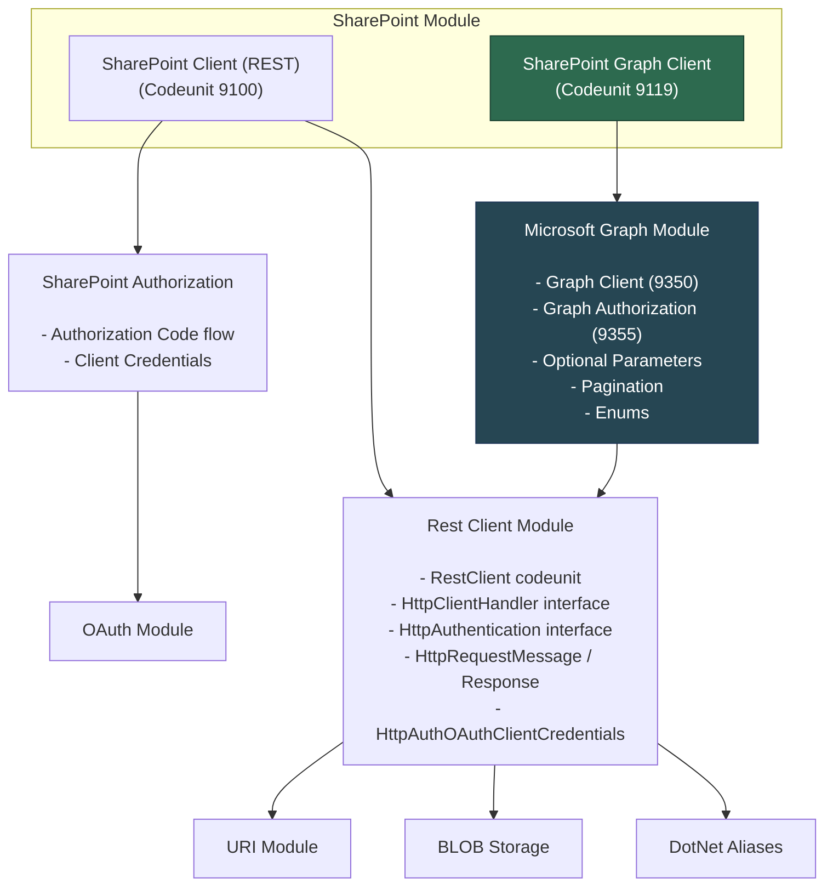

## 2. Internal Layered Architecture

Detailed internal architecture of the SharePoint Graph API module.

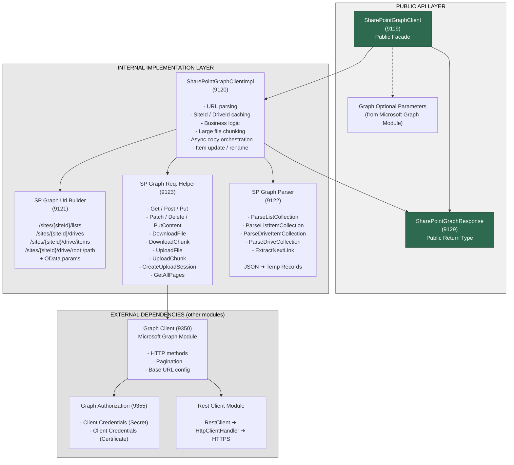

## 3. Data Model (Temporary Tables)

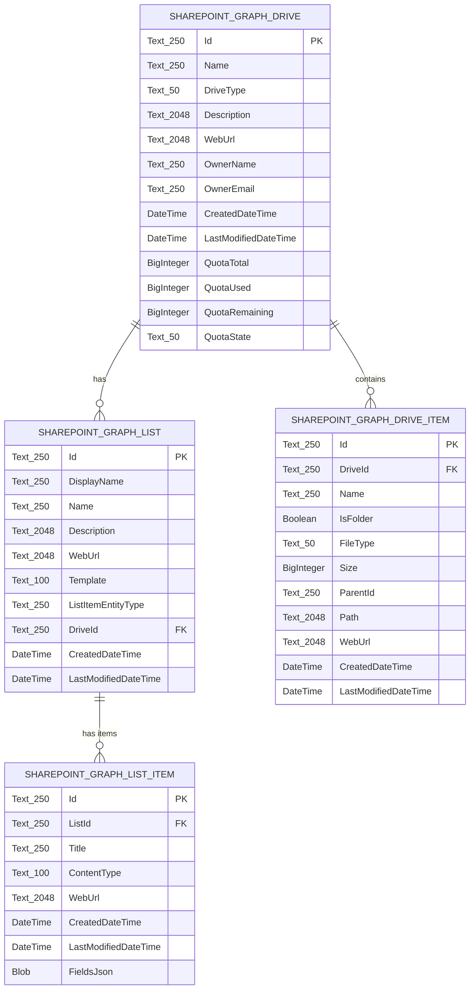

> **Note:** All tables are `Access = Public`, `Temporary = true`, `Extensible = false`, `DataClassification = SystemMetadata`. The primary key is `Id` in every table; List Item and Drive Item additionally define secondary keys `(ListId, Id)` and `(DriveId, Id)`.

## 4. REST API vs Graph API — Side-by-Side

```mermaid
graph LR
    subgraph REST["SharePoint REST API (existing)"]
        direction TB
        R_EP["Endpoint: https://site/_api/web/..."]
        R_Auth["Auth: SharePoint Authorization<br/>(Auth Code + Client Creds)"]
        R_Facade["Facade: SharePointClient (9100)"]
        R_Impl["Impl: SharePointClientImpl (9101)"]
        R_Helpers["Helpers:<br/>UriBuilder (9110)<br/>RequestHelper (9109)<br/>HttpContent (9107)<br/>OperationResponse (9108)"]
        R_Models["Models:<br/>SharePoint List<br/>SharePoint List Item<br/>SharePoint File<br/>SharePoint Folder<br/>SharePoint List Item Atch"]
        R_Return["Returns: Boolean"]
        R_Caps["Capabilities:<br/>+ Lists and Items<br/>+ Files and Folders<br/>+ Attachments<br/>+ Integration events<br/>- No large file chunking<br/>- No OData query params<br/>- No Copy/Move<br/>- No conflict behavior"]

        R_EP --- R_Auth --- R_Facade --- R_Impl --- R_Helpers --- R_Models --- R_Return --- R_Caps
    end

    subgraph GRAPH["SharePoint Graph API (NEW)"]
        direction TB
        G_EP["Endpoint: https://graph.microsoft.com<br/>/v1.0/sites/id/..."]
        G_Auth["Auth: Graph Authorization<br/>(Client Secret / Certificate)"]
        G_Facade["Facade: SPGraphClient (9119)"]
        G_Impl["Impl: SPGraphClientImpl (9120)"]
        G_Helpers["Helpers:<br/>UriBuilder (9121)<br/>ReqHelper (9123)<br/>Parser (9122)"]
        G_Models["Models:<br/>SP Graph List (9130)<br/>SP Graph List Item (9131)<br/>SP Graph Drive Item (9132)<br/>SP Graph Drive (9133)"]
        G_Return["Returns: SPGraphResponse codeunit<br/>(success, error, callstack, diagnostics)"]
        G_Caps["Capabilities:<br/>+ Lists and Items<br/>+ Drives and Drive Items<br/>+ Item updates (list item fields,<br/>drive item properties, rename)<br/>+ Large file upload/download (100MB)<br/>+ OData: filter, select, expand, orderby<br/>+ Copy (async) / Move<br/>+ Conflict behavior (replace/rename/fail)<br/>+ Path-based and ID-based ops<br/>+ Auto-pagination<br/>+ Diagnostics interface"]

        G_EP --- G_Auth --- G_Facade --- G_Impl --- G_Helpers --- G_Models --- G_Return --- G_Caps
    end

    style GRAPH fill:#f0fdf4,stroke:#2d6a4f,color:#000
    style REST fill:#fafafa,stroke:#666,color:#000
```

## 5. Request Flow Sequence

How a typical Graph API call (e.g., `GetLists`) flows through the layers.

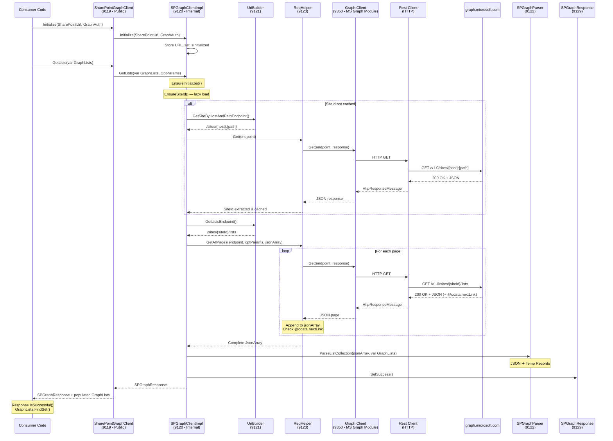

## 6. Object Registry

| ID | Object Name | Type | Access |
|----|------------|------|--------|
| **9119** | SharePoint Graph Client | Codeunit | **Public** — Entry point |
| 9120 | SharePoint Graph Client Impl. | Codeunit | Internal |
| 9121 | SharePoint Graph Uri Builder | Codeunit | Internal |
| 9122 | SharePoint Graph Parser | Codeunit | Internal |
| 9123 | SharePoint Graph Req. Helper | Codeunit | Internal |
| **9129** | SharePoint Graph Response | Codeunit | **Public** — Return type |
| **9130** | SharePoint Graph List | Table | **Public** — Model |
| **9131** | SharePoint Graph List Item | Table | **Public** — Model |
| **9132** | SharePoint Graph Drive Item | Table | **Public** — Model |
| **9133** | SharePoint Graph Drive | Table | **Public** — Model |

> All tables: `Temporary = true`, `Extensible = false`, `DataClassification = SystemMetadata`

## 7. Test Coverage

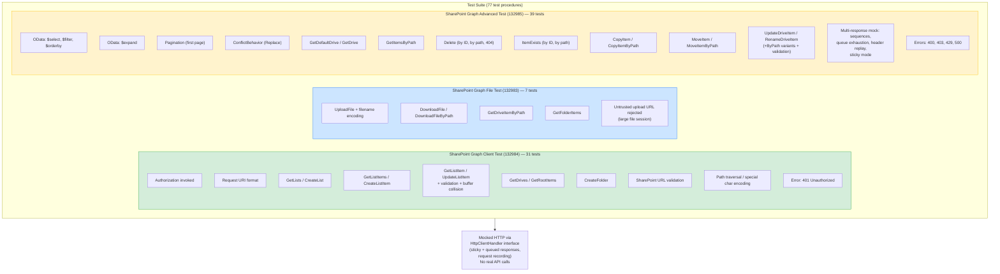

## 8. Public API Surface Summary

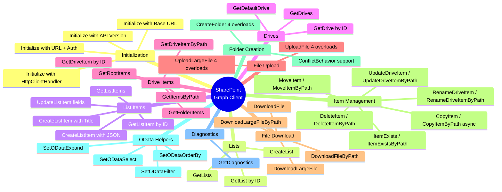

## 9. Functional Comparison: REST API vs Graph API

High-level capability comparison from a **business functionality** perspective.

### Functional Area Coverage

```mermaid
graph TD
    subgraph BOTH["Shared Functional Areas"]
        direction TB
        B1["List Management<br/>Create and browse SharePoint lists"]
        B2["List Item Management<br/>Create and read items in lists"]
        B3["File Upload<br/>Upload documents to SharePoint"]
        B4["File Download<br/>Retrieve file content"]
        B5["Folder Management<br/>Create folders, browse contents"]
        B6["Delete Operations<br/>Remove files and folders"]
        B7["Diagnostics<br/>Inspect HTTP response details"]
        B8["List Item Field Updates<br/>Modify metadata fields<br/>on existing list items"]
    end

    subgraph REST_ONLY["REST API Only"]
        direction TB
        R1["List Item Attachments<br/>Full CRUD for files attached<br/>directly to list items"]
        R3["Integration Events<br/>Extensibility hooks for<br/>custom metadata processing"]
        R4["UI File Picker<br/>Built-in browser dialog for<br/>end-user file selection"]
        R5["Client-Side Download<br/>Trigger file download<br/>directly in user's browser"]
    end

    subgraph GRAPH_ONLY["Graph API Only"]
        direction TB
        G1["Drive Management<br/>Enumerate document libraries,<br/>inspect storage quotas"]
        G2["Large File Handling<br/>Chunked upload/download for<br/>files exceeding 150MB limit"]
        G3["Copy, Move and Rename<br/>Relocate or rename files/folders<br/>within SharePoint"]
        G4["Existence Checks<br/>Verify if a file or folder<br/>exists before operating on it"]
        G5["Data Querying<br/>Filter, sort, select fields,<br/>expand relations via OData"]
        G6["Conflict Resolution<br/>Control behavior when<br/>name collisions occur"]
        G7["Auto-Pagination<br/>Transparently retrieve all<br/>pages of large result sets"]
    end

    style BOTH fill:#e3f2fd,stroke:#1565c0
    style REST_ONLY fill:#fff3e0,stroke:#e65100
    style GRAPH_ONLY fill:#e8f5e9,stroke:#1b5e20
```

### Authentication and Connection

| Aspect | REST API | Graph API |
|--------|----------|-----------|
| **Protocol** | SharePoint REST endpoints (`/_api/web/`) | Microsoft Graph (`graph.microsoft.com`) |
| **Auth model** | SharePoint-specific authorization (Auth Code + Client Credentials with Request Digest) | OAuth 2.0 Client Credentials (Client Secret or Certificate) via Microsoft Graph |
| **Auth module** | SharePoint Authorization (dedicated module) | Microsoft Graph Authorization (shared across all Graph consumers) |
| **API versioning** | Fixed endpoint, no version control | Selectable: `v1.0` (stable) or `beta` (preview) |
| **Base URL** | Tied to SharePoint site URL | Configurable (defaults to `graph.microsoft.com`) |
| **Testability** | Relies on integration event subscribers | `HttpClientHandler` interface injection + test helpers |

### Resource Addressing

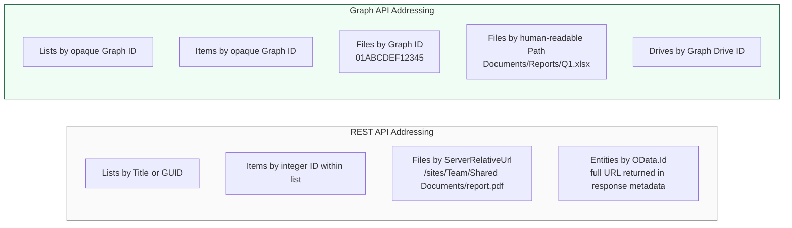

> **Key difference:** REST API requires SharePoint-specific URLs (ServerRelativeUrl, OData.Id) that couple callers to site structure. Graph API offers both opaque IDs (stable across renames) and human-readable paths (intuitive for users).

### Error Handling Philosophy

| Aspect | REST API | Graph API |
|--------|----------|-----------|
| **Return type** | `Boolean` (true/false) | `Codeunit "SharePoint Graph Response"` |
| **Error message** | Must call `GetDiagnostics()` separately on the client | `Response.GetError()` — embedded in the response |
| **Error context** | HTTP status + reason phrase | Error message + AL call stack at failure point + HTTP diagnostics |
| **Checking pattern** | `if not Client.GetLists(List) then ...` | `Response := Client.GetLists(List);` `if not Response.IsSuccessful() then ...` |
| **Multiple calls** | Diagnostics overwritten by each call | Each response holds its own diagnostics independently |

### File Operations Depth

| Capability | REST API | Graph API |
|-----------|----------|-----------|
| **Small file upload** | Yes (+ UI file picker) | Yes (to default or specific drive) |
| **Large file upload** | No | Yes — chunked upload sessions |
| **Small file download** | Yes (to InStream, TempBlob, or browser) | Yes (to TempBlob) |
| **Large file download** | No | Yes — 100MB chunked download |
| **Name collision handling** | No control | Replace, Rename, or Fail |
| **Copy files** | No | Yes (asynchronous server-side) |
| **Move files** | No | Yes (synchronous) |
| **Rename / update item properties** | No | Yes (by ID or path) |
| **Check if file exists** | Only for folders (FolderExists) | Yes, for any item (by ID or path) |
| **Delete by path** | Only by ServerRelativeUrl or OData.Id | Yes, by ID or by path |

### Data Querying and Retrieval

| Capability | REST API | Graph API |
|-----------|----------|-----------|
| **Filter results** | No | Yes — `$filter` OData expressions |
| **Select specific fields** | No | Yes — `$select` to reduce payload |
| **Sort results** | No | Yes — `$orderby` with asc/desc |
| **Expand related data** | Limited (`$expand` via URL hacking) | Yes — `$expand` as first-class feature |
| **Pagination** | Manual (caller must handle) | Automatic — `GetAllPages` retrieves everything |
| **Single item retrieval** | Get by ServerRelativeUrl | Get by ID or by path |

### Feature Matrix Summary

| Functional Area | REST | Graph |
|----------------|:----:|:-----:|
| Browse lists | Yes | Yes |
| Create lists (with template) | Yes | Yes (with template choice) |
| Read list items | Yes | Yes + OData filtering + single item by ID |
| Create list items | Yes (needs EntityType) | Yes (simple JSON or title) |
| Update list item fields | Yes (single field) | Yes (multiple fields via JSON) |
| **List item attachments** | **Yes (full CRUD)** | No |
| Browse folders | Yes | Yes |
| Create folders | Yes | Yes + conflict behavior |
| Upload files | Yes + UI picker | Yes + large file + conflict |
| Download files | Yes (3 targets) | Yes + large file chunked |
| Delete files/folders | Yes | Yes + path-based |
| **Copy / Move files** | No | **Yes** |
| **Rename / update drive items** | No | **Yes (by ID or path)** |
| **Check item existence** | Folders only | **Yes (any item)** |
| **Drive/library management** | No | **Yes (enumerate, quotas)** |
| **OData query support** | No | **Yes (filter, select, sort, expand)** |
| **Auto-pagination** | No | **Yes** |
| **Large file support** | No | **Yes (100MB chunks)** |
| **Conflict resolution** | No | **Yes (replace/rename/fail)** |
| **Integration events** | **Yes** | No |
| **UI interactions** | **Yes (file picker, browser download)** | No (server-side only) |
| Rich error responses | Basic (boolean + diagnostics) | **Yes (message + callstack + HTTP)** |

## 10. Architecture and Design Patterns

Patterns identified in the SharePoint Graph API module, organized by category.

### Structural Patterns

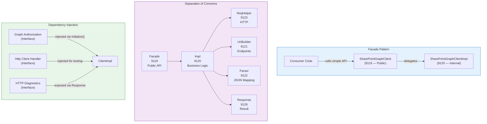

> **Facade** — `SharePointGraphClient` (9119) is a thin public shell. Every method delegates to `SharePointGraphClientImpl` (9120). Consumers never touch internal helpers directly.
>
> **Separation of Concerns** — Each codeunit has a single responsibility: facade exposes API, impl orchestrates logic, ReqHelper handles HTTP, UriBuilder constructs endpoints, Parser maps JSON, Response wraps results.
>
> **Dependency Injection** — Authorization and HTTP handling are injected as interfaces. This decouples the module from specific auth implementations and enables mock-based testing.

### Data and Response Patterns

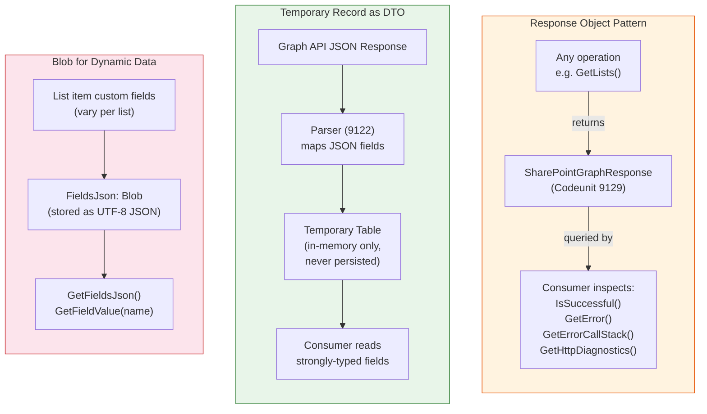

> **Response Object** — Every operation returns a `SharePointGraphResponse` codeunit instead of a boolean. It bundles success/failure status, error message, AL call stack captured at error time, and HTTP diagnostics. Each response is independent — making multiple calls doesn't overwrite previous diagnostics.
>
> **Temporary Records as DTOs** — Tables 9130–9133 are all `TableType = Temporary`. They serve as in-memory data transfer objects, never written to the database. The parser maps JSON to typed fields; consumers get IntelliSense and compile-time safety.
>
> **Blob for Dynamic Data** — List item custom fields vary per SharePoint list. Instead of defining columns for every possible field, the module stores the raw JSON in a `Blob` field and provides `GetFieldValue(FieldName)` for on-demand access.

### Performance Patterns

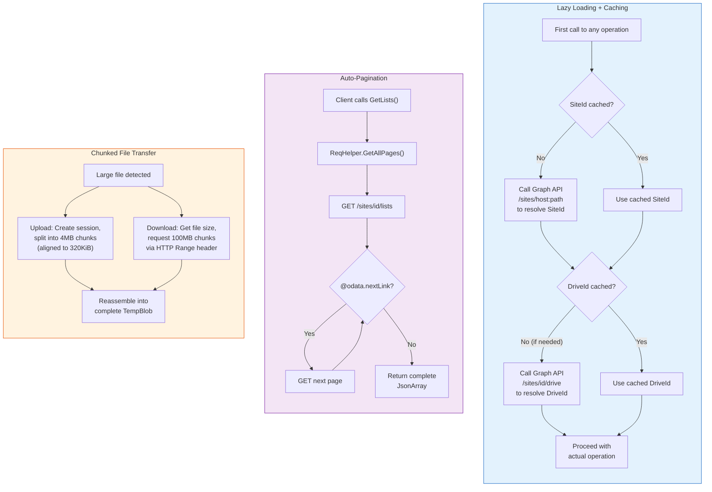

> **Lazy Loading + Caching** — SiteId and DefaultDriveId are resolved from the Graph API only on first use, then cached in instance variables. Changing the SharePoint URL clears the cache, forcing re-resolution.
>
> **Auto-Pagination** — Collection endpoints (lists, items, drives) automatically follow `@odata.nextLink` to retrieve all pages. The consumer receives the complete result set without manual paging logic.
>
> **Chunked Transfer** — Large file uploads use Graph API upload sessions with 4MB chunks (aligned to 320KiB multiples per Microsoft requirements). Large downloads use HTTP `Range` headers with 100MB chunks, staying under Business Central's 150MB response limit.

### API Design Patterns

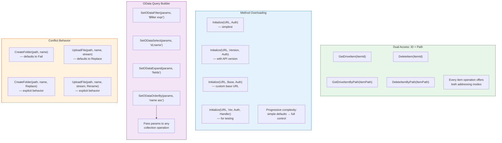

> **Dual Access (ID + Path)** — Most item operations come in pairs: one by opaque Graph ID (stable across renames), one by human-readable path (intuitive). Path variants either address the resource directly via the path endpoint (get, delete, update, rename) or resolve the path to an ID first where Graph requires real IDs (move, copy target folders).
>
> **Method Overloading** — Operations offer progressively complex signatures. The simplest form uses sensible defaults; advanced forms expose API version, base URL, conflict behavior, or OData parameters.
>
> **OData Query Builder** — Filter, select, expand, and orderby are set via helper methods on `GraphOptionalParameters`, then passed to any collection operation. This separates query construction from execution.
>
> **Conflict Behavior** — File/folder creation accepts an optional `Graph ConflictBehavior` enum (`Replace`, `Rename`, `Fail`). Default differs by context: uploads default to `Replace`, folder creation defaults to `Fail`.

### Error Handling and Resilience Patterns

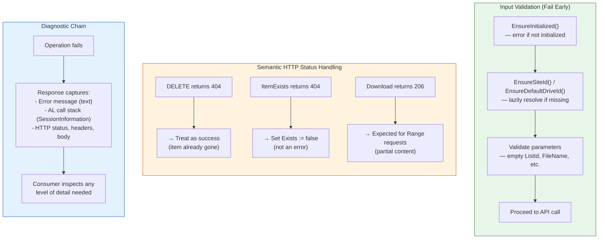

> **Input Validation** — Every operation checks initialization state and required parameters (ListId, FileName, etc.) before issuing its HTTP call, producing descriptive AL errors instead of cryptic HTTP 400s. Site and drive IDs are resolved lazily on first use — that resolution may itself issue a discovery request.
>
> **Semantic HTTP Handling** — Not all non-2xx status codes are errors. DELETE returning 404 means the item is already gone (success). ItemExists returning 404 means "doesn't exist" (not an error). Range requests returning 206 is expected behavior for partial content.
>
> **Diagnostic Chain** — On failure, the response captures the error message, the full AL call stack at the point of failure (via `SessionInformation`), and full HTTP diagnostics. Each response is self-contained — multiple concurrent operations don't interfere.

### Testability Patterns

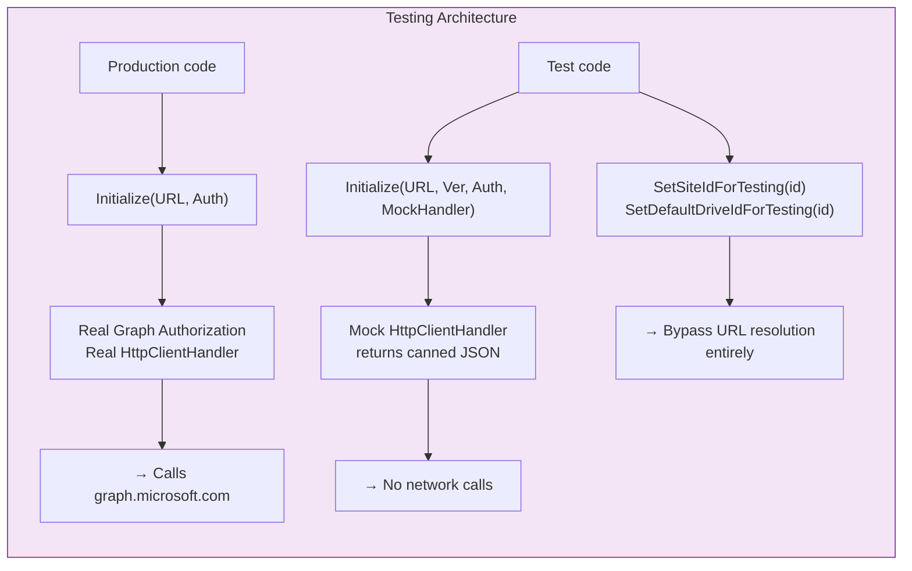

> **Interface-Based Mocking** — The `HttpClientHandler` interface can be swapped with a mock that returns predefined JSON responses. Tests verify business logic without network calls.
>
> **Test Helpers** — Internal procedures `SetSiteIdForTesting()` and `SetDefaultDriveIdForTesting()` let tests bypass the Graph API resolution step entirely, eliminating a dependency on real SharePoint sites.

### Pattern Summary

| Category | Pattern | Where | Purpose |
|----------|---------|-------|---------|
| **Structural** | Facade | Client 9119 → Impl 9120 | Hide complexity behind simple public API |
| | Separation of Concerns | All 6 codeunits | Each codeunit has single responsibility |
| | Dependency Injection | Initialize() with interfaces | Decouple auth and HTTP from logic |
| | Interface Segregation | 3 interfaces used | Small, focused contracts |
| **Data** | Response Object | Response 9129 | Rich operation results with diagnostics |
| | Temporary Records as DTO | Tables 9130–9133 | Typed in-memory data containers |
| | Blob for Dynamic Fields | ListItem.FieldsJson | Handle varying list schemas |
| | JSON Parser/Mapper | Parser 9122 | Convert API responses to models |
| **Performance** | Lazy Loading | SiteId, DriveId | Resolve only when first needed |
| | Instance Caching | SiteId, DriveId variables | Avoid repeated API resolution calls |
| | Auto-Pagination | GetAllPages + nextLink | Transparent multi-page retrieval |
| | Chunked Upload | 4MB aligned chunks | Handle files beyond size limits |
| | Chunked Download | 100MB Range requests | Stay under BC 150MB response limit |
| **API Design** | Dual Access (ID + Path) | All item operations | Flexibility for callers |
| | Method Overloading | Initialize, Upload, Create | Simple defaults → full control |
| | OData Query Builder | Optional Parameters | Composable query construction |
| | Conflict Behavior | Upload, CreateFolder | Control name collision handling |
| | Endpoint Templates | UriBuilder label constants | Centralized, typo-proof URL patterns |
| **Resilience** | Input Validation | Impl before each call | Fail early with clear messages |
| | Semantic HTTP Handling | Delete→404=OK, Exists→404=false | Context-aware status interpretation |
| | Diagnostic Chain | Response carries full context | Error message + call stack + HTTP details |
| | Path Normalization | TrimStart('/') | Standardize user input |
| **Testability** | Interface Mocking | HttpClientHandler injection | Test without network |
| | Test Helpers | SetSiteIdForTesting() | Bypass resolution in tests |
